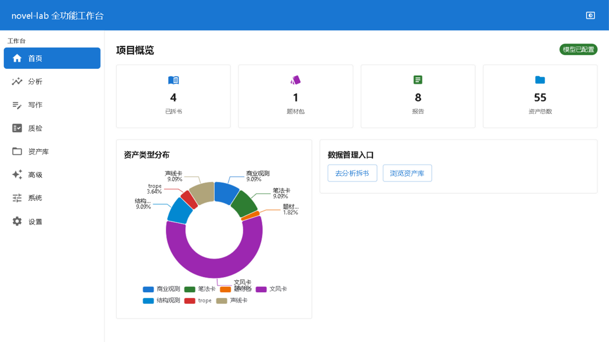
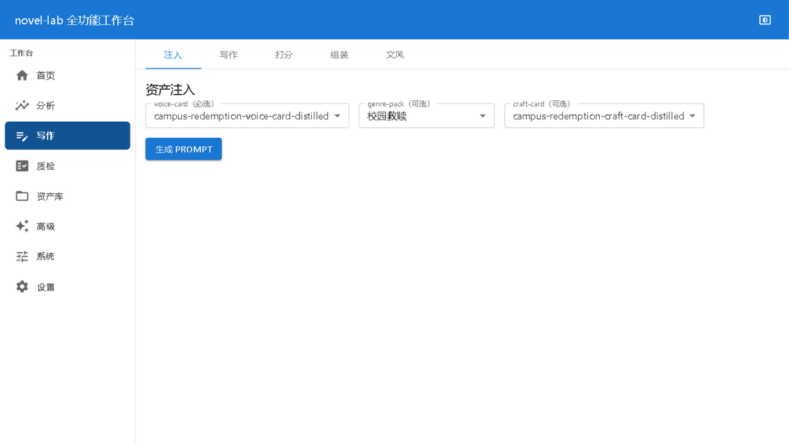

# novel-lab · 网文拆书与创作工作台

把优秀小说拆成可复用的结构化资产，再用这些资产驱动 AI 创作。

novel-lab 是一套本地优先（local-first）的网文创作辅助系统，覆盖全链路：

```
导入语料 → 拆书分析（五遍扫描） → 多维资产蒸馏 → 万字分析报告 → 质量检查 → 资产注入辅助写作
```

双形态交付：**CLI 引擎**（`novel.py`，20+ 中文子命令）+ **GUI 工作台**（浏览器访问 `http://127.0.0.1:8000/`）。

| 亮色首页 | 暗色首页 | 暗色写作台 |
|---|---|---|
|  |  |  |

## 下载安装

从 [Releases](https://github.com/monesyilya3-Niko/novel-lab/releases) 下载：

| 产物 | 适合 | 用法 |
|---|---|---|
| `novel-lab-setup-v*.exe` | 普通用户 | 双击安装（免管理员），开始菜单/桌面快捷方式启动 |
| `novel-lab-portable-v*.zip` | 绿色党/便携场景 | 解压后双击 `Start.bat` |

两者都**内置 Python 运行时**，无需安装任何依赖；完全本地运行，不上传任何数据。

## 功能总览

| 模块 | 能力 |
|---|---|
| 拆书引擎 | TXT 全本 → 分层采样 → 量化 → 五遍扫描 → 归一化 → 结构化资产 |
| 资产体系 | 文风卡 / 笔法卡 / 结构观测 / 商业观测 / 题材包 / 蒸馏资产 / 文风卡库 / 桥段库 |
| 写作台 | 资产注入 → system prompt → 生成 → 一致性/质量双维度改写循环 |
| 质检台 | 单章检查（12 维 100 分制）+ 全书质检（6 类）+ QC 四层十二维 |
| 题材隔离 | 不同题材的资产/配置严格隔离，聚合与注入全链路校验 |

## 快速开始

### 方式一：绿色版（需要本机已装 Python 3.10+）

```bash
git clone https://github.com/monesyilya3-Niko/novel-lab.git
cd novel-lab
./Start.bat        # 双击亦可；自动探测 python 并启动 GUI
```

启动后浏览器自动打开 `http://127.0.0.1:8000/`。

### 方式二：CLI 引擎

```bash
python novel.py 状态                          # 查看项目状态
python novel.py 拆书 book.txt --genre campus-redemption   # 拆一本新书
python novel.py 注入 voice.json               # 资产生成写作 prompt
python novel.py 检查 chapter.txt --voice voice.json       # 章节质量检查
```

完整命令清单见 `python novel.py --help`。

### GUI 工作台

```bash
python -m gui.launch
```

首页概览 / 拆书分析 / 资产库 / 写作台 / 质检台 / 高级（蒸馏·批量·资产编辑）/ 系统状态。

## 架构

```
前端  Vite + React + MUI + ECharts（预构建产物入库，用户免装 Node）
  │  HTTP REST + SSE（65 个端点）
后端  Python 纯标准库（http.server + sqlite3，零第三方依赖）
  │  同进程 engine_adapter
引擎  scripts/ 32 个纯标准库脚本（pipeline / qc / distill / write / report …）
```

三条项目铁律（违反即视为 bug，CI 自动守护）：

1. **题材隔离**——聚合题材包时 source_books 的 genre 必须全一致，不一致 `sys.exit(1)`
2. **万字报告硬校验**——拆书报告 + 笔法分析合计 ≥ 10000 字符，不足阻断交付
3. **纯标准库**——`scripts/` 与 `gui/` 后端零第三方依赖

## 开发

```bash
python run_tests.py        # 全量测试（353 用例基线）
git config core.hooksPath .githooks   # 启用提交前自动测试
```

开发规范、架构约束与贡献流程见 [CONTRIBUTING.md](CONTRIBUTING.md)。

## 安全模型

本应用设计为**仅本机使用**：服务硬绑定 `127.0.0.1`，无公网暴露。可选 token 认证见 [SECURITY.md](SECURITY.md)。

## 许可证

[MIT](LICENSE) ｜ 本仓库不包含任何受版权保护的范文语料，`corpus/` 仅存在于本地。
