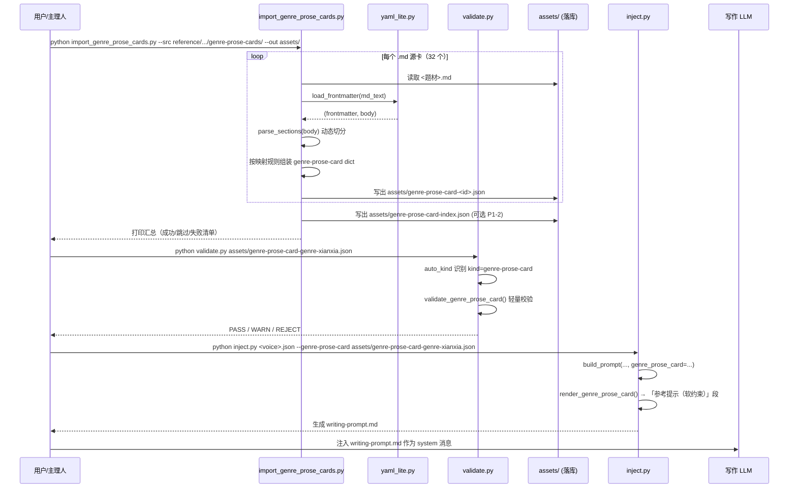
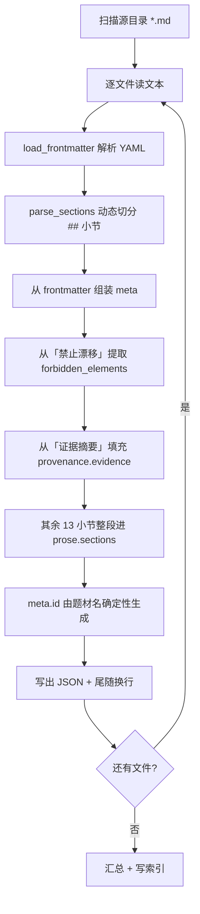
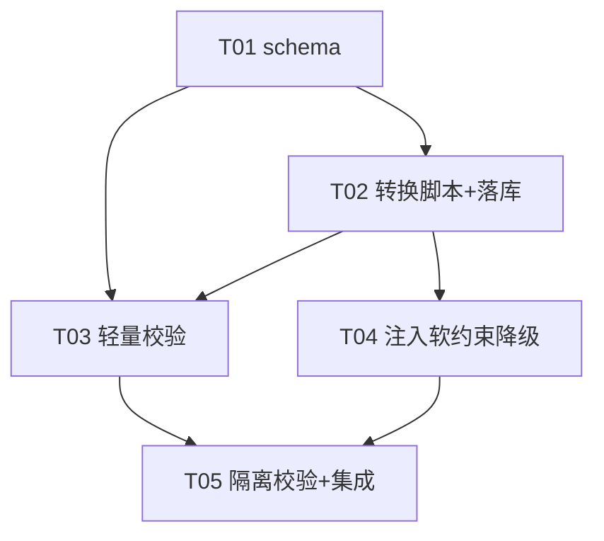

# 架构设计 · 阶段② 增量移植 oh-story 30+ 题材文风卡

> 项目：novel-lab（拆书 → 资产 → AI 写作闭环）
> 作者：架构师 高见远
> 日期：2026-09-09
> 文档类型：增量架构设计 + 任务分解（最小变更原则，现有代码零修改优先）

---

## 一、实现方案 + 框架选型

### 1.1 核心结论

oh-story 的 `genre-prose-cards`（32 张散文式题材文风卡）与 novel-lab 现有 `genre-pack`（多书聚合规则包）是**两个不同物种**，不能互相转换。本阶段引入一个**新的轻量资产 `genre-prose-card`（种子模板 / 中间层）**，作为「未来升格为 genre-pack」的种子。

关键判断（已由 `scripts/convert_genre_card.py` 的失败反证）：
- 文风卡**没有范文**，无法产出 genre-pack 要求的量化商业层（爽点密度 / buildup_length / 每千字爽点密度）。
- 文风卡的「散文描述」是**提示性文本**，不是结构化枚举，无法通过 `validate_genre_pack` 的硬校验（`iron_rules.min_items=1`、`payoff_types.min_items=1`、`buildup_length` 必须给数字）。
- 因此 `genre-prose-card` 走**独立的轻量 schema + 独立轻量校验**，与 genre-pack 彻底分离，避免「伪装成题材包」绕过铁律一（≥3 本才出 genre-pack）。

### 1.2 数据映射原则（决策 2 落地）

> **能结构化 → 结构化；不能结构化 → 原文保留为 `prose` 字段；无数据 → 空置不臆造。**

| 源字段（frontmatter + 13 小节） | 目标字段 | 处理 |
|---|---|---|
| `genre` / `aliases` | `meta.name` / `meta.sub_tags` | ✅ 直接映射 |
| `platform` | `meta.target_platform` | ✅ 直接映射 |
| `confidence`(high/medium/low) | `meta.confidence`(0.85/0.65/0.4) | ✅ 沿用 `_confidence_map` |
| `source` | `meta.provenance.source` | ✅ 直接映射（标注 MIT + repo） |
| 「禁止漂移」 | `language_rules.forbidden_elements` + `banned_phrases` | 🟡 提取「不要/禁止/不得」句式 |
| 「对话与声线」 | `language_rules.voice_notes` | 🟡 原文保留 |
| 「章尾钩子」「正文落点」 | `structure.hook_notes`（定性） | 🟡 原文保留 |
| 「爽点与情绪释放」 | `commercial.payoff_notes`（定性） | 🟡 原文保留 |
| 「节奏密度」「前中后期打法」 | `structure.arc_rhythm_notes` | 🟡 原文保留 |
| 「证据摘要」 | `meta.provenance.evidence` | ✅ 原文保留（升格溯源依据） |
| 其余全部 13 小节 | `prose.sections`（字典） | ✅ 原文兜底保留 |
| **量化商业字段 / source_books** | —— | ❌ 留空占位，升格时由范文拆书填充 |

### 1.3 纯标准库实现（铁律三）

**零第三方依赖**，复用项目已有的手写 YAML 解析器：

- **YAML frontmatter 解析**：复用 `scripts/yaml_lite.py` 的 `load_frontmatter()`（已实现，支持本项目源卡片的 `genre/aliases/platform/confidence/source` 全部字段，含内联列表 `[a, b]`）。**不引入 PyYAML**。
- **13 小节切分**：复用 `convert_genre_card.py` 里的 `parse_sections()` 思路（按 `## 标题` 切分），但**通用化**：不再依赖 `_SECTION_TITLES` 固定 13 标题，而是**动态收集**所有 `## ` 标题为 key（保证未来源卡新增小节不丢数据）。
- **落库**：`json` 标准库，`ensure_ascii=False` + `indent=2`。
- **校验**：`validate.py` 纯 Python 手写校验函数（与现有 6 个 `validate_*` 同风格，不引入 jsonschema）。

### 1.4 题材隔离（铁律一）

- 每张卡 `meta.id` 唯一，由题材名确定性生成（见「共享知识」）。
- 每张卡独立落库为 `assets/genre-prose-card-<id>.json`，**一个题材一个文件**，不跨题材混用。
- 校验时断言 `meta.id` 与文件名、`meta.name` 三者一致，防止串味。
- 不触碰 `validate.py` 的 `KNOWN_GENRES`（仍只含 `campus-redemption`），genre-prose-card **不进入** genre-pack 的题材白名单校验——它是独立资产。

### 1.5 注入定位（决策 3 落地，P0-5）

- genre-pack → 注入为「**题材铁律（最高优先级）**」（现有 `inject.py render_genre_pack` 行为，**不改动**）。
- genre-prose-card → 注入为「**题材参考提示（软约束，低优先级）**」，**新增独立渲染函数** `render_genre_prose_card()`，输出段标题明确标注「参考级、非铁律」。
- 优先级：**有 genre-pack 时 genre-pack 优先，genre-prose-card 作为补充参考；无 genre-pack 时 genre-prose-card 单独作为参考提示**。二者**不互相覆盖**，prose-card 永不冒充铁律。

### 1.6 弃用决策（决策 4 落地）

`scripts/convert_genre_card.py` 作为「验证反面路径」的历史遗产**保留但不作为主力**，本阶段另起通用脚本 `scripts/import_genre_prose_cards.py`。`convert_genre_card.py` 的 `parse_sections()` 思路被吸收进新脚本，但 `_HOOK_KEYWORD_MAP`/`_PAYOFF_KEYWORD_MAP`/`_extract_required_elements` 等青春甜宠硬编码**全部弃用**。

---

## 二、文件列表及相对路径

### 2.1 新建文件（4 个）

| 路径 | 职责 |
|---|---|
| `schema/genre-prose-card.schema.json` | genre-prose-card 的 JSON Schema 定义（轻量，含 `meta.kind`、`prose`、`upgrade_status` 等） |
| `scripts/import_genre_prose_cards.py` | 通用批量转换脚本：源 `.md` → genre-prose-card JSON 落库（题材无关，纯标准库） |
| `assets/genre-prose-card-<id>.json` ×32 | 32 张题材卡的落库产物（由脚本生成，非手写） |
| `assets/genre-prose-card-index.json` | 题材名 → 文件路径 / id 的索引（P1-2，可选，检索用） |

### 2.2 修改文件（3 个，均为「追加」不「改动既有逻辑」）

| 路径 | 修改方式 |
|---|---|
| `scripts/validate.py` | **追加** `validate_genre_prose_card()` 函数 + 注册到 `DISPATCH`/`AUTO_HINTS`/`auto_kind`；`--kind` choices 追加 `genre-prose-card`；**不改动**现有 6 个 `validate_*` |
| `scripts/inject.py` | **追加** `render_genre_prose_card()` 渲染函数 + `build_prompt()` 新增可选参数 `genre_prose_card` + `main()` 新增 `--genre-prose-card` 参数；**不改动** `render_genre_pack` 与既有段落顺序 |
| `novel.py` | **追加** `import-genre-prose-cards` 便利子命令 + `注入`/`校验` 子命令的参数透传；**不改动**既有子命令逻辑（含保留 `convert-genre-card` 子命令及其对 `convert_genre_card.py` 的引用） |

---

## 三、数据结构设计（genre-prose-card JSON Schema）

### 3.1 完整字段定义

```jsonc
{
  "$schema": "http://json-schema.org/draft-07/schema#",
  "$id": "genre-prose-card.schema.json",
  "title": "题材文风卡（种子模板）",
  "description": "从 oh-story 散文式题材文风卡移植的轻量参考资产。非聚合产物、无范文来源，写作时注入为软约束参考，不冒充 genre-pack 题材铁律。",
  "type": "object",
  "required": ["meta", "language_rules", "prose"],
  "properties": {
    "meta": {
      "type": "object",
      "required": ["id", "name", "kind", "confidence"],
      "properties": {
        "id":       { "type": "string", "description": "题材唯一 id，如 genre-xianxia" },
        "name":     { "type": "string", "description": "题材中文名，如 东方仙侠" },
        "kind":     { "type": "string", "const": "genre-prose-card" },
        "sub_tags": { "type": "array", "items": {"type":"string"}, "description": "别名/细分标签" },
        "target_platform": { "type": "string" },
        "confidence": { "type": "number", "minimum": 0, "maximum": 1,
                        "description": "来源自报置信度（high=0.85/medium=0.65/low=0.4），非拆书实测" },
        "upgrade_status": { "type": "string", "enum": ["seed", "upgraded"], "default": "seed" },
        "provenance": {
          "type": "object",
          "properties": {
            "source":    { "type": "string", "description": "来源仓库，如 zenstory-ai/oh-story-claudecode" },
            "license":   { "type": "string", "default": "MIT" },
            "verified":  { "type": "boolean", "default": false, "description": "是否经范文拆书实测验证。genre-prose-card 恒为 false（来源自报，未经验证）" },
            "evidence":  { "type": "string", "description": "证据摘要原文（升格溯源依据）" },
            "converted_at": { "type": "string", "format": "date-time" }
          }
        },
        "source_books": { "type": "array", "items": {"type":"object"}, "description": "范文明细占位，升格时填充（本阶段恒为空）" }
      }
    },

    "language_rules": {
      "type": "object",
      "description": "语言软规则（倾向/避用/禁忌，非铁律）",
      "properties": {
        "forbidden_elements": { "type": "array", "items": {"type":"string"}, "description": "禁止漂移要素" },
        "banned_phrases":     { "type": "array", "items": {"type":"string"}, "description": "避用/禁用表达" },
        "voice_notes":        { "type": "string", "description": "对话与声线散文描述原文" }
      }
    },

    "structure": {
      "type": "object",
      "description": "结构定性描述（非量化）",
      "properties": {
        "hook_notes":        { "type": "string", "description": "章尾钩子/正文落点定性描述" },
        "arc_rhythm_notes":  { "type": "string", "description": "节奏密度/前中后期打法定性描述" }
      }
    },

    "commercial": {
      "type": "object",
      "description": "商业定性描述（无量化字段）",
      "properties": {
        "payoff_notes":      { "type": "string", "description": "爽点与情绪释放定性描述" }
      }
    },

    "prose": {
      "type": "object",
      "description": "原文散文正文整段保留（写作兜底参考 + 升格素材）",
      "required": ["sections"],
      "properties": {
        "sections": {
          "type": "object",
          "description": "13 小节标题 → 原文内容（动态收集，不依赖固定标题清单）",
          "additionalProperties": { "type": "string" }
        }
      }
    }
  }
}
```

### 3.2 与 genre-pack 的字段差异对照（关键）

| 维度 | genre-pack（严格） | genre-prose-card（轻量） |
|---|---|---|
| `meta.kind` | 无（靠 auto_kind 推断） | **`genre-prose-card`（显式）** |
| `meta.source_books` | 必填，≥3 本 | 占位，恒空 |
| `structure` | 必填，量化（chapter_word_range/hook_system/foreshadow_pattern） | 可选，定性（hook_notes/arc_rhythm_notes） |
| `commercial` | 必填，量化（payoff_density/opening_analysis/paywall） | 可选，定性（payoff_notes） |
| `language_rules.iron_rules` | 必填 min_items=1 | **无 iron_rules**（软规则，不设铁律） |
| `prose` | 无 | **独有**（原文兜底） |
| `upgrade_status` | 无 | **独有**（seed/upgraded） |
| `provenance.verified` | 无（有 `human_reviewed`） | **独有**（恒 false，来源自报未验证） |

### 3.3 落库产物示例（`assets/genre-prose-card-genre-xianxia.json`）

```json
{
  "meta": {
    "id": "genre-xianxia",
    "name": "东方仙侠",
    "kind": "genre-prose-card",
    "sub_tags": ["东方仙侠", "仙侠", "修仙", "古典仙侠"],
    "target_platform": "长篇通用",
    "confidence": 0.65,
    "upgrade_status": "seed",
    "provenance": {
      "source": "zenstory-ai/oh-story-claudecode",
      "license": "MIT",
      "verified": false,
      "evidence": "样本说明：本地同题材长篇样本，可用 308 本；抽样 24 本……",
      "converted_at": "2026-09-09T00:00:00+00:00"
    },
    "source_books": []
  },
  "language_rules": {
    "forbidden_elements": ["空泛古风散文", "堆宗门设定", "无代价开挂", "主角只被命运推着走"],
    "banned_phrases": [],
    "voice_notes": "可比都市更克制，但不能空泛古风。师长、弟子、宗门对手、皇权人物要有身份分寸。"
  },
  "structure": {
    "hook_notes": "适合用新试炼、师门秘密、境界异象、强敌拜山、规矩反噬、旧因果浮现收尾。",
    "arc_rhythm_notes": "每章至少推进一条修行线、关系线或局势线。修炼章可以慢，但必须有瓶颈、试错、代价或外部压力。"
  },
  "commercial": {
    "payoff_notes": "释放来自破境、悟道、守住重要关系、破局后身份提升、敌方重新评估。仙气服务选择，不替代冲突。"
  },
  "prose": {
    "sections": {
      "正文提示词": "写东方仙侠时，把修行规则、身份位置……",
      "开场抓手": "从门规压力、师徒关系、试炼……",
      "冲突发动机": "修行规矩 + 身份约束 + 道义/利益选择……",
      "爽点与情绪释放": "释放来自破境、悟道……",
      "对话与声线": "可比都市更克制……",
      "章尾钩子": "适合用新试炼……",
      "场景颗粒": "优先落到山门、洞府……",
      "正文落点": "开场落到门规……",
      "前中后期打法": "- 前期：……",
      "节奏密度": "每章至少推进……",
      "本章取舍": "若本章主打修行……",
      "禁止漂移": "不要写成空泛古风散文……",
      "证据摘要": "样本说明：……"
    }
  }
}
```

---

## 四、程序调用流程

### 4.1 时序图：源 .md → 转换脚本 → 落库 → 校验 → 注入



### 4.2 流程图：转换脚本内部逻辑（题材无关通用化）



---

## 五、任务列表（有序，含依赖与验收标准）

> 遵循最小变更原则：T01 基础设施先行，其余任务尽量解耦。共 **5 个任务**（硬上限内）。

| ID | 任务名 | 依赖 | 优先级 | 验收标准 |
|---|---|---|---|---|
| **T01** | genre-prose-card 轻量 schema | 无 | P0 | `schema/genre-prose-card.schema.json` 落盘；`required` 仅 `meta`+`language_rules`+`prose`；含 `meta.kind`/`provenance`/`upgrade_status`/`prose`；不含 genre-pack 量化必填字段 |
| **T02** | 通用转换脚本 + 32 卡落库 | T01 | P0 | `scripts/import_genre_prose_cards.py` 存在；题材无关（无硬编码关键词表）；运行后 `assets/` 产出 ≥32 个 `genre-prose-card-<id>.json`，每个含 `meta.provenance` 溯源 + `prose.sections` 原文兜底；纯标准库 |
| **T03** | 独立轻量校验 | T01, T02 | P0 | `validate.py` 追加 `validate_genre_prose_card`；对 32 卡全量 `PASS`（或仅 WARN）；`meta.kind`/`meta.id`/`meta.name`/`confidence` 校验正确；不套用 genre-pack 量化硬校验 |
| **T04** | 注入引用（软约束降级） | T01, T02 | P0 | `inject.py` 支持 `--genre-prose-card`；无 genre-pack 时注入「参考提示（软约束）」段且明确标注非铁律；有 genre-pack 时 genre-pack 优先、prose-card 不覆盖；`render_genre_prose_card` 输出可读 |
| **T05** | 题材隔离校验 + 集成入口 | T03, T04 | P0 | 校验断言 `meta.id` 唯一、与文件名/`meta.name` 一致、不跨题材混用；`novel.py` 追加 `import-genre-prose-cards` 子命令 + 注入/校验子命令参数透传；现有拆书/写作主链路无回归 |

**依赖图（见第八节）。**

---

## 六、依赖包列表

**无第三方依赖。** 纯 Python 标准库实现：

```
无第三方依赖（硬铁律三）
- 仅使用标准库：json / argparse / pathlib / re / datetime / typing / collections
- YAML frontmatter 复用项目内 scripts/yaml_lite.py（手写，零依赖）
- 校验复用 validate.py 手写函数（不引入 jsonschema）
```

---

## 七、共享知识（跨文件约定）

1. **card id 命名规则**：`meta.id = "genre-<题材名全拼>"`（多词用连字符），由题材中文名确定性生成。拼音映射表内置在 `import_genre_prose_cards.py`（32 个题材名 → 拼音 slug），不依赖第三方拼音库。示例：东方仙侠 → `genre-xianxia`，青春甜宠 → `genre-qingchun-tianchong`。
2. **`meta.kind` 取值**：恒为字符串 `"genre-prose-card"`，与 genre-pack 区分。`auto_kind` 优先依据 `meta.kind == "genre-prose-card"` 判定，避免与 voice-card 兜底误判。
3. **文件名约定**：`assets/genre-prose-card-<id>.json`，即 `genre-prose-card-genre-xianxia.json`。文件名中的 `<id>` 与 `meta.id` 必须一致（T05 校验）。
4. **软约束注入标记**：`render_genre_prose_card()` 输出段首固定标注：
   `## 〇、题材参考提示（genre-prose-card · 软约束·来源自报·未经验证）`，与 genre-pack 的 `## 〇、题材规则（genre-pack · 最高优先级）` 形成明确等级区分。`meta.confidence` 为 low（0.4）的卡在注入段额外标注「低置信·仅供参考」。
5. **置信度映射**：`high→0.85 / medium→0.65 / low→0.4 / 缺省→0.5`（沿用 `_confidence_map`）。此置信度是「来源自报」，`provenance.verified` 恒为 `false`（未经验证），升格为 genre-pack 后由范文拆书实测改为 `true`。
6. **provenance 溯源**：`source="zenstory-ai/oh-story-claudecode"`、`license="MIT"`、`evidence`=「证据摘要」小节原文。MIT 要求保留 attribution。
7. **升格占位**：`upgrade_status="seed"` + `source_books=[]` 占位，未来 `pass5_aggregate` 升格时填入真实范文并改 `upgrade_status="upgraded"`。
8. **不修改既有代码逻辑**：`render_genre_pack`、`validate_genre_pack`、`pass5_aggregate.py`、`pipeline.py`、`write.py` 一律不改动，仅追加新函数/新参数/新文件。
9. **题材隔离**：一个题材一个文件；`prose.sections` 不跨题材引用；`validate_genre_prose_card` 断言 id 与文件名一致。

---

## 八、任务依赖图



---

## 九、待明确事项（已全部闭合）

> 以下 7 项已由 team-lead 传达主理人最终决策，全部闭合，作为实施的硬约束。

1. **拼音 slug 映射表**：✅ 采纳 32 项建议表，「青春甜宠」修正为 `genre-qingchun-tianchong`。统一口径 `genre-<题材名全拼>`，多词连字符。
2. **`novel.py` 是否新增子命令**：✅ 加。追加 `import-genre-prose-cards` 便利子命令 + 注入/校验参数透传，纳入 T05 必做项（不再标可选）。
3. **`convert_genre_card.py` 的去留**：✅ 保留不删。物理删除牵动 novel.py 现有 `convert-genre-card` 子命令引用，仅作历史遗产保留。
4. **「禁止漂移」提取精度**：✅ 接受降级。提取为空时置空 + `prose.sections["禁止漂移"]` 原文兜底。
5. **索引文件**：✅ 纳入本阶段交付边界，T02 顺带生成 `genre-prose-card-index.json`。
6. **confidence 未经验证语义**：✅ 加显式 `provenance.verified=false` 布尔字段；注入段仍标注「软约束·来源自报·未经验证」。
7. **low 卡（0.4）注入**：✅ 本阶段 32 卡全部可注入，low 卡注入段额外标注「低置信·仅供参考」，P2 再做分级过滤。

---

## 附：32 题材清单与建议 id 映射（供拍板）

| 题材 | 建议 id |
|---|---|
| 东方仙侠 | genre-xianxia |
| 传统玄幻 | genre-xuanhuan |
| 历史古代 | genre-lishi |
| 历史脑洞 | genre-lishi-naodong |
| 双男主 | genre-shuangnan |
| 古言脑洞 | genre-guyan-naodong |
| 古风世情 | genre-gufeng-shiqing |
| 女频悬疑 | genre-nvpin-xuanyi |
| 女频种田 | genre-nvpin-zhongtian |
| 宫斗宅斗 | genre-gongdou |
| 年代 | genre-niandai |
| 快穿 | genre-kuaichuan |
| 悬疑灵异 | genre-xuanyi-lingyi |
| 悬疑脑洞 | genre-xuanyi-naodong |
| 战神赘婿 | genre-zhanshen-zhuixu |
| 抗战谍战 | genre-kangzhan-diezhan |
| 星光璀璨 | genre-xingguang |
| 民国言情 | genre-minguo-yanqing |
| 游戏体育 | genre-youxi-tiyu |
| 玄幻脑洞 | genre-xuanhuan-naodong |
| 玄幻言情 | genre-xuanhuan-yanqing |
| 现言脑洞 | genre-xianyan-naodong |
| 科幻末世 | genre-kehuan-moshi |
| 职场婚恋 | genre-zhichang-hunlian |
| 西方奇幻 | genre-xifang-qihuan |
| 豪门总裁 | genre-haomen-zongcai |
| 都市修真 | genre-dushi-xiuzhen |
| 都市日常 | genre-dushi-richang |
| 都市种田 | genre-dushi-zhongtian |
| 都市脑洞 | genre-dushi-naodong |
| 都市高武 | genre-dushi-gaowu |
| 青春甜宠 | genre-qingchun-tianchong |

> 映射表已由 team-lead 拍板采纳。统一口径：`genre-<题材名全拼>`，多词用连字符。
