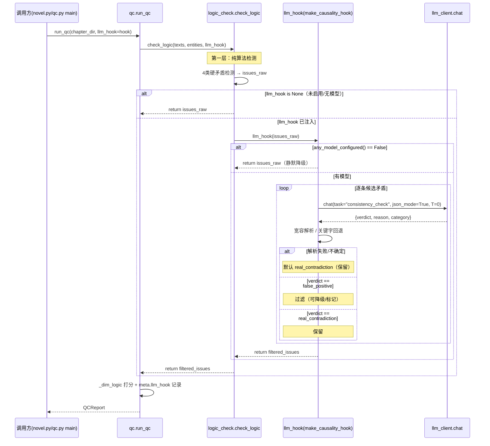

# 架构设计 · 阶段④ 实现 D2 逻辑合理的 LLM 因果合理性二次判定（llm_hook）

> 项目：novel-lab（拆书 → 资产 → AI 写作闭环）
> 作者：架构师（software-architect-4-2）
> 日期：2026-09
> 文档类型：增量架构设计 + 任务分解（最小变更原则）

---

## 零、背景与目标

`scripts/logic_check.py` 的 `check_logic(texts, entities=None, llm_hook=None)` 中，`llm_hook` 目前是**占位参数**（docstring 明确「当前不实现（架构师已定稿）」）。本阶段把这个占位参数真正落地为「LLM 因果合理性二次判定」：

- **第一层（保留）**：纯算法检测四大类硬矛盾（数字/年龄、时间线、称呼、状态），天然存在误报（闪回/倒叙/伏笔/合理设定被误判为矛盾）。
- **第二层（新增）**：对第一层命中的疑似矛盾，调用 LLM 判断「真矛盾 vs 误报」，过滤误报以降低 D2 的误报率。

**硬约束**：
1. **铁律三**：import 白名单仅限 Python 标准库。复用项目内 `llm_client.py`（本身是标准库 `urllib` 实现）不违反铁律三——这是既有约定（`pipeline.py` / `pass5_aggregate.py` / `write.py` 均已调 `llm_client.chat`）。
2. **无模型降级**：`any_model_configured()` 为 False 或 `llm_client.LLMError` 抛错时，**必须静默回退到纯算法结果**，QC 绝不能因 LLM 不可用而崩溃。
3. **保持可测性**：`logic_check.py` 是纯函数、可单测、零外部依赖，不能因接入 LLM 而破坏这个特性。

---

## 一、接口契约（决策 1）

### 1.1 结论：`llm_hook` 保持「默认 None、显式传入 callable」

**`llm_hook` 参数签名**（保持现状的 `=None` 默认值，只改 docstring 与函数体）：

```python
def check_logic(
    texts: dict,
    entities: dict = None,
    llm_hook=None,               # 类型：Optional[Callable[[list[dict]], list[dict]]]
) -> list:
```

- `llm_hook` 是一个 **callable**，语义为「因果合理性二次判定器」。
- 入参：第一层纯算法产出的**完整 issue 列表** `list[dict]`。
- 出参：过滤后的 `list[dict]`（可能删除误报、可能降级 severity、可能给 issue 追加元字段）。
- 类型用 `Optional[Callable[[list], list]]` 在 docstring 注明即可（项目零第三方，不强制 `typing.Protocol`，但可 import `typing` 标准库做注解，不违反铁律三）。

### 1.2 权衡理由

| 方案 | 优点 | 缺点 | 取舍 |
|---|---|---|---|
| **A. 传入 callable（默认 None）** | ① `logic_check` 保持纯函数、可单测；② 调用方决定是否启用、注入什么实现；③ 零循环依赖 | 需要 qc.py 显式构造 hook 再传入 | ✅ **采用** |
| B. `logic_check` 内部直接 `import llm_client` | 调用方零改动、开箱即用 | ① 破坏纯函数特性；② 单测会被真实网络请求污染；③ 引入模块级副作用；④ 与「无模型降级」硬约束耦合更深 | ❌ 否决 |

**关键判断**：`logic_check` 的定位是「可独立运行的纯算法检测器」（有 `__main__` 入口），直接内联 LLM 会让它的 `main()` 在没有网络/没有模型配置的环境下不可控。把 LLM 判定**上移到调用方（qc.py）**，通过 callable 注入，是「纯函数核心 + 编排层注入」的经典解耦，也符合 `qc.py` 本身「整合 + 编排」的职责定位。

### 1.3 谁来实现这个 callable

新增 `scripts/llm_hook.py`，对外暴露一个工厂/构造器：

```python
# scripts/llm_hook.py（纯标准库）
def make_causality_hook(task: str = "consistency_check") -> "Optional[Callable[[list], list]]":
    """构造因果判定 hook。无模型配置时返回 None（表示「不启用，走纯算法」）。"""
```

- 返回 `None` = 不启用（对应 `any_model_configured()` 为 False 的场景）。
- 返回 callable = 启用。该 callable 内部封装「批量喂 LLM → 解析结构化返回 → 过滤误报」的完整逻辑，并保证**任何 LLM 异常都静默吞掉、返回原 issue 列表**（降级硬约束在 hook 内部兜底，`check_logic` 无需感知）。

---

## 二、判定流程（决策 2）

### 2.1 整体流程

```
check_logic(texts, entities, llm_hook)
  ├─ 第一层：纯算法检测（_check_number/_timeline/_appellation/_state）→ issues_raw
  ├─ 若 llm_hook is None → 直接返回 issues_raw（现状行为，零变化）
  └─ 若 llm_hook 非 None → issues = llm_hook(issues_raw)
        └─ hook 内部：
              ├─ 无候选矛盾 → 原样返回
              ├─ any_model_configured() False → 原样返回（静默降级）
              ├─ 构造候选列表（只取 4 类「疑似矛盾」的 issue）
              ├─ 逐条/批量喂 llm_client.chat(task="consistency_check")
              ├─ 解析结构化返回 → {issue_index: 判定}
              ├─ 误报 → 过滤或降级；真矛盾 → 保留
              └─ 捕获 LLMError/异常 → 原样返回（静默降级）
```

### 2.2 候选筛选（哪些 issue 值得喂 LLM）

只对「算法天然易误报」的类型做二次判定，避免无谓 token 消耗：

- `number_contradiction`（high）— 年龄/年份互斥，闪回/回忆里「18 岁」「24 岁」同时出现是常见伏笔，最易误报。
- `timeline_contradiction`（high）— 倒叙章节时间线回溯，最常见误报源。
- `state_contradiction`（critical）— 死亡角色再次出场，闪回标记不完备时最需要 LLM 把关。
- `appellation_contradiction`（medium）— 称呼切换可能是「叙述视角切换/亲疏关系变化」，价值中等，**可选纳入**（默认纳入，成本低）。

> 候选上限建议：单次 QC 最多喂 N 条（建议 `MAX_CANDIDATES=50`），超出按 severity 优先（critical > high > medium）截断，防止超长书籍 token 爆炸。

### 2.3 Prompt 设计要点

**System 提示（固定，判定角色 + 输出契约）：**

```
你是一名网文逻辑审校员。任务：判断给定的「疑似逻辑矛盾」是否是真矛盾，
还是闪回/倒叙/伏笔/世界观合理设定的误报。
只输出 JSON，不要输出任何多余文字。
```

**User 输入（每条候选 issue 需包含的上下文）：**

1. `issue.detail`（算法给出的矛盾描述，含涉及的章节号、实体名、冲突取值）；
2. **相关章节片段原文**：取 issue 涉及的「首次出现章」与「当前章」的相关段落（截取含关键实体/关键词的上下文窗口，建议每段 ≤ 800 字，避免超 token）。

> 关键设计：**不能只喂 `detail` 一句话**，因为 detail 丢失了原文语境，LLM 无法判断是否闪回。必须带上原文片段，让 LLM 读到「回忆/梦/倒叙」等语境词。

**批量 vs 逐条**：
- 推荐**单条一条 user 消息**（每条独立调用），理由：① 判断类任务需要独立上下文窗口，批量混排会互相干扰；② 失败可逐条隔离重试；③ 成本可控（候选通常不多）。若候选很多，可退化为「一次喂一批、要求返回数组」，但优先级低（P2 优化项）。

### 2.4 结构化返回与防格式漂移（决策核心）

**约定输出 schema（JSON）：**

```json
{
  "verdict": "real_contradiction" | "false_positive",
  "reason": "一句中文判定理由",
  "category": "flashback" | "foreshadowing" | "setting" | "narration_switch" | "real" | "unknown"
}
```

**是否用 `json_mode`：**

- **调用 `llm_client.chat(..., json_mode=True)`**。`llm_client` 已支持 `json_mode`（openai 兼容协议会注入 `response_format={"type":"json_object"}`，见 `_call_openai_compatible`）。
- 但 `json_mode` 不保证所有协议/模型都生效（anthropic/ollama 不消费该字段）。因此 hook 必须**自带解析兜底**。

**防格式漂移的双保险（必须在 hook 内实现）：**

1. **宽容 JSON 解析**：先 `json.loads(text)`；失败则尝试提取首个 `{...}` 子串（正则 `re.search(r'\{.*\}', text, re.S)`）再 `json.loads`。
2. **关键字回退**：仍失败时，用关键字匹配兜底——若返回文本包含「闪回/倒叙/伏笔/回忆/合理/设定/误报/不矛盾」→ 判 `false_positive`；包含「确实矛盾/硬伤/矛盾/冲突/不一致」→ 判 `real_contradiction`；无法判定 → 默认 `real_contradiction`（**宁保留不漏杀**，保守策略）。

**保守原则（重要）**：解析失败、`verdict` 缺失、或任何不确定时，**默认判定为 `real_contradiction`（保留 issue）**。即「LLM 只负责降误报，绝不因为解析失败而漏掉真矛盾」。

### 2.5 过滤 vs 降级策略

- `false_positive` → **默认过滤（删除该 issue）**；但为了可追溯，不直接丢弃，而是：
  - 若 hook 提供「verbose」开关，可将被过滤的 issue 以 `severity` 降级或标记 `"filtered_by_llm": true` 的形式保留在 `raw` 元数据里（见决策 6）。
- `real_contradiction` → 保留原 issue（severity 不变）。
- 可选降级：`false_positive` 但 category 为 `foreshadowing`（伏笔）时，可降级为 `low` 而非删除，作为「提醒作者确认」而非「报错」。**默认实现为「直接过滤」，降级作为 P2 可选优化**，保持最小变更。

---

## 三、无模型降级（决策 3，硬约束）

降级必须在**三个层级**都兜住，任何一层失败都不能让 QC 崩溃：

| 层级 | 触发条件 | 行为 |
|---|---|---|
| **L1 构造期** | `any_model_configured()` 返回 False | `make_causality_hook()` 返回 `None` → `check_logic` 走纯算法，**零 LLM 调用** |
| **L2 调用期** | `llm_client.chat` 抛 `LLMError`（含无 key、HTTP 错误、超时、重试耗尽） | hook 捕获，**返回原 issue 列表**（该条/该批放弃二次判定） |
| **L3 解析期** | JSON 解析失败 / verdict 缺失 / 任何解析异常 | 该条默认 `real_contradiction`（保留），不抛异常 |

**实现要点**：hook 内部用 `try/except Exception` 包裹整个 LLM 调用链，捕获 `llm_client.LLMError` 以及更宽泛的 `Exception`（网络层异常），`except` 分支直接 `return issues_raw`。**绝不让异常向上冒泡到 `check_logic` / `run_qc` / `novel.py`。**

同时，`check_logic` 本身也应对 `llm_hook` 调用做一层防御：`llm_hook` 抛异常时 `check_logic` 捕获并返回 `issues_raw`（双保险，即使未来有人传入不健壮的 hook 也不会崩）。

---

## 四、文件与改动清单（最小变更）

### 4.1 新增文件

| 文件 | 职责 |
|---|---|
| `scripts/llm_hook.py` | 封装因果判定 hook：`make_causality_hook()` 构造器 + 内部 `_judge_candidates()`（喂 LLM）+ `_parse_verdict()`（防漂移解析）+ `_filter()`（过滤/降级）+ 降级兜底。纯标准库，仅 import `llm_client`、`json`、`re`、`typing`。 |

### 4.2 改动文件（3 处）

| 文件 | 位置 | 改动 |
|---|---|---|
| `scripts/logic_check.py` | `check_logic()` 第 355-377 行 | ① 更新 docstring（`llm_hook` 从「占位」改为「可选 callable」）；② 函数体末尾：`if llm_hook is not None: issues = llm_hook(issues)` 并外层 `try/except` 兜底；③ `main()` 第 392 行可加 `--llm-hook` 开关（P2，可选） |
| `scripts/qc.py` | `_dim_logic()` 第 186-192 行 + `run_qc()` 第 383 行签名 | ① `run_qc` 增加关键字参数 `llm_hook=None`；② `_dim_logic(texts, entities, llm_hook)` 内 `logic_check.check_logic(texts, entities, llm_hook)`；③ `run_qc` 内 `dims` 列表第 420 行 `_dim_logic(texts, entities)` → `_dim_logic(texts, entities, llm_hook)`；④ `meta` 第 459-471 行追加 `llm_hook` 追溯字段 |
| `scripts/qc.py` | `main()` 第 613-632 行 | ① 增加 `--llm-hook` 开关（`action="store_true"`）；② 为 True 时构造 `hook = make_causality_hook()` 并传给 `run_qc(llm_hook=hook)` |

### 4.3 CLI 传递（`novel.py`，2 处）

| 位置 | 改动 |
|---|---|
| `novel.py` 第 139-148 行（qc 子命令定义） | 增加 `p3e.add_argument("--llm-hook", action="store_true", help="启用 LLM 因果合理性二次判定（无模型时自动降级）")` |
| `novel.py` 第 362-379 行（qc 分发） | `if args.llm_hook: qc_args += ["--llm-hook"]` |

---

## 五、任务列表（有序，含依赖）

> 顺序原则：先构造 hook（可独立单测）→ 接入 check_logic → 接入 qc 编排 → 接入 CLI → 测试收尾。

| 任务 | 产出文件 | 依赖 | 验收标准 |
|---|---|---|---|
| **T01 新增 `llm_hook.py` 因果判定模块** | `scripts/llm_hook.py` | 无（仅依赖既有 `llm_client.py`） | ① `make_causality_hook()` 在无模型配置时返回 `None`；② 有模型时返回 callable，喂入 issue 列表返回过滤后列表；③ 模拟 LLMError/解析失败均静默返回原列表；④ 单测 `tests/test_llm_hook.py` 覆盖：空候选、无模型、解析漂移（返回纯文本/包裹文字）、正常判定 4 类 |
| **T02 接入 `logic_check.check_logic`** | `scripts/logic_check.py`（改 `check_logic` + docstring，第 355-377 行） | T01 | ① `llm_hook=None` 时行为与现状完全一致（回归通过）；② 传入 callable 时，返回值为 `llm_hook(issues_raw)`；③ 传入会抛异常的 hook 时，`check_logic` 捕获并返回 `issues_raw` |
| **T03 接入 `qc.py` 编排层** | `scripts/qc.py`（改 `run_qc` 签名 + `_dim_logic` + `dims` 列表 + `meta`） | T01、T02 | ① `run_qc(llm_hook=hook)` 能将 hook 透传到 `_dim_logic`；② 不传时走纯算法（默认 `None`）；③ `meta` 新增 `llm_hook` 字段，含 `enabled`/`candidates`/`filtered` 计数，无 hook 时 `enabled=False` |
| **T04 接入 CLI 开关（qc.py + novel.py）** | `scripts/qc.py`（`main`）、`novel.py`（qc 子命令定义 + 分发） | T03 | ① `python qc.py <dir> --llm-hook` 能启用 hook；② `novel qc <dir> --llm-hook` 透传成功；③ 无模型环境下加 `--llm-hook` 不报错、结果等同纯算法 |
| **T05 集成测试 + 回归 + 文档更新** | `tests/`（集成用例）、`docs/`（本文档同步至最终态） | T01-T04 | ① `run_tests.py` 全绿；② 无模型环境全链路 `novel qc --llm-hook` 输出与无 hook 一致；③ 有模型环境实测过滤若干闪回误报，`meta` 记录 filtered 计数 |

**依赖图**：T01 → T02 → T03 → T04 → T05（严格线性，最小变更场景下无法进一步并行；T01 可先独立开发与单测）。

---

## 六、共享知识与风险

### 6.1 跨文件约定

- **issue 结构不变**：第一层与第二层都沿用 `{"type", "severity", "chapter", "detail"}`。hook 过滤时**不改变保留 issue 的既有字段**，仅可追加可选元字段（如 `"llm_verdict"`、`"llm_reason"`，用于追溯）。`_wrap_issues`（qc.py 第 154 行）已 `dict(it)` 拷贝并 `setdefault`，不会因额外字段崩溃。
- **LLM 任务路由**：hook 调用 `llm_client.chat(..., task="consistency_check")`，命中 `DEFAULT_ROUTES["consistency_check"]="cheap"`（llm_client.py 第 31 行已预留槽位）。判断类任务理想应走 strong，但「cheap」是既有预留值——**本设计沿用 cheap 不改动路由表**，若实际误判率高再升 strong（P2 优化项，避免改动 llm_client）。
- **温度**：判定任务建议 `temperature=0`（确定性判断，减少漂移），区别于写作的 0.7。
- **max_tokens**：单条判定返回 JSON 很短，`max_tokens` 可设 512（默认 8192 浪费，但 hook 显式传小值以控成本）。

### 6.2 LLM 调用成本

- **候选数量控制**：`MAX_CANDIDATES=50`，按 severity 优先截断。单本书典型 D2 命中量小（几到几十条），token 开销可控。
- **上下文窗口**：每条候选只带「相关章节片段 ≤ 800 字/段 × 2 段」，不喂全文，控制 prompt token。
- **成本估算**：`llm_client.chat` 已返回 `cost`（按 `price_in/out_per_1m` 估算）。hook 可累加总 cost 写入 `meta.llm_hook.cost`，便于用户感知（P2）。

### 6.3 并发 / 超时 / 重试

- **串行调用**：hook 对候选逐条串行调用（不并发），理由：① 判断类任务需稳定，并发增加触发限流概率；② 候选量小，串行延迟可接受；③ 避免标准库无异步的复杂度。若未来候选多，可再用 `concurrent.futures`（标准库）做小并发（P2）。
- **超时/重试**：复用 `llm_client.chat` 的 `retries=2` 与 `_post_json` 的 `timeout`（模型配置 `model.timeout`，默认 180s）。hook 无需自定义，但可对单条设更短超时（P2）。
- **超长候选**：若候选 > MAX_CANDIDATES，剩余未判定的 issue **原样保留**（不因截断漏杀），仅 meta 记录「未判定数量」。

### 6.4 LLM 判定如何影响 QCReport.verdict 与 meta

- **verdict**：hook 过滤误报后，`all_issues` 变少，`_judge`（qc.py 第 524 行）自然可能从 FAIL/WARN 降为 WARN/PASS。**这是预期的「降误报」效果**，无需改 `_judge`。
- **meta 可追溯（必须实现）**：`run_qc` 的 `meta` dict（第 459-471 行）追加：

```python
"llm_hook": {
    "enabled": bool,        # 是否启用（hook 非 None）
    "candidates": int,      # 送入 LLM 判定的候选数
    "filtered": int,        # 被判定为误报并过滤的数量
    "retained": int,        # 判定为真矛盾保留的数量
    "undetermined": int,    # 因截断/解析失败而未判定的数量（保守保留）
    "cost": float,          # 累计 cost（P2，可为 0）
}
```

- 无 hook 时 `meta.llm_hook = {"enabled": False}`，保证报告 schema 稳定，下游（dashboard/报告渲染）可安全读取。

### 6.5 风险清单

| 风险 | 缓解 |
|---|---|
| LLM 把真矛盾误判为误报（漏杀） | 保守策略：解析失败/不确定默认 `real_contradiction`；hook 只做过滤，不主动降 critical |
| `json_mode` 在 anthropic/ollama 不生效 | hook 自带宽容解析 + 关键字回退，不依赖 `json_mode` |
| 候选过多 token 爆炸 | `MAX_CANDIDATES` 截断 + 片段截断 + 串行 |
| 破坏 `logic_check` 可测性 | hook 以 callable 注入，`check_logic` 默认 `None`，纯算法单测零改动 |
| 路由用 cheap 模型误判率高 | 沿用既有 `consistency_check="cheap"` 预留；误判率高时改 `models.json` 的 `roles.cheap` 指向更强模型（配置级，不改代码） |
| 额外字段污染 issue 结构 | `_wrap_issues` 已 `dict(it)` 拷贝 + `setdefault`，兼容未知字段 |

---

## 七、时序图（纯算法 → LLM 二次判定 → 过滤/保留）



---

## 附：接口契约速查

```python
# scripts/llm_hook.py
def make_causality_hook(task: str = "consistency_check") -> Optional[Callable[[list], list]]:
    """无模型配置返回 None；否则返回因果判定 callable。
    callable 语义：入参第一层 issue 列表，出参过滤后 issue 列表。
    任何 LLM 异常内部静默捕获，返回原列表。"""

# scripts/logic_check.py（改）
def check_logic(texts: dict, entities: dict = None, llm_hook=None) -> list:
    """llm_hook: Optional[Callable[[list[dict]], list[dict]]]，默认 None（纯算法）。
    非 None 时对第一层结果做 LLM 因果合理性二次判定；异常兜底返回纯算法结果。"""

# scripts/qc.py（改）
def run_qc(chapter_dir, *, voice_card_path=None, genre_pack_path=None,
           asset_path=None, book_path=None, novel_dir=None, llm_hook=None) -> QCReport:
    """llm_hook 透传给 _dim_logic → logic_check.check_logic；None 时纯算法。"""
```
