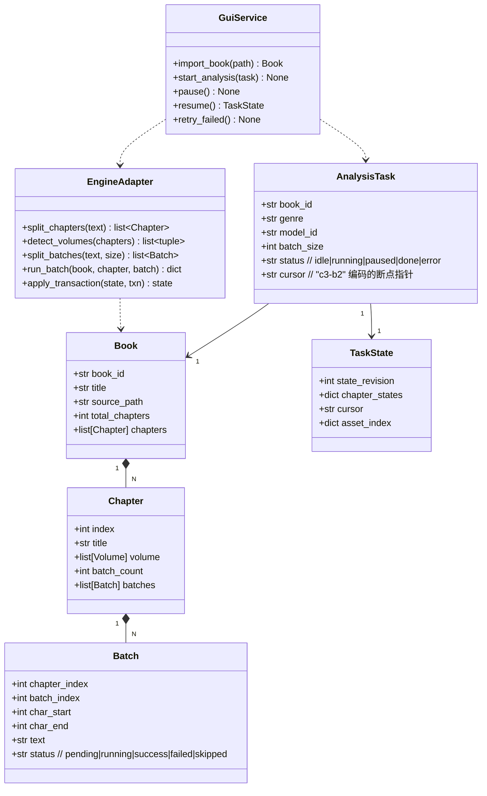
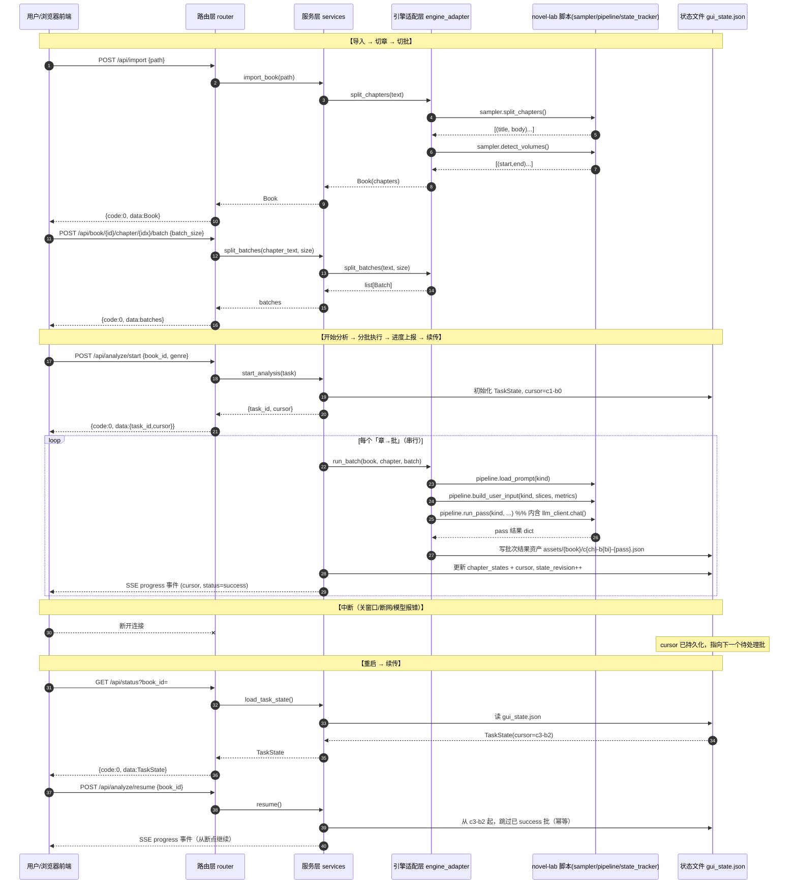

# 系统设计 — novel-lab 书籍分析 GUI 工具

> 架构师：高见远
> 上游输入：`docs/PRD_gui_book_analyzer.md`（已确定）
> 定位：novel-lab CLI 的「可视化外壳 / GUI 前端层」，后端引擎全保留，GUI 仅调用 + 展示。

---

## 0. 设计总览

```
浏览器前端 (Vite + React + MUI + Tailwind + TanStack Virtual)
        │  HTTP (localhost:8000)  —— REST + SSE 进度推送
        ▼
GUI 后端服务 (Python 标准库 http.server，零第三方依赖)
        │  同进程 import（不 subprocess，不传 CLI）
        ▼
novel-lab 后端引擎 (纯标准库，零改动)
  sampler.py · pipeline.py · state_tracker.py · llm_client.py · model_config.py
```

**一句话架构**：前端只跟「GUI 桥接层」的一个 REST API 说话；桥接层在**同一进程**内 `import` novel-lab 的脚本模块并直接调函数；状态持久化沿用 `state_tracker` 的 JSON 权威层方案，新增一份「GUI 任务状态文件」描述「章×批」进度。

---

## 1. 实现方案 + 框架选型

### 1.1 核心难点与决策

| 难点 | 决策 | 理由 |
|---|---|---|
| 后端不能违反「纯标准库零第三方依赖」三铁律 | GUI 后端用 `http.server` + `ThreadingHTTPServer`，只 `import` 标准库 + 已有脚本 | PRD 已定；前端是独立层，不受铁律约束 |
| 前端长文本渲染（10 万字级章） | TanStack Virtual 无头虚拟化 + 动态行高 | 无头、支持动态尺寸，最适合正文流 |
| 整本书无法一次性塞上下文 | 双层切分：章（复用 sampler）+ 批（新增薄封装，默认 ≤4000 字符可配置） | 与 PRD Q1 一致 |
| 断点精确到「第几章第几批」 | 复用 `state_tracker` 的 JSON 权威层思路 + 新增 GUI 任务状态文件 | 与现有架构一致，避免 SQLite 依赖 |
| 进度实时推送 | SSE（Server-Sent Events）长连接，标准库 `http.server` 自带分块写能力 | 无 WebSocket 依赖，前端 `EventSource` 原生支持 |

### 1.2 进程模型：import 直调 vs subprocess 调 CLI

**结论：GUI 后端采用「同进程 import 直调」，不用 subprocess 调 novel.py CLI。**

| 维度 | import 直调（采用） | subprocess 调 CLI（否决） |
|---|---|---|
| 进度粒度 | 可在每个「批」完成后回调，精细到批 | 只能拿子进程 stdout 解析，粒度粗 |
| 断点续传 | 内存中直接读写状态文件，事务可控 | 每次重启子进程，状态同步难 |
| 错误处理 | Python 异常直接捕获、结构化返回 | 只能解析退出码 + 文本 |
| 三铁律 | 均零依赖，两者都合规 | 合规，但体验差 |
| 性能 | 无进程启动开销，LLM 调用期间可复用线程 | 每个批/每命令都要 fork 一次 |
| 代价 | 需处理 `sys.path` 与模块缓存（见 1.4） | 无 |

**关键取舍**：`pipeline.py` 是 CLI 脚本而非纯函数库，`run_pass()` 内部 `print` 且 `main()` 是端到端编排。GUI 需要的是**更细粒度**的「单章单批分析」，因此 GUI 桥接层**不复用 `pipeline.main()` 的整书编排**，而是复用它的**原子函数**：

- 复用：`pipeline.load_prompt()` / `pipeline.build_user_input()` / `pipeline.run_pass()` / `pipeline.extract_json()` / `pipeline.assemble_voice_card_v2()` / `pipeline.assemble_obs()`。
- 不复用：`pipeline.main()` 的「整本书一次性采样→量化→五遍扫描→组装」主流程（因为它没有章/批粒度，无法中断续传）。

### 1.3 架构模式

- 后端：**分层** `HTTP 路由层 → 服务层 → 引擎适配层(engine adapter)`。路由层只管 HTTP 解析/序列化；服务层做业务编排（导入/切批/分析/续传）；适配层是唯一 import novel-lab 脚本的薄封装，隔离「脚本模块副作用」。
- 前端：**React 函数组件 + Hooks + Context**（轻量，不引入 Redux），`AppState` Context 管理「书/章节/批次/任务进度」全局态，配合 `EventSource` 订阅进度。

### 1.4 脚本 import 的工程处理（重要）

novel-lab 的 `scripts/` 下模块用「`import sampler`」这种扁平名（见 `pipeline.py` 第 30 行 `import sampler`），依赖 `sys.path` 里先有 `scripts/`。GUI 桥接层启动时必须：

```python
import sys
from pathlib import Path
SCRIPTS = Path(__file__).resolve().parent.parent / "scripts"
if str(SCRIPTS) not in sys.path:
    sys.path.insert(0, str(SCRIPTS))
```

并注意：`sampler`、`llm_client`、`state_tracker` 等脚本在被 import 时**只定义函数、不在顶层执行副作用**（已确认源码：顶层仅有常量/正则/`if __name__ == "__main__"`），可安全 import。

---

## 2. 文件列表（GUI 层新增，相对路径基于 novel-lab 根目录）

### 2.1 后端（纯标准库，零第三方依赖）

| 相对路径 | 职责 |
|---|---|
| `gui/__init__.py` | 包标记 |
| `gui/server.py` | HTTP 服务入口：起 `ThreadingHTTPServer`、挂路由、自动弹浏览器、优雅停机 |
| `gui/router.py` | REST 路由表 + 请求分发 + JSON 序列化 + 统一错误码 |
| `gui/services.py` | 服务层业务编排：导入/切批/分析/续传/进度状态机 |
| `gui/engine_adapter.py` | 引擎适配层：唯一 import `sampler`/`pipeline`/`state_tracker`/`llm_client` 的地方，处理 `sys.path` |
| `gui/state_store.py` | GUI 任务状态文件（`gui_state.json`）的读写：章×批状态、断点指针、资产索引 |
| `gui/sse.py` | SSE 进度推送工具：`text/event-stream` 分块响应封装 |
| `gui/launch.py` | 启动脚本（`python gui/launch.py`）：解析端口、起 server、`webbrowser.open` |
| `gui/config.py` | GUI 自有配置（端口、批次大小、静态目录）读取，复用 `scripts/model_config.py` 的模型配置 |

### 2.2 前端（独立层，可自由引第三方）

| 相对路径 | 职责 |
|---|---|
| `gui/web/package.json` | 前端依赖声明 + 脚本 |
| `gui/web/vite.config.ts` | Vite 配置：dev 代理到 8000，build 产物到 `gui/web/dist` |
| `gui/web/tsconfig.json` | TS 编译配置 |
| `gui/web/tailwind.config.ts` | Tailwind 配置 |
| `gui/web/index.html` | 前端入口 HTML |
| `gui/web/src/main.tsx` | React 挂载入口 |
| `gui/web/src/App.tsx` | 应用根组件：布局 + 路由 |
| `gui/web/src/api/client.ts` | REST/SSE 客户端封装（fetch + EventSource） |
| `gui/web/src/types.ts` | 前端类型定义（对齐后端 JSON schema） |
| `gui/web/src/state/AppContext.tsx` | 全局状态 Context（书/章节/批次/任务） |
| `gui/web/src/components/ImportPanel.tsx` | 导入面板（拖拽/选文件） |
| `gui/web/src/components/ChapterList.tsx` | 章节列表面板（卷→章→批，状态徽标） |
| `gui/web/src/components/ReaderPanel.tsx` | 内容阅读器（TanStack Virtual 虚拟滚动） |
| `gui/web/src/components/ProgressPanel.tsx` | 分析进度面板（总进度条 + 章×批矩阵） |
| `gui/web/src/components/ControlBar.tsx` | 控制条（开始/暂停/继续/重试） |
| `gui/web/src/components/ResultPanel.tsx` | 分析结果面板（资产 JSON 渲染，P1 扩展） |
| `gui/web/src/index.css` | 全局样式 + Tailwind 指令 |

> 说明：后端托管 `gui/web/dist`（预构建产物）作为静态目录；`launch.py` 检测 `dist` 不存在时提示「先 `npm run build` 或用 dev 模式」。

---

## 3. 数据结构与接口

### 3.1 核心数据模型（类图）



### 3.2 批次 ID 编码规则（跨文件约定）

- 章节 `index`：从 1 开始（与 `sampler.split_chapters` 的输出序一致，`第N章`）。
- 批次 `batch_index`：从 0 开始。
- 断点指针 `cursor` 编码为字符串 `"c<chapter_index>-b<batch_index>"`，例如 `"c3-b2"` 表示「第 3 章第 3 批（batch_index=2）」。
- 完整批次 ID 编码：`"c{chapter}-b{batch}"` 作为 `chapter_states` 的 key。

### 3.3 GUI 任务状态文件（`gui_state.json`，权威续传层）

```json
{
  "schema_version": 1,
  "book_id": "my-book",
  "title": "我的书",
  "state_revision": 42,
  "cursor": "c3-b2",
  "chapter_states": {
    "c1-b0": {"status": "success", "asset": "assets/my-book/c1-b0-pass1.json", "ts": 1720000000},
    "c1-b1": {"status": "success", "asset": "assets/my-book/c1-b1-pass1.json", "ts": 1720000100}
  },
  "asset_index": {
    "c1": ["c1-b0", "c1-b1"]
  }
}
```

> 与 `state_tracker._tracking-state.json` 的差异：state_tracker 追踪的是**叙事连续性状态**（角色/伏笔/时间线）；GUI 任务状态文件追踪的是**分析进度**（章×批状态 + 断点）。两者职责不同、文件不同，但**都采用「JSON 权威层 + 单调递增 state_revision + 原子写回」同一套协议**，这是对 PRD「沿用 state_tracker JSON 方案」的落实——复用其**设计范式**而非复用其**数据结构**。

### 3.4 API 端点清单

统一响应包裹：`{"code": 0, "data": ..., "message": ""}`，`code != 0` 为错误（见 §7 状态码约定）。

| 方法 | 路径 | 入参 | 出参（data） | 说明 |
|---|---|---|---|---|
| POST | `/api/import` | `{path}` 或 `multipart file` | `Book`（章节列表） | 读 txt → `split_chapters` → 返回章节 |
| GET | `/api/book/<book_id>` | — | `Book` 摘要（章节+批元信息，不含全文） | 恢复会话时拉取 |
| GET | `/api/book/<book_id>/chapter/<idx>` | — | `Chapter`（含全文 + 批切分结果） | 阅读器取正文 |
| POST | `/api/book/<book_id>/chapter/<idx>/batch` | `{batch_size?}` | `list[Batch]`（切批结果） | 切批薄封装，可配置 |
| POST | `/api/analyze/start` | `{book_id, genre, model_id?, batch_size?}` | `{task_id, cursor}` | 开始/重启分析，串行跑 |
| POST | `/api/analyze/pause` | `{book_id}` | `{cursor}` | 暂停（当前批完成后停） |
| POST | `/api/analyze/resume` | `{book_id}` | `{cursor}` | 从中断批续传 |
| POST | `/api/analyze/chapter/<idx>/batch/<bidx>` | `{book_id}` | `{status, result?}` | 手动单批执行（P1 重试用） |
| POST | `/api/analyze/retry-failed` | `{book_id}` | `{retried: int}` | 重试所有失败批 |
| GET | `/api/status` | `?book_id=` | `TaskState`（含 cursor + chapter_states） | 前端拉取/恢复断点 |
| GET | `/api/events` | `?book_id=` | SSE 流：`progress` 事件 | 实时进度推送 |
| GET | `/api/config/models` | — | 已配置模型 + 路由（读 `model_config.py`） | P1 模型配置界面 |

### 3.5 前端数据类型（`types.ts`，对齐后端）

```typescript
type BatchStatus = "pending" | "running" | "success" | "failed" | "skipped";
interface Batch { chapter_index: number; batch_index: number; char_start: number; char_end: number; text: string; status: BatchStatus; }
interface Chapter { index: number; title: string; batch_count: number; batches: Batch[]; }
interface Book { book_id: string; title: string; total_chapters: number; chapters: Chapter[]; }
interface TaskState { state_revision: number; cursor: string; chapter_states: Record<string, {status: BatchStatus; asset?: string; ts: number}>; }
interface ProgressEvent { cursor: string; chapter_index: number; batch_index: number; status: BatchStatus; done: number; total: number; }
```

---

## 4. 程序调用流程（时序图）



---

## 5. 任务列表（有序，可独立验收）

| Task ID | 任务名 | 源文件 | 依赖 | 优先级 | 验收标准 |
|---|---|---|---|---|---|
| T01 | 项目基础设施 | 前端 `package.json`/`vite.config.ts`/`tsconfig.json`/`tailwind.config.ts`/`index.html`/`src/main.tsx`/`src/App.tsx`/`src/index.css`；后端 `gui/__init__.py`/`gui/config.py`/`gui/launch.py` | — | P0 | `python gui/launch.py` 能起服务并自动弹浏览器；`npm run build` 产出 `gui/web/dist`；启动无第三方 import 报错 |
| T02 | 引擎适配层 + 数据模型 | `gui/engine_adapter.py`/`gui/state_store.py`/`gui/services.py`（骨架）/`gui/web/src/types.ts` | T01 | P0 | `engine_adapter.split_chapters` 调用 `sampler` 返回正确章节；`split_batches` 按 `batch_size` 切批；`state_store` 能读写 `gui_state.json` 且原子写 |
| T03 | HTTP 路由 + SSE 进度 | `gui/router.py`/`gui/server.py`/`gui/sse.py`/`gui/services.py`（分析执行）/`gui/web/src/api/client.ts` | T02 | P0 | `POST /api/import` 返回章节；`GET /api/status` 返回 TaskState；`GET /api/events` 能持续推送 progress 事件 |
| T04 | 前端核心组件 | `ImportPanel.tsx`/`ChapterList.tsx`/`ReaderPanel.tsx`/`ProgressPanel.tsx`/`ControlBar.tsx`/`state/AppContext.tsx` | T03 | P0 | 导入后章节列表可点选；ReaderPanel 虚拟滚动流畅渲染 10 万字章；ProgressPanel 展示进度矩阵；控制条能开始/暂停/继续 |
| T05 | 断点续传 + 集成联调 | `gui/state_store.py`（续传逻辑完善）/`gui/services.py`（resume/retry）/`ResultPanel.tsx` | T04 | P0 | 中断后重启 `GET /api/status` 返回正确 cursor；`resume` 从断点继续且跳过已 success 批；失败批可 retry |

> 说明：T02 中的 `services.py` 先建骨架（占位方法），T03 补分析执行，T05 补 resume/retry——避免单文件跨多个任务造成依赖链过长。批次切分薄封装落在 T02（engine_adapter），符合「至少 3 个相关文件/任务」的粒度下限。

---

## 6. 依赖包列表

### 6.1 后端（零第三方依赖，仅标准库）

```
- 标准库：http.server / socketserver / threading / json / urllib / webbrowser / pathlib / sys / re / typing / os
- （无任何 pip 依赖；novel-lab 三铁律满足）
```

### 6.2 前端（npm）

```
- react@^18.3.0          UI 框架
- react-dom@^18.3.0      React 渲染
- vite@^5.4.0            构建/开发服务器
- @vitejs/plugin-react@^4.3.0  React 插件
- typescript@^5.5.0      TS 编译
- @mui/material@^5.16.0  组件库
- @mui/icons-material@^5.16.0  图标
- @emotion/react@^11.13.0  MUI 依赖
- @emotion/styled@^11.13.0  MUI 依赖
- tailwindcss@^3.4.0     原子化样式
- postcss@^8.4.0         Tailwind 依赖
- autoprefixer@^10.4.0   Tailwind 依赖
- @tanstack/react-virtual@^3.10.0  虚拟滚动（长文本渲染）
```

---

## 7. 共享知识（跨文件约定）

- **API 路径前缀**：所有后端接口以 `/api/` 开头；`/api/events` 为 SSE 长连接（不走 JSON 包裹）。
- **响应包裹**：成功 `{"code":0,"data":...,"message":""}`；失败 `code` 取非 0，`message` 为可读错误，`data` 为 null。
- **状态码约定**：`0` 成功；`400` 参数错误；`404` 资源不存在；`500` 内部错误（模型调用失败等）；`409` 状态冲突（stale 事务）。
- **JSON 字段命名**：统一 `snake_case`（`chapter_index`/`batch_index`/`state_revision`），与 novel-lab 后端一致；前端 `types.ts` 用 camelCase 映射时通过 `client.ts` 统一转换，避免两处口径漂移。
- **批次 ID 编码**：`c{chapter_index}-b{batch_index}`（chapter 从 1 起，batch 从 0 起）；断点指针 `cursor` 同格式。
- **断点状态文件**：`gui_state.json`，结构见 §3.3；`state_revision` 单调递增；写回必须**原子**（先写 `.tmp` 再 `os.replace`，对齐 `state_tracker.save_state`）。
- **资产落盘路径**：`assets/{book_id}/c{ch}-b{bi}-{pass}.json`，`asset_index` 记录「章 → 批」映射。
- **串行处理**：首版章内批串行、章间串行（不并发），`threading` 仅用于 HTTP 并发接受请求 + 单工作线程跑分析，避免 token 限流与状态竞争。
- **模型路由**：分析任务透传 `task=pass1_structure` 等给 `llm_client.chat()`，由 `model_config.py` 的路由表选模型；`model_id` 可选覆盖。
- **零依赖铁律边界**：后端 `gui/` 下**禁止** import 任何第三方包；`sys.path` 注入 `scripts/` 由 `engine_adapter.py` 统一负责，其他模块不得再 import novel-lab 脚本。

---

## 8. 待明确事项

| # | 事项 | 影响 | 建议默认值 |
|---|---|---|---|
| A1 | 批次默认切分粒度：按「字符数」还是「token 估算」？ | 决定单批是否超上下文 | 默认 ≤4000 字符（PRD Q1 已定），切批时附 token 估算仅供展示，不做硬截断 |
| A2 | `pipeline.run_pass` 需要整书 `slices` + `metrics`，但 GUI 是「单章单批」粒度，如何构造每个批的输入？ | 核心实现难点 | 每个批的 `build_user_input` 输入**只含该批文本**，`metrics` 用「导入时整书算一次」缓存复用；`run_pass` 的 prompt 模板沿用，但切片参数缩小到单批（需在 engine_adapter 内做轻量适配，不修改 pipeline 源码） |
| A3 | 前端构建产物是否随仓库提交 `dist`？ | 影响用户安装体验（是否需装 Node） | 提交预构建 `dist`，`launch.py` 直接托管；开发者改前端走 `npm run dev` 代理 |
| A4 | 无外部模型时的「AI 接管模式」是否在 GUI 体现？ | 影响首版范围 | P0 仅支持已配置模型；无模型时 `start` 返回明确错误提示走 CLI（PRD Q7 已定） |
| A5 | 端口固定还是动态？ | 多实例冲突 | 默认 8000，被占用则 +1 递增（PRD Q6 已定） |
| A6 | 「批」的分析结果是否需要在批完成后即时组装成 voice-card，还是全部批跑完再组装？ | 影响资产组装时机 | 首版：每个批只存 `pass` 原始结果 JSON；整本书全批完成后再统一走 `assemble_voice_card_v2` 组装（与 pipeline 组装逻辑一致，避免批级组装不一致） |
| A7 | 多本书是否同时存在多个 `gui_state.json`？ | 影响状态文件命名 | 每本书一个状态文件 `gui_state_{book_id}.json`，`book_id` 由书名 + hash 生成 |

---

## 9. 任务依赖图


---

*文档结束。本设计遵循「简洁优先 + 复用优先」，聚焦让工程师能按 T01→T05 顺序独立验收每个任务。*
