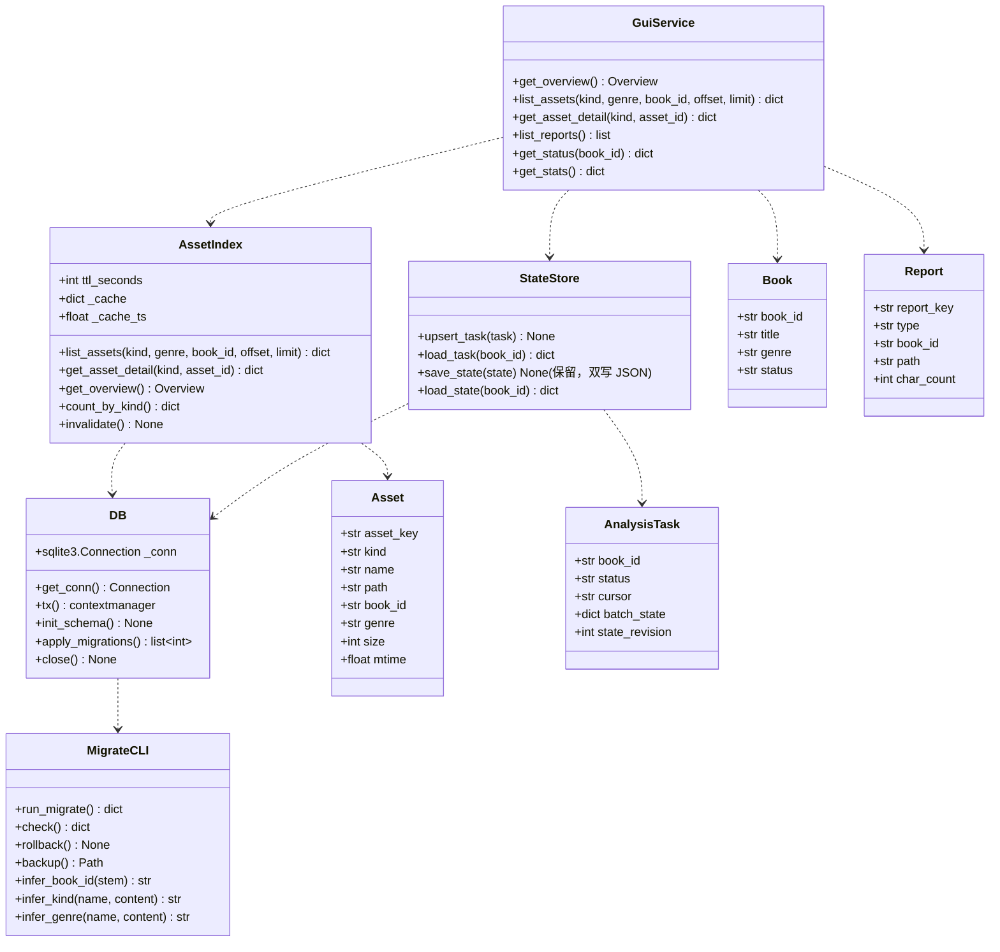
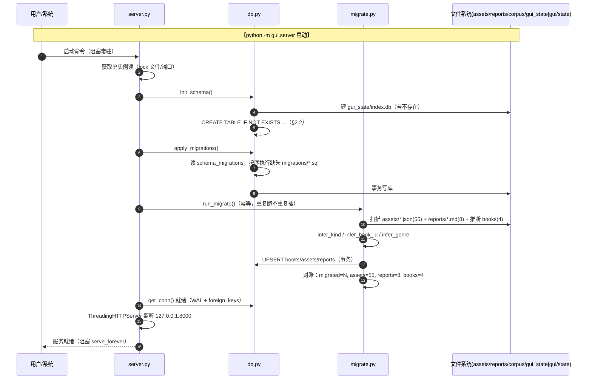
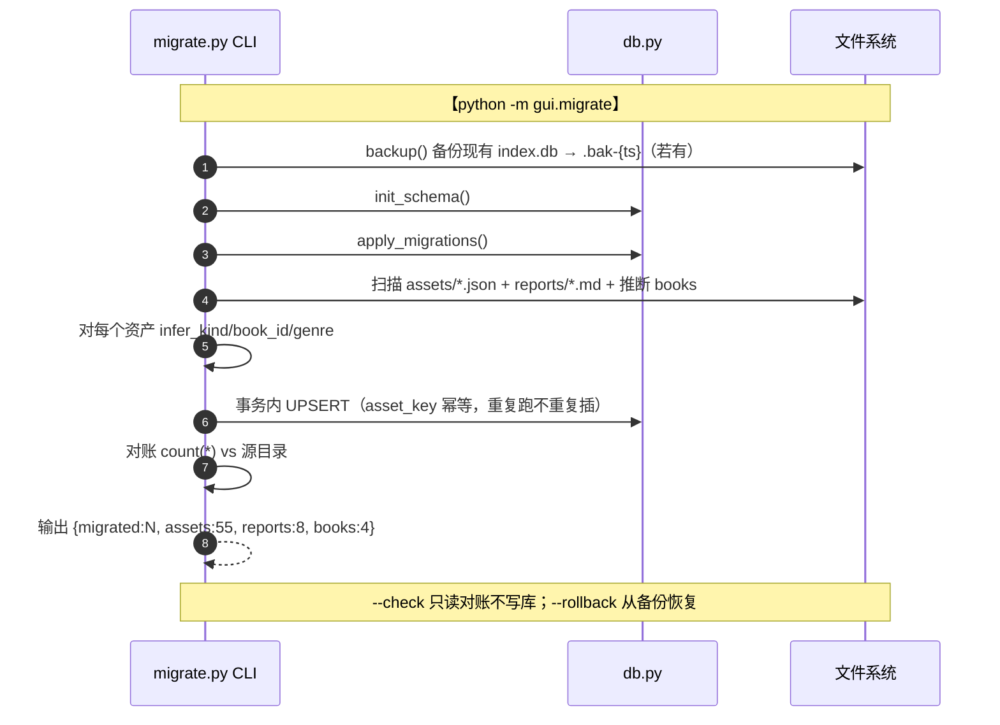
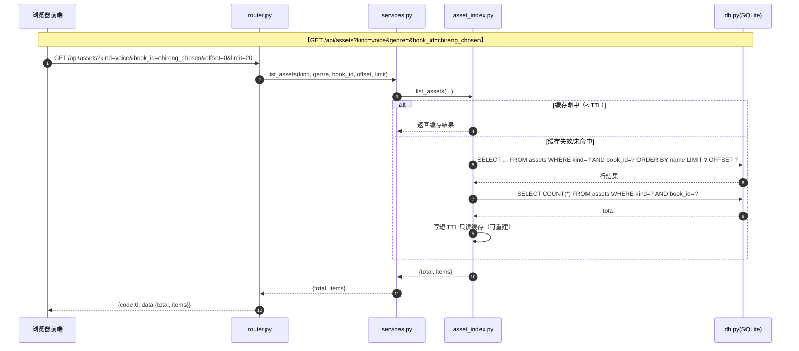

# 增量系统设计 — novel-lab GUI 数据持久化 + 稳定性 + 可维护性升级

> 架构师：高见远
> 上游输入：`docs/PRD_gui_persistence.md`（增量 PRD，已定稿）+ `docs/PRD_gui_workbench.md` + `docs/DESIGN_gui_workbench.md`（阶段一）
> 定位：在阶段一「全功能可视化工作台」的分层（路由 → 服务 → 资产索引）之上，把数据层从「内存扫描 + 散落 JSON」升级为「SQLite 关系索引 + 版本化迁移 + 常驻服务」。
> 本文只描述**变更部分**，不重复阶段一已定的拆书主链路、前端可视化、API 契约。

---

## 0. 变更摘要（一句话）

在保留「纯标准库 `http.server` 后端 + Vite/React 前端 + `import` 直调复用脚本原子函数」范式不变的前提下，新增 **SQLite 持久化层（`gui/db.py` + `gui/migrations/`）**、**幂等迁移 CLI（`gui/migrate.py`）**、**改造 `asset_index` 由内存扫描改为 SQL 查询为主**、**分析进度落库**、**常驻入口 + 单实例锁 + 自启脚本**，实现「稳定持久 + 可统计扩展 + AI 易维护」三目标，老数据（55 资产 + 8 报告 + 4 书）无损迁移。

---

## 1. 实现方案 + 技术选型

### 1.1 核心难点与决策

| 难点 | 决策 | 理由 |
|---|---|---|
| 铁律三：后端禁用第三方包 | 只用 Python 标准库 `sqlite3`，**不引入 ORM**（SQLAlchemy/peewee 都是第三方） | `sqlite3` 是标准库，天然合规；ORM 是 pip 依赖，违反铁律三 |
| 连接管理 | 封装 `DB` 连接管理类：进程级单连接 + `check_same_thread=False` + 每请求 `with` 语句取游标 + WAL 模式 | `http.server` 的 ThreadingHTTPServer 多线程并发，SQLite 默认连接绑定创建线程；`check_same_thread=False` 让单连接跨线程共享，靠 SQLite 自身锁串行化写；WAL 提升并发读写 |
| 写并发/双写冲突 | 单实例锁（P1）+ SQLite 事务 + WAL | 事务保证原子性；单实例锁避免多进程同时写同一 `index.db` 导致 `database is locked` |
| 资产 JSON 大字段不落库 | SQLite 只存「索引 + 元数据 + 关系」，`content` 仍按 `path` 读原 JSON | PRD 4.3 明确；避免库膨胀，保持「单文件小库 + 实体文件」分离 |
| kind 靠文件名后缀硬编码（痛点 2） | kind 从代码常量改为**数据字段**，但保留**白名单校验**（防路径穿越）；迁移时用「文件名 + JSON 内容」双重推断 | `trope-library.json`、`genre-prose-card-index.json` 无卡片后缀，仅靠文件名无法识别，必须读 JSON 内容判断结构 |
| schema 版本化 | `schema_migrations` 表记录已执行迁移版本，启动时按 `migrations/*.sql` 文件名序号顺序执行缺失迁移 | PRD P0-13/14/15；迁移幂等 + 事务 |
| 缓存失效 | SQLite 为权威，`list_assets` 高频场景加**短 TTL 只读缓存**（内存），但缓存可重建、权威是 SQLite | 主理人 Q2 拍板；缓存仅提速 |
| 分析进度易失（痛点 3） | `analysis_tasks` 表落库（cursor/batch_state/status），`gui/state/*.json` 保留作降级副本双写 | 主理人 Q4 拍板；SQLite 权威，JSON 可读可备份。**L2**：JSON 副本目录独立为 `gui/state/`，保留运行时降级写能力；该目录**不入库**（SQLite 派生镜像，2026-09-11 裁决） |
| 开机自启 | Windows 任务计划为主 + 启动文件夹 `.bat` 备用 | 主理人 Q6 拍板 |
| 全文检索 | P2 本期 `LIKE` 模糊，FTS5 后续再开 | 主理人 Q7 拍板 |

### 1.2 分层扩展（增量，不改范式）

```
浏览器前端 (Vite + React + MUI + Tailwind + ECharts)
        │  HTTP REST + SSE（沿用阶段一，API 契约不变）
        ▼
GUI 后端（纯标准库）
  路由层 router.py          —— ✏️ 新增筛选参数 genre/book_id；新增迁移状态端点
  服务层 services.py        —— ✏️ get_overview/list_assets 改走 SQL；新增统计查询
  资产索引 asset_index.py   —— ✏️ 由「内存扫描」改为「SQLite 查询为主 + 文件扫描为迁移/增量同步源」
  持久化层 db.py            —— 🆕 连接管理 + schema 初始化 + 迁移执行（纯 sqlite3）
  迁移 CLI migrate.py       —— 🆕 python -m gui.migrate（执行/对账/回滚）
  引擎适配 engine_adapter.py ——（不改，仍唯一 import scripts/）
        │  同进程 import
        ▼
novel-lab 脚本（纯标准库，零改动）
```

**关键分层边界**（沿用阶段一，强化）：
- `gui/db.py` 是唯一 import `sqlite3` 并接触 `.db` 文件的地方。
- `asset_index.py` 改为「读 SQLite」而非「扫目录」；目录扫描逻辑**下沉到 `migrate.py` 与 `db.py` 的 sync 函数**，作为「实体文件 → 索引」的唯一来源。
- `engine_adapter.py` 仍唯一 `import scripts/`，`asset_index.py`/`db.py` 不得 import 脚本。

### 1.3 连接管理与事务策略（纯 sqlite3）

```python
# gui/db.py 核心设计（伪代码，示意连接/事务/WAL）
import sqlite3
DB_PATH = config.STATE_ROOT / "index.db"   # Q1：gui_state/index.db（运行时目录）
# 注：状态 JSON 副本另置 config.STATE_JSON_DIR = ROOT_DIR / "gui" / "state"（L2 分离；不入库，SQLite 派生镜像）

_conn: sqlite3.Connection | None = None

def get_conn() -> sqlite3.Connection:
    """进程级单连接；check_same_thread=False 允许多线程共享；
    row_factory 返回 dict-like；开 WAL + busy_timeout。"""
    global _conn
    if _conn is None:
        _conn = sqlite3.connect(DB_PATH, check_same_thread=False)
        _conn.row_factory = sqlite3.Row
        _conn.execute("PRAGMA journal_mode=WAL")
        _conn.execute("PRAGMA foreign_keys=ON")
        _conn.execute("PRAGMA busy_timeout=5000")
    return _conn

@contextmanager
def tx():
    """事务上下文：提交/回滚。写路径统一走这里。"""
    conn = get_conn()
    try:
        yield conn
        conn.commit()
    except Exception:
        conn.rollback()
        raise
```

- **读**：`get_conn().execute(sql, params).fetchall()`，无事务，SQLite 读锁 + WAL 下读写不互斥。
- **写**：所有写操作包在 `with tx():` 内；迁移每条 SQL 在单事务内执行，失败回滚。
- **优雅关闭**：`server.shutdown()` 时调用 `db.close()`，`PRAGMA wal_checkpoint(TRUNCATE)` 刷盘。

---

## 2. 数据库 schema 设计（本次核心）

### 2.1 表清单总览

| 表名 | 用途 | 关系 |
|---|---|---|
| `schema_migrations` | 已执行迁移版本登记 | — |
| `books` | 已拆/已导入书元数据 | 1—N assets / reports / analysis_tasks |
| `assets` | 资产实体索引 + 元数据 + 关系 | N—1 books（可空） |
| `reports` | 报告实体索引 + 类型 | N—1 books |
| `analysis_tasks` | 分析进度/断点/batch_state | N—1 books |
| `genres` | 题材字典表（题材名标准化 + 计数统计） | 1—N assets |

> `genres` 表作为**轻量字典/统计表**，不强制外键（题材是可扩展自由文本，但需白名单/标准化），避免外键过严导致迁移失败。

### 2.2 CREATE TABLE SQL（具体可落地）

```sql
-- 0001_init.sql（版本化迁移文件，实际内容见 gui/migrations/0001_init.sql）
PRAGMA foreign_keys = ON;

CREATE TABLE IF NOT EXISTS schema_migrations (
    version      INTEGER PRIMARY KEY,        -- 迁移版本号 = 文件名序号
    name         TEXT    NOT NULL,           -- 迁移名（如 0001_init）
    applied_at   TEXT    NOT NULL DEFAULT (datetime('now'))  -- 执行时间（UTC）
);

CREATE TABLE IF NOT EXISTS books (
    id            INTEGER PRIMARY KEY AUTOINCREMENT,
    book_id       TEXT    NOT NULL UNIQUE,   -- 稳定业务 ID（如 chireng_chosen）
    title         TEXT    NOT NULL,          -- 书名（可等于 book_id）
    source_path   TEXT,                      -- 源 txt 路径（相对 ROOT_DIR，可空=仅从报告/资产推断）
    genre         TEXT,                      -- 题材（标准化的 genre key，如 campus-redemption）
    status        TEXT    NOT NULL DEFAULT 'idle',  -- idle/imported/done/error
    imported_at   TEXT,                      -- 导入时间 ISO8601
    updated_at    TEXT
);
CREATE INDEX IF NOT EXISTS idx_books_genre ON books(genre);

CREATE TABLE IF NOT EXISTS assets (
    id            INTEGER PRIMARY KEY AUTOINCREMENT,
    asset_key     TEXT    NOT NULL UNIQUE,   -- 幂等主键：稳定逻辑 ID（见 §5.3 推断规则）
    kind          TEXT    NOT NULL,          -- 白名单：voice|structure|commercial|craft|genre_pack|prose_card|trope
    name          TEXT    NOT NULL,          -- 显示名（文件名 stem 或 meta.name）
    path          TEXT    NOT NULL UNIQUE,   -- 相对 ROOT_DIR 的实体文件路径（如 assets/xxx.json）
    book_id       TEXT,                      -- 外键 → books.book_id（可空：题材卡/trope/索引 无归属书）
    genre         TEXT,                      -- 题材（从 meta.genre 或文件名推导）
    size          INTEGER,                   -- 字节数
    mtime         REAL,                      -- 文件修改时间（epoch）
    meta_json     TEXT,                      -- 资产 meta 摘要（小字段，非完整 content）
    created_at    TEXT NOT NULL DEFAULT (datetime('now')),
    updated_at    TEXT
);
CREATE INDEX IF NOT EXISTS idx_assets_kind   ON assets(kind);
CREATE INDEX IF NOT EXISTS idx_assets_book   ON assets(book_id);
CREATE INDEX IF NOT EXISTS idx_assets_genre  ON assets(genre);
-- path 已 UNIQUE（幂等 + 定位详情），无需另建唯一索引。

CREATE TABLE IF NOT EXISTS reports (
    id            INTEGER PRIMARY KEY AUTOINCREMENT,
    report_key    TEXT    NOT NULL UNIQUE,   -- 幂等主键：{book_id}:{type}
    type          TEXT    NOT NULL,          -- book（拆书报告）| craft（笔法分析）
    book_id       TEXT,                      -- 外键 → books.book_id
    path          TEXT    NOT NULL UNIQUE,   -- 相对 ROOT_DIR 路径
    title         TEXT,
    char_count    INTEGER,                   -- 字数（用于铁律二 ≥10000 校验统计）
    created_at    TEXT NOT NULL DEFAULT (datetime('now'))
);
CREATE INDEX IF NOT EXISTS idx_reports_book ON reports(book_id);
CREATE INDEX IF NOT EXISTS idx_reports_type ON reports(type);

CREATE TABLE IF NOT EXISTS analysis_tasks (
    id            INTEGER PRIMARY KEY AUTOINCREMENT,
    book_id       TEXT    NOT NULL UNIQUE,   -- 一本一个进行中任务（1 对 1，见 PRD 4.2）
    status        TEXT    NOT NULL DEFAULT 'idle',  -- pending/running/paused/done/error
    genre         TEXT,
    model_id      TEXT,
    batch_size    INTEGER,
    cursor        TEXT    NOT NULL DEFAULT '',       -- 断点 c{ch}-b{bi}
    batch_state   TEXT    NOT NULL DEFAULT '{}',     -- JSON：章×批状态摘要（chapter_states）
    state_revision INTEGER NOT NULL DEFAULT 0,       -- 单调递增（对齐 state_store 范式）
    last_error    TEXT,
    created_at    TEXT NOT NULL DEFAULT (datetime('now')),
    updated_at    TEXT
);
CREATE INDEX IF NOT EXISTS idx_tasks_status ON analysis_tasks(status);

CREATE TABLE IF NOT EXISTS genres (
    id            INTEGER PRIMARY KEY AUTOINCREMENT,
    name          TEXT    NOT NULL UNIQUE,   -- 标准化题材名（campus-redemption / genre-xuanhuan）
    display_name  TEXT,                      -- 展示名（校园救赎 / 传统玄幻）
    kind          TEXT,                      -- 题材来源 kind，枚举：genre_pack / prose_card / book
    created_at    TEXT NOT NULL DEFAULT (datetime('now'))
);
```

> **`genres.kind` 写入契约（L1 修复）**：该列**只允许** `genre_pack` / `prose_card` /
> `book` 三个枚举值。写入走 `migrate._upsert_genre`，规则为「**题材包优先**」：
> 1. 入参资产 kind 先过 `_sanitize_genre_kind`——非枚举值（`voice`/`commercial`/
>    `craft`/`structure`/`trope`）一律置为 `NULL`，**既不写入也不覆盖**已有值。
> 2. UPSERT 的 UPDATE 分支带 `WHERE` 优先级裁决：仅当新值优先级**严格更高**时才覆盖
>    （`genre_pack(3) > book(2) > prose_card(1) > NULL(0)`）。故同一题材被多个资产
>    （题材包 + 多张蒸馏卡）逐个 UPSERT 时，**题材包的 `genre_pack` 最终胜出**，
>    绝不会被后续 `voice` 等覆盖（L1 根因：旧 `COALESCE(excluded.kind, genres.kind)`
>    的后写覆盖让 `campus-redemption` 落成 `voice`）。

### 2.3 关键字段说明

| 字段 | 说明 | 备注 |
|---|---|---|
| `assets.kind` | **白名单**：`voice`/`structure`/`commercial`/`craft`/`genre_pack`/`prose_card`/`trope` | 白名单定义集中在 `gui/asset_index.py` 顶部常量 `ASSET_KINDS`，`db.py` 引用同一份，**单一来源** |
| `assets.asset_key` | 幂等主键，迁移/同步唯一标识 | 规则见 §5.3：`{book_id}:{kind}:{suffix}` 或 `{kind}:{stem}` |
| `assets.path` | **相对化**（相对 `ROOT_DIR`，如 `assets/chireng_chosen-voice-card.json`） | 不暴露绝对路径；`UNIQUE` 保证不重复 |
| `assets.book_id` | 外键 → `books.book_id`，**可空** | 题材文风卡/trope/索引无归属书；4 本书的卡有归属 |
| `assets.genre` | 题材 key | 从 `meta.genre` 或文件名 `genre-xxx` 段提取 |
| `assets.meta_json` | 资产 `meta` 子对象的 JSON 字符串（摘要，非完整 content） | 避免塞大字段；详情仍按 `path` 读原 JSON |
| `reports.type` | `book`（拆书报告）| `craft`（笔法分析） | 对应文件名 `-拆书报告.md`/`-笔法分析.md` |
| `reports.char_count` | 字数 | 支撑铁律二「两份报告合计 ≥10000」统计 |
| `analysis_tasks.batch_state` | `chapter_states` 的 JSON 序列化 | 替代进程内 `_runtime` 的易失部分，重启可恢复 |
| `analysis_tasks.cursor` | 断点 `c{ch}-b{bi}` | 与 `state_store.batch_id` 编码一致 |

### 2.4 索引设计（查询驱动）

| 索引 | 支撑查询 |
|---|---|
| `assets(kind)` | `list_assets?kind=` 筛选（P0-17） |
| `assets(book_id)` | 「某书产出了哪些资产」（P0-4/18） |
| `assets(genre)` | 「某题材有多少卡片」（P0-18） |
| `assets.path UNIQUE` | 幂等去重 + 详情定位 + 增量同步 diff |
| `books(book_id UNIQUE)` | 书 → 资产/报告/任务关联 |
| `reports(book_id)` / `reports(type)` | 「某书关联哪些报告」/ 报告类型筛选 |
| `analysis_tasks(book_id UNIQUE)` | 一本一任务，断点续传读取 |
| `genres(name UNIQUE)` | 题材计数统计去重 |

---

## 3. 文件列表（相对路径，基于 novel-lab 根目录）

> 标注：🆕 新增；✏️ 修改。

### 3.1 后端（纯标准库，零第三方依赖）

| 相对路径 | 状态 | 职责 |
|---|---|---|
| `gui/db.py` | 🆕 | SQLite 连接管理 + schema 初始化 + 迁移执行 + `sync_*` 目录→库同步函数 |
| `gui/migrations/0001_init.sql` | 🆕 | 初始化 schema（§2.2 的建表 SQL） |
| `gui/migrate.py` | 🆕 | 迁移 CLI：`python -m gui.migrate`（执行 / `--check` 对账 / `--rollback` 回滚 / `--backup` 备份） |
| `gui/asset_index.py` | ✏️ | 由「内存扫描」改为「SQLite 查询为主 + 短 TTL 只读缓存」；`kind` 读库；保留 `list_assets`/`get_asset_detail`/`get_overview` 接口契约 |
| `gui/services.py` | ✏️ | `get_overview`/`list_assets`/`list_reports` 改走 SQL；新增统计查询；`get_status` 改读 `analysis_tasks` |
| `gui/state_store.py` | ✏️ | 分析进度双写：SQLite（权威）+ `gui/state/*.json`（降级副本，L2 分离）；新增 `upsert_task`/`load_task`、`resolve_state_path`（兼容旧 `gui_state/` 位置） |
| `gui/router.py` | ✏️ | `/api/assets` 增加 `genre`/`book_id` 筛选参数；新增 `/api/stats`（关系统计，P1） |
| `gui/config.py` | ✏️ | 新增 `DB_PATH = STATE_ROOT / "index.db"` 常量 |
| `gui/server.py` | ✏️ | 常驻入口（`python -m gui.server` 阻塞运行）+ 单实例锁 + 优雅关闭刷盘 |
| `gui/autostart/install_task.bat` | 🆕 | Windows 任务计划注册脚本（P1） |
| `gui/autostart/uninstall_task.bat` | 🆕 | 卸载开机自启（P1） |
| `gui/autostart/start_gui.bat` | 🆕 | 启动文件夹备用启动脚本（P1） |
| `tests/test_db.py` | 🆕 | schema/迁移/幂等/事务单测 |
| `tests/test_migrate.py` | 🆕 | 迁移 CLI 集成测试（幂等 + 对账） |

### 3.2 前端（本次可零改动）

| 相对路径 | 状态 | 说明 |
|---|---|---|
| （无新增） | — | API 契约（`/api/overview`、`/api/assets` 返回结构）保持不变，前端零改动；`/api/assets` 新增的 `genre`/`book_id` 参数为**可选**，前端按需后续接入 |

### 3.3 文档

| 相对路径 | 状态 | 职责 |
|---|---|---|
| `docs/DESIGN_gui_persistence.md` | 🆕 | 本文档 |

---

## 4. 数据结构和接口

### 4.1 核心类/函数签名（类图）



### 4.2 关键接口签名（伪代码）

```python
# ---- gui/db.py ----
def get_conn() -> sqlite3.Connection: ...
def tx() -> "contextmanager": ...
def init_schema() -> None: ...                    # 建 schema_migrations + 各表（幂等 CREATE IF NOT EXISTS）
def apply_migrations() -> list[int]: ...          # 按序执行 migrations/*.sql 缺失版本，返回已执行版本列表
def close() -> None: ...                          # wal_checkpoint + close

# ---- gui/migrate.py ----
def run_migrate() -> dict: ...                    # 建库→迁移→扫描实体→建索引→对账，返回 {"migrated":N,"assets":55,"reports":8,"books":4}
def check() -> dict: ...                          # 只读对账：库 vs 源目录 diff，返回缺失/多余清单
def rollback() -> None: ...                       # 从备份恢复 index.db
def backup() -> Path: ...                         # 备份现有 index.db 为 index.db.bak-{ts}
def infer_book_id(stem: str) -> str | None: ...   # 从文件名反推 book_id
def infer_kind(name: str, content: dict) -> str | None: ...  # 文件名 + JSON 内容 → kind
def infer_genre(name: str, content: dict) -> str | None: ... # meta.genre / 文件名 genre-xxx / meta.id 的 genre- 前缀

# ---- gui/asset_index.py（改造后） ----
ASSET_KINDS = ("voice", "structure", "commercial", "craft", "genre_pack", "prose_card", "trope")
def list_assets(kind=None, genre=None, book_id=None, offset=0, limit=50) -> dict: ...  # SQL WHERE + LIMIT/OFFSET
def get_asset_detail(kind, asset_id) -> dict: ...  # 读库取 path，再读原 JSON（白名单校验）
def get_overview() -> dict: ...                    # SQL 聚合 COUNT(*)
def count_by_kind() -> dict: ...                   # SELECT kind, COUNT(*) GROUP BY kind

# ---- gui/services.py（改造后） ----
def get_overview() -> dict: ...
def list_assets(kind=None, genre=None, book_id=None, offset=0, limit=50) -> dict: ...
def get_stats() -> dict: ...                       # P1 关系统计：书→资产/报告计数、题材→卡片计数
def get_status(book_id=None) -> dict: ...          # 改读 analysis_tasks 表

# ---- gui/state_store.py（改造后） ----
def upsert_task(task: dict) -> None: ...           # SQLite 权威写 + JSON 降级副本双写
def load_task(book_id: str) -> dict: ...           # 优先 SQLite，缺失回退 JSON
```

---

## 5. 程序调用流程（时序图）

### 5.1 启动初始化流程（建库 → 迁移 → 建索引 → 服务监听）



### 5.2 迁移流程（幂等 + 备份 + 对账）



### 5.3 一次 list_assets 查询流程（SQL 为主 + 短 TTL 缓存）



---

## 6. 迁移策略（关键，老数据无损）

### 6.1 源数据现状（以实际目录为准）

| 数据 | 实际数量 | 迁移后应保持 |
|---|---|---|
| 资产 JSON（`assets/*.json` 平铺） | 55 | 55 全部被索引命中 |
| 报告（`reports/*.md`） | 8 | 8 |
| 已拆书（`corpus/*.txt` 中 4 本 + `*_chosen` 前缀） | 4（chireng_chosen/qingning_chosen/sangshi_chosen/suyixinjian_chosen） | 4 |
| 题材文风卡（`genre-prose-card-genre-*`） | 32 | 32 |
| 题材包（`*-genre-pack.json`） | 1（campus-redemption） | 1 |
| 非卡片资产 | 2（trope-library.json / genre-prose-card-index.json） | 2 |
| 书卡（`*_chosen-*-card/-obs`） | 4 书 × 4 = 16 | 16 |

> 口径（实测）：55 = 16（书卡）+ 4（campus-redemption 蒸馏卡：voice/structure/commercial/craft，跨书蒸馏产物）+ 32（题材文风卡）+ 1（题材包 campus-redemption-genre-pack）+ 2（非卡片：trope-library / genre-prose-card-index）= **55**。按 `kind` 分布实测为 `commercial=5 / craft=5 / structure=5 / voice=5 / prose_card=32 / trope=2 / genre_pack=1`（合计 55；书卡 4×4 与蒸馏卡 4 合并为 voice/structure/commercial/craft 各 5）。**对账以实际扫描为准，不硬编码数字**（PRD §5 明确）。

### 6.2 kind 推断规则（文件名 + JSON 内容双重，解决痛点 2）

迁移时对每个 `assets/*.json` 执行 `infer_kind(name, content)`，优先级从高到低：

| 优先级 | 判定规则 | kind | 命中示例 |
|---|---|---|---|
| 1 | 文件名含 `trope-library` 且 content 含 `tropes` 键 | `trope` | `trope-library.json`（**非卡片**，靠内容识别） |
| 2 | 文件名含 `genre-prose-card-index` 且 content 含 `cards` 键 | `trope`（或单列 `index`，本期归 `trope` 类「其他」） | `genre-prose-card-index.json`（**非卡片**） |
| 3 | 文件名含 `genre-prose-card-` 且 content 含 `meta.kind == "genre-prose-card"` | `prose_card` | `genre-prose-card-genre-xuanhuan.json` |
| 4 | 文件名后缀 `-voice-card` / `-voice-card-distilled` | `voice` | `chireng_chosen-voice-card.json` |
| 5 | 文件名后缀 `-structure-obs` / `-structure-obs-distilled` | `structure` | `chireng_chosen-structure-obs.json` |
| 6 | 文件名后缀 `-commercial-obs` / `-commercial-obs-distilled` | `commercial` | `chireng_chosen-commercial-obs.json` |
| 7 | 文件名后缀 `-craft-card` / `-craft-card-distilled` | `craft` | `chireng_chosen-craft-card.json` |
| 8 | 文件名后缀 `-genre-pack` | `genre_pack` | `campus-redemption-genre-pack.json` |

> 关键改进：**不再用旧 `_SUFFIX_KIND` 常量硬编码**；改为「文件名规则 + JSON `meta.kind`/顶层键结构」双重判定，`trope-library`、`genre-prose-card-index` 这类无卡片后缀的资产能通过**内容结构**（`tropes` 键 / `cards` 键）被正确识别。未命中任何规则的资产记入日志并**保留为 `kind='trope'` 兜底**（宁多勿丢），迁移对账中单列 `unrecognized` 清单供人工复核。

### 6.3 book_id 推断规则

| 数据源 | 推断规则 | 命中示例 |
|---|---|---|
| 资产卡 | 文件名去掉 `-voice-card`/`-structure-obs`/`-commercial-obs`/`-craft-card`（含 `-distilled`）后缀，取剩余前缀 = book_id | `chireng_chosen-voice-card.json` → `chireng_chosen` |
| 报告 | 文件名去掉 `-拆书报告.md`/`-笔法分析.md` 后缀 = book_id | `chireng_chosen-拆书报告.md` → `chireng_chosen` |
| 书实体 | `corpus/*.txt` 的 stem（排除 raw/sampled/metrics/fanqie 子目录） | `chireng_chosen.txt` → `chireng_chosen` |
| 蒸馏卡 | `campus-redemption-*` 无 `_chosen` 前缀，book_id 置 **NULL**（跨书蒸馏产物，无单书归属） | `campus-redemption-voice-card-distilled.json` → book_id=None |

> 4 本书固定为 `*_chosen` 后缀的 4 本；`corpus/` 下另有 `autumn_chosen.txt`/`duwo_chosen.txt`（未拆书，无资产卡），迁移时作为「已导入但未拆」的书记录 `status='idle'`，不计入「已拆 4 本」对账（对账口径 = 有资产卡或报告的书 = 4）。

### 6.4 幂等 / 事务 / 回滚设计

- **幂等**：`assets.asset_key`、`books.book_id`、`reports.report_key` 均 UNIQUE，迁移用 `INSERT ... ON CONFLICT(...) DO UPDATE`（UPSERT），重复跑不产生重复行。
- **事务**：整个迁移扫描→建索引在一个事务内执行（`with tx():`），失败回滚，不留半成品。
- **备份/回滚**：迁移前 `backup()` 把现有 `index.db`（若有）复制为 `index.db.bak-{timestamp}`；`--rollback` 用备份覆盖当前库恢复。
- **对账输出**：迁移结束输出 `migrated=N, assets=55, reports=8, books=4`，与源目录扫描结果比对，不一致时显式告警（PRD P0-8）。

### 6.5 genre 推断规则

| 优先级 | 数据源 | 规则 | 示例 |
|---|---|---|---|
| 1（最高） | `meta.genre` 字段 | 优先读资产 `meta.genre` | `chireng_chosen-voice-card.json` 的 `meta.genre == "campus-redemption"` |
| 2 | 文件名 `genre-xxx` 段 | 题材文风卡 `genre-prose-card-genre-{genre}.json` → 提取 `{genre}` | `genre-prose-card-genre-xuanhuan.json` → `xuanhuan` |
| 3 | `meta.id` 前缀 `genre-` | 题材包无 `meta.genre` 时，读 `meta.id` 去 `genre-` 前缀取题材 key | `campus-redemption-genre-pack.json` 的 `meta.id == "genre-campus-redemption"` → `campus-redemption` |
| — | `genres` 表 | 标准化后登记（`display_name` 从 `meta.name` 取，COALESCE 保证非空值不被覆盖） | `campus-redemption` → 校园救赎（来自题材包 `meta.name`） |

> 优先级说明：`meta.genre` 与文件名 `genre-xxx` 段两条既有规则**优先级更高**，`meta.id` 前缀规则仅在前两条均未命中时兜底，确保不改变既有题材推断结果（如 `genre-prose-card-genre-xuanhuan` 仍为 `xuanhuan`）。

---

## 7. 任务列表（有序，含依赖，W 编号）

> 阶段一已有 W01–W05（见 `DESIGN_gui_workbench.md` §5），本次持久化升级从 **W06** 起编号。

| Task ID | 任务名 | 源文件 | 依赖 | 优先级 | 验收标准 |
|---|---|---|---|---|---|
| W06 | SQLite 持久化层 + schema + 迁移框架 | `gui/db.py`（🆕）/ `gui/migrations/0001_init.sql`（🆕）/ `gui/config.py`（✏️ DB_PATH）/ `tests/test_db.py`（🆕） | W05（阶段一基线） | P0 | `db.init_schema()` 建 6 表；`apply_migrations()` 幂等执行；`tx()` 事务提交/回滚；`close()` 刷盘；单测通过 |
| W07 | 迁移 CLI + 实体入库 + 幂等对账 | `gui/migrate.py`（🆕）/ `gui/asset_index.py`（✏️ 读库）/ `tests/test_migrate.py`（🆕） | W06 | P0 | `python -m gui.migrate` 迁移 55 资产 + 8 报告 + 4 书；重复跑不重复插；`--check` 对账；`--rollback` 可回滚；`trope-library`/`genre-prose-card-index` 被正确识别 |
| W08 | 服务层改造 + 筛选/统计 API | `gui/services.py`（✏️ get_overview/list_assets/get_stats）/ `gui/router.py`（✏️ genre/book_id 参数 + /api/stats）/ `gui/state_store.py`（✏️ 进度落库 upsert_task/load_task） | W07 | P0 | `/api/overview` 走 SQL 聚合；`/api/assets?kind=&genre=&book_id=` 组合筛选；`get_status` 重启后可恢复 cursor/batch_state |
| W09 | 常驻入口 + 单实例锁 + 优雅关闭 | `gui/server.py`（✏️ 常驻 + 锁 + 刷盘）/ `gui/autostart/*.bat`（🆕 自启脚本，P1） | W08 | P0 | `python -m gui.server` 阻塞常驻；重复启动被单实例锁拦截；关闭时 `db.close()` 刷盘；自启脚本可安装/卸载 |

### 7.1 任务依赖图


---

## 8. 依赖包列表

### 8.1 后端

```
- 无任何第三方依赖（铁律三满足）
- 仅标准库：sqlite3 / http.server / socketserver / threading / json / os / pathlib / sys / re / time / hashlib / contextlib / argparse / dataclasses
```

### 8.2 前端

```
- 无新增（复用阶段一 ECharts/React 栈；本次 API 契约不变，前端零改动）
```

---

## 9. 共享知识（跨文件约定）

- **path 相对化基准**：所有入库 `path` 一律 `relative_to(config.ROOT_DIR)`，形如 `assets/xxx.json` / `reports/xxx.md` / `corpus/xxx.txt`；不暴露绝对路径。详情读取按 `path` 拼 `ROOT_DIR` 取文件。
- **kind 白名单单一来源**：`ASSET_KINDS` 常量定义在 `gui/asset_index.py` 顶部，`db.py`/`migrate.py`/`services.py` 均引用同一份；新增 kind 需同时在该常量 + 迁移推断规则登记。
- **命名规范**：Python 字段 `snake_case`；SQL 列名 `snake_case`；前端 `camelCase`（`client.ts` 转换）。表名复数（books/assets/reports/analysis_tasks/genres）。
- **错误处理约定**：`db.py` 抛 `sqlite3.Error`，服务层捕获转 `ServiceError(message, code)`；`migrate.py` 对账失败返回非 0 退出码。
- **时间字段**：统一 ISO8601 UTC（`datetime('now')`）。
- **book_id 生成**：复用 `state_store.book_id_from_title`（书名 sanitize + 路径 md5 短 hash），但存量 `*_chosen` 资产直接从文件名提取，不重新 hash。
- **铁律三边界**：`gui/db.py` 是唯一 import `sqlite3` 的地方；`engine_adapter.py` 仍唯一 import `scripts/`；`asset_index.py`/`migrate.py` 不 import 脚本，只做文件扫描 + SQLite 读写。
- **单实例锁**：锁文件 `gui_state/.lock`，启动时 `os.open(O_CREAT|O_EXCL)` 独占创建并写入本进程 pid；已存在时读锁内 pid 判存活——**存活**则拒绝二次启动，**已退出/内容非法**则视为 stale lock，先 `os.replace` 重命名到本进程专属临时名复核后删除（原子清理，避免并发双删双取），再重试获取（P1，W09 实现；stale 清理为 W09 修复项）。存活性探测：POSIX 用 `os.kill(pid, 0)`（`ProcessLookupError`→已退出，`PermissionError`→保守视为存活）；**Windows 用 `ctypes` 调 `OpenProcess`+`GetExitCodeProcess`** 精确判定（实测 `os.kill` 对存活进程误报 `WinError 87`、对僵尸进程误报存活，不可靠），打开失败且无权限（`ERROR_ACCESS_DENIED`）保守视为存活。
- **双写降级**：`state_store.upsert_task` 先写 SQLite（权威），后原子写 `gui/state/*.json`（降级副本）；读取优先 SQLite，缺失回退 JSON（先查新目录 `gui/state/`，再兼容旧位置 `gui_state/`）。**L2**：JSON 副本目录与运行时目录 `gui_state/` 分离，保留运行时降级写能力；`gui/state/` **不入库**（SQLite 派生镜像，2026-09-11 裁决）。

---

## 10. 待明确事项（D 编号）

> 主理人已拍板 8 条（Q1–Q8，见 PRD §7），本设计全部遵循。剩余需澄清项：

| # | 事项 | 影响 | 建议默认值 |
|---|---|---|---|
| D1 | `genre-prose-card-index.json`（索引文件）的 kind 归到 `trope` 还是单列新 kind `index`？ | 影响 kind 白名单与 `list_assets` 分类展示 | 建议归 `trope`（「其他/非卡片」类），避免 kind 膨胀；若需区分，后续迁移新增 `index` kind |
| D2 | `campus-redemption-*` 5 个蒸馏卡的 book_id 置 NULL 后，首页「某书产出了哪些资产」是否会漏掉跨书蒸馏产物？ | 关系查询口径 | 建议 NULL 归「跨书蒸馏」特殊组，`/api/stats` 单列；或未来建 `distill` 归属表（P2） |
| D3 | 分析进度落库后，进程内 `_runtime`（线程/控制标志）是否完全废弃？ | 影响 `state_store` 改造范围 | 建议**保留 `_runtime` 作「运行中」控制（线程、paused 标志），仅把「持久状态」（cursor/batch_state/status）落库；运行态不落库（进程重启即任务停止，符合「串行单任务」模型） |
| D4 | `corpus/` 下 `autumn_chosen.txt`/`duwo_chosen.txt` 两个未拆书是否纳入 books 表？ | 影响对账「books=4」口径 | 建议纳入 books（status='idle'），但「已拆书」对账口径 = 有资产卡/报告的书 = 4，二者分开统计，避免误判丢数据 |

---

*文档结束。本增量设计遵循「简洁优先 + 复用优先」，聚焦「数据持久化 + 稳定性 + 可维护性」三目标，schema SQL 已具体到可落地，迁移规则覆盖痛点 2（非卡片资产识别）与幂等/对账/回滚，任务分解 W06–W09 按依赖排序、可独立验收。*
