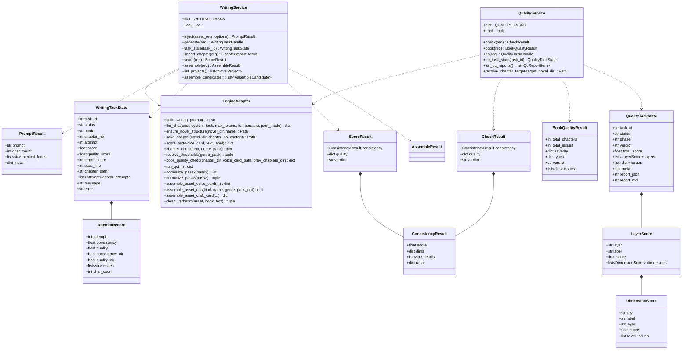
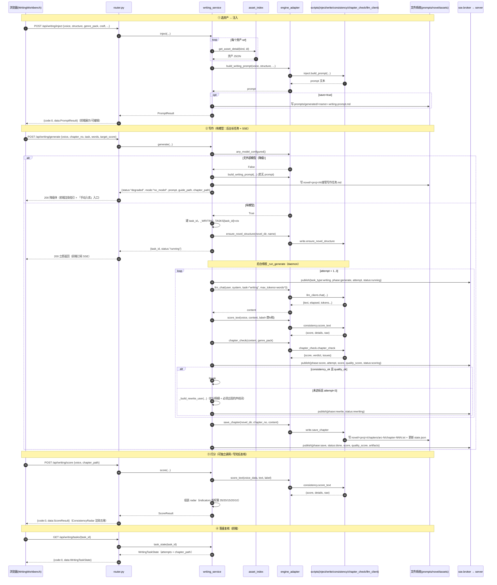
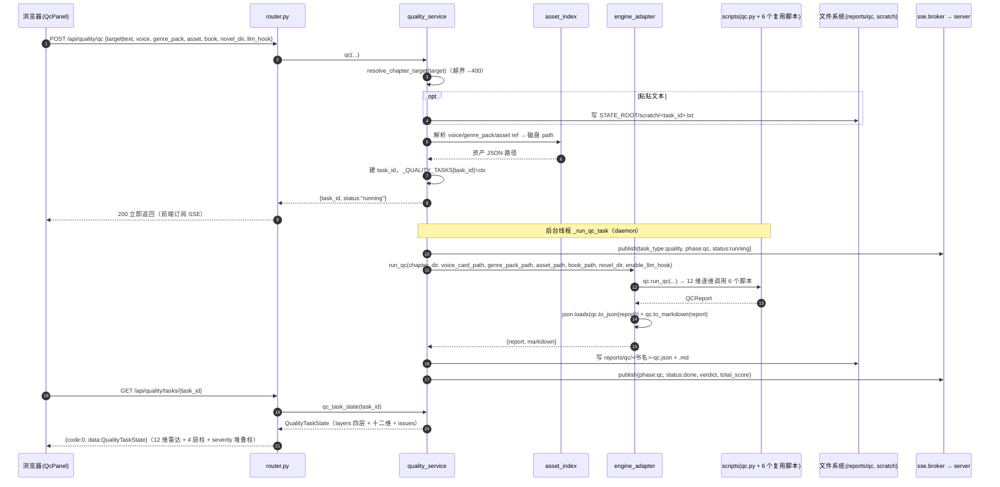
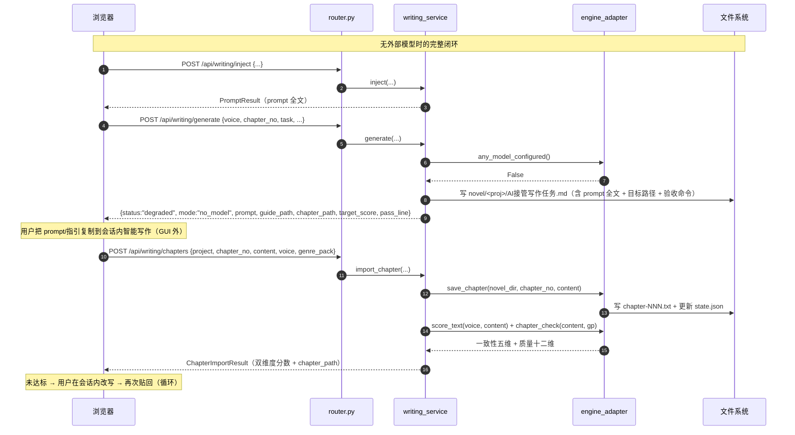

# 增量系统设计 — novel-lab GUI 阶段二：写作闭环（M2）+ 质检工作台（M3）

> 架构师：高见远
> 上游输入：`docs/PRD_gui_workbench.md`（§阶段二「写作闭环」M2+M3）+ `docs/DESIGN_gui_workbench.md`（§5.2 阶段二/三模块级任务表 W06/W07，标注「不细拆」）+ `docs/DESIGN_gui_persistence.md`（SQLite 6 表已落地）
> 定位：在既有「纯标准库 `http.server` 后端 + Vite/React/MUI/Tailwind/ECharts 前端 + `import` 直调脚本原子函数」范式**不变**的前提下，把 `DESIGN_gui_workbench.md` §5.2 中「仅列模块级、不细拆」的 **W06（M2 写作）/ W07（M3 质检）细化到可落地**。
> 任务编号：**从 W10 起**（W06–W09 已被持久化升级占用，见 `DESIGN_gui_persistence.md` §7；原 `DESIGN_gui_workbench.md` §5.2 的 W06/W07/W08 与持久化编号冲突，本文以 W10+ 消解）。
> 范围边界：**只做 M2 + M3**。M5 系统与合规、M1 高级（蒸馏/聚合/批量）、M4 资产库写入均属阶段三，不在本文。

---

## 0. 变更摘要（一句话）

在既有分层（路由 → 服务 → 引擎适配）上，新增 **`gui/writing_service.py`（M2 四能力）+ `gui/quality_service.py`（M3 三能力）+ 13 个 API 端点 + 2 个前端工作台**，并把现有 **SSE 广播扩展为 `task_id` 命名空间**以承载「写作改写循环」「qc 四层十二维」两条长任务；因 `write.py` 的改写循环内联在 `main()` 中不可复用，**由服务层重写编排、只复用其原子函数**；无外部模型时 GUI 以「降级指引 + 手动入库」承接 CLI 的「AI 接管任务.md」路径。稳定性约束：长任务**并发上限 2 写作 + 2 质检（超限 429，不排队）**，写作产出**单写入路径 `novel/<project>`**（裸 `novel/` 只读兼容），scratch 临时文件**结束即删 + 启动自清理**（见 §8 已裁决事项）。

---

## 1. 实现方案 + 框架选型

### 1.1 核心难点与决策

| # | 难点 | 决策 | 理由 |
|---|---|---|---|
| 1 | 后端铁律三：零第三方依赖 | 新增代码只用标准库（`threading`/`json`/`pathlib`/`uuid`/`time`/`re`/`shutil`/`urllib`）。**不新增任何 pip 包** | 铁律三硬约束；质检/打分/组装本就是纯算法脚本 |
| 2 | `write.py` 的改写循环在 `main()` 里，无法 import 复用 | **服务层重写编排**（`writing_service._run_generate`），只调 `engine_adapter` 包装的**原子函数**：`llm_chat` / `score_text` / `chapter_check` / `save_chapter` / `ensure_novel_structure` | 旧 DESIGN §1.2 已定「复用原子函数、不复用 main 端到端编排」；且只有服务层重写才能在每稿后发 SSE 进度 |
| 3 | 长任务阻塞 `http.server` | 沿用现有范式：请求线程**只入队并立即返回** `{task_id,status:"running"}`，真正工作在 `threading.Thread(daemon=True)` 里跑，进度经 `sse.broker.publish` 推送 | `_run_analysis`（`gui/services.py:250`）已验证该模式；`ThreadingHTTPServer` 天然多请求并发，长任务不进请求线程即不阻塞 |
| 4 | SSE 现只按 `book_id` 过滤（`server.py:109`），写作/质检任务不绑书 | **扩展 SSE 过滤维度**：`_handle_sse` 支持 `task_id` 与 `task_type` 过滤；事件体新增 `task_type`/`task_id`/`phase` 字段 | 改动局限在 `server.py` 一个函数；`sse.py` broker 本身是广播模型，无需改 |
| 5 | 无外部模型：GUI 内无 AI 可在会话内接管 | **双出口降级**：① `POST /api/writing/generate` 无模型时同步返回 `mode:"no_model"` + 完整 prompt + 可复制指引（并落盘 `novel/<proj>/AI接管写作任务.md`）；② 新增 `POST /api/writing/chapters` 让用户把「会话内写好的正文」贴回入库并自动打分 | CLI 的「AI 接管任务.md」是给人看的；GUI 必须把「拿出去写 → 贴回来」闭环补上，否则写作工作台在无模型下完全不可用 |
| 6 | 质检/写作的「章节输入」来源多样（novel 项目 / corpus / 粘贴文本），有路径穿越风险 | 统一 `resolve_chapter_target()`：只允许解析到 `NOVEL_DIR` / `CORPUS_DIR` 之内，或把粘贴文本落到 `STATE_ROOT/scratch/<task_id>.txt`；越界 → 400 | 与 `asset_index` 的相对化/白名单安全策略一致 |
| 7 | 组装（`assemble.py`）写 `assets/*.json`，但 SQLite 索引不会自动更新 | 新增 `gui/migrate.py::sync_asset(fp)` 单文件重索引（复用 `_upsert_asset`/`infer_*`），组装后逐个调用 + `asset_index.index.invalidate()` | 不能直接调 `run_migrate()`（它每次 `backup()`，重且产生备份堆积）；单文件 sync 精确、幂等、无副作用 |
| 8 | 打分五维天然适合雷达图 | 复用 `charts/RadarChart.tsx`，新增薄封装 `charts/ConsistencyRadar.tsx`（指标 max 按权重 35/20/15/20/10） | `consistency.score_text` 的第三返回值 `raw` 恰为 `{voice,emotion,narration,banned,imagery}`，零转换即得雷达数据 |
| 9 | 质检 severity 分布/十二维需可视化 | 复用 `charts/BarChart.tsx`（stacked severity）+ `charts/RadarChart.tsx`（十二维）+ 4 层柱状 | 现有图表组件已覆盖，无需新增图表库 |
| 10 | 新服务层必须可测且不污染真实数据目录 | 新服务层只经 `engine_adapter` 触碰 `scripts/`、只经 `config` 取路径；测试用 `tests/_isolation.py::isolate_paths`；新增 `config.PROMPTS_DIR` **必须同步登记** `DATA_PATH_CONSTANTS` | 沿用 R1 血泪教训（AGENTS.md §4）；`test_config_isolation.py` 是自动防线 |

### 1.2 分层扩展（增量，不改范式）

```
浏览器前端 (Vite + React + MUI + Tailwind + ECharts)
  WritingWorkbench / QualityWorkbench / charts/ConsistencyRadar
        │  HTTP REST + SSE（扩展 task_id 过滤）
        ▼
GUI 后端（纯标准库）
  路由层 router.py           ✏️ 注册 M2/M3 共 13 个端点
  服务层 writing_service.py  🆕 M2：注入 / 写作(长任务) / 打分 / 组装 / 手动入库 / 项目列举
  服务层 quality_service.py  🆕 M3：检查 / 全书质检 / qc(长任务) / 报告清单 / 章节目标解析
  服务层 services.py         （不改：拆书链路保持原样）
  持久化 migrate.py          ✏️ 新增 sync_asset(fp) 单文件重索引（组装后用）
  引擎适配 engine_adapter.py ✏️ 新增 inject/write/consistency/chapter_check/book_quality/qc/assemble 原子函数包装
  SSE server.py              ✏️ _handle_sse 支持 task_id / task_type 过滤
  路径 config.py             ✏️ 新增 PROMPTS_DIR（+ 测试隔离登记）
        │  同进程 import（不 subprocess）
        ▼
novel-lab 脚本（纯标准库，零改动）
  inject.py · write.py · consistency.py · assemble.py
  chapter_check.py · book_quality.py · qc.py · normalize.py · clean_verbatim.py · llm_client.py
```

**关键分层边界（沿用并强化）**：
- `engine_adapter.py` 仍是**唯一** `import scripts/` 的地方；`writing_service.py`/`quality_service.py` 不得直接 import 任何脚本。
- `db.py` 仍是**唯一** import `sqlite3` 的地方；组装重索引经 `migrate.sync_asset`（内部走 `db.tx`）。
- 新服务层是 `services.py` 的**平级兄弟**（同属服务层）；`router.py` 直接 `from gui import writing_service, quality_service`。

### 1.3 为什么 `write.py` 必须「重写编排、复用原子」

`scripts/write.py` 的可复用单元是这些**模块级函数**（非 `main`）：

| write.py 函数 | 签名 | 用途 |
|---|---|---|
| `ensure_novel_structure(novel_dir, name)` | `-> Path` | 建 `settings/chapters/tracker` + `state.json` |
| `save_chapter(novel_dir, chapter_no, content)` | `-> Path` | 写 `chapters/arc-N/chapter-NNN.txt` + 更新 state |
| `run_consistency(voice_path, ch_file)` | `-> None`（打印） | 仅 CLI 打印用，GUI 不用（直接用 `score_text`） |
| `run_conflict_check(novel_dir, content)` | `-> None`（打印） | 仅 CLI 打印用，GUI 不用 |

而**生成 + 自检 + 改写循环**（`write.py:228-322`）内联在 `main()` 中，无法 import。故 GUI 在 `writing_service._run_generate` 中**等价重写**该循环，但每一步都调 `engine_adapter` 包装的原子函数（`llm_chat` / `score_text` / `chapter_check` / `save_chapter`），从而获得 CLI 没有的能力：**逐稿 SSE 进度**。

> 等价性约束：改写循环的达标判定口径必须与 CLI 一致——一致性 `score >= target_score`、章节质量 `quality_score >= pass_line`（`pass_line` 由 `chapter_check.resolve_thresholds(genre_pack)` 解析，CLI 显式 > 题材包 > 默认 75）；最多 3 轮（1 初稿 + 2 改写）。**不改 scripts/ 源码。**

### 1.4 长任务与 SSE 扩展（`task_id` 命名空间）

现状：`sse.broker` 是进程内广播（`sse.py:14`），`server._handle_sse` 只按 `book_id` 过滤（`server.py:109`）。拆书分析复用良好，但写作/质检任务不属于任何 book。

**扩展方案（最小改动）**：
1. 事件体统一新增 `task_type`（`"writing"` / `"quality"`）与 `task_id`（`uuid4().hex[:12]`）字段；拆书分析事件保持原字段（向后兼容，可补 `task_type:"analysis"`）。
2. `server._handle_sse(query)` 过滤逻辑改为：`task_id` 优先（命中即推送）；否则按 `book_id`（沿用现有行为）；两者都缺省则全量推送（现有调试行为）。
3. 前端 `subscribeEvents` 增加可选 `taskId` 参数，`AppContext` 按 `task_id` 路由事件到写作/质检面板。

**避免阻塞 `http.server`**：
- 请求线程**不跑长任务**。`POST /api/writing/generate`、`POST /api/quality/qc` 仅：建 task 记录 → 起 `daemon` 线程 → 返回 `{task_id, status:"running"}`。
- `ThreadingHTTPServer`（`server.py:433`）已为每请求起线程，短请求并发不受影响；长任务线程独立于请求生命周期。
- 任务注册表 `_WRITING_TASKS` / `_QUALITY_TASKS`（进程内 dict + `threading.Lock`）保留「运行态」（线程、进度、最近事件）；**运行态不落库**（与持久化设计 D3 一致：进程重启即任务终止）。qc 的**产出报告**落盘 `reports/qc/`（权威产物），可跨重启查看。

### 1.5 无模型降级路径（GUI 呈现方案）

**问题**：项目当前「无外部模型」。`write.py:200-226` 在无模型时生成 `novel/AI接管写作任务.md` 并 `return 0`——那是**给 CLI 用户看的一张纸**。GUI 里没有「会话内 AI」可以接管，因此必须有 GUI 自己的闭环。

**方案（两个出口）**：

- **出口 A — 降级指引（同步返回，不起线程）**
  `POST /api/writing/generate` 进入时先判 `engine_adapter.any_model_configured()`：
  - 为 `False` → 不跑循环，**同步**返回：
    ```json
    {"code":0,"data":{
      "task_id":"w-...", "status":"degraded", "mode":"no_model",
      "chapter_no":12, "target_score":90, "pass_line":75,
      "prompt":"<注入后的完整 system prompt>",
      "guide_markdown":"<AI 接管指引（含 prompt 全文、目标路径、验收命令）>",
      "guide_path":"novel/新书/AI接管写作任务.md",
      "chapter_path":"novel/新书/chapters/arc-1/chapter-012.txt",
      "notice":"未配置外部模型：请把上方指引与 prompt 交给会话内智能写作，写完后用「手动入库」贴回。"
    }}
    ```
  - 指引文本由 `writing_service` **自行组装**（纯字符串格式化，不改 `scripts/write.py`），落盘 `config.NOVEL_DIR/<proj>/AI接管写作任务.md`。
- **出口 B — 手动入库（补上闭环）**
  `POST /api/writing/chapters`：用户把会话内写好的正文贴回 → 后端 `engine_adapter.save_chapter` 落盘 → 立即 `score_text`（一致性五维）+ `chapter_check`（质量十二维）→ 返回双维度分数。这样「注入 → 拿出去写 → 贴回来 → 打分 → 落盘」在无模型下依然端到端可用。

**质检（M3）不受影响**：`chapter_check` / `book_quality` / `qc` 全是纯算法，无模型也能跑；`qc --llm-hook` 在无模型时 `llm_hook.make_causality_hook` 返回 `None` 自动降级为纯算法（`qc.py:424`），GUI 默认 `enable_llm_hook=False`。

### 1.6 章节输入来源与路径安全

质检/检查/打分都需「一段章节文本或一个章节目录」。统一解析器（`quality_service`，写作打分复用）：

```python
def resolve_chapter_target(target: str, *, novel_dir: str | None = None) -> Path:
    """把前端 target 解析为磁盘上真实存在的章节文件/目录（防路径穿越）。

    支持三种 target：
      1. 项目内相对 ref：``novel/<proj>`` 或 ``novel/<proj>/chapters``（相对 NOVEL_DIR 解析）
      2. 绝对/相对路径：resolve 后必须落在 NOVEL_DIR 或 CORPUS_DIR 之内
      3. 越界 / 不存在 → ServiceError(..., 400)
    """
```

「粘贴文本」模式：前端 POST `{text: "..."}` → `quality_service` 写 `config.STATE_ROOT/scratch/<task_id>.txt`（运行时目录、测试隔离覆盖），再走同一套脚本调用。

**scratch 生命周期（D3 裁决）**：仅靠「任务结束即删」在**进程崩溃/硬杀**场景会留残留，故采用**双保险**：
1. **正常路径**：`_run_generate` / `_run_qc_task` 的 `finally` 块删除本任务 scratch 文件；
2. **启动自清理**：`quality_service.clean_stale_scratch()` 在 `server.GuiServer.start()` 里调用一次，删除 `STATE_ROOT/scratch/` 下**所有**残留 `.txt`（进程重启后旧任务必然已终止，残留即为 stale）。

```python
# gui/quality_service.py
def clean_stale_scratch() -> int:
    """删除 STATE_ROOT/scratch/ 下全部残留任务文本（进程启动时调用一次）。

    Returns:
        删除的文件数。目录不存在时返回 0（不建目录）。
    """
```
> 该函数由 `gui/server.py::GuiServer.start()`（`db.init_schema()` 之后）调用，与「常驻服务启动」绑定；测试环境由 `isolate_paths` 重定向 `STATE_ROOT`，不触真实目录。

### 1.7 组装后重新索引

`assemble` 把 `assets/<name>-*.json` 写到磁盘，但 SQLite `assets` 表不会自动感知 → 资产库/概览看不到新卡。

**方案**：`gui/migrate.py` 新增

```python
def sync_asset(fp: Path) -> None:
    """单文件重索引：复用 infer_kind/infer_book_id/infer_genre + _upsert_asset（db.tx 内，幂等）。"""
```

`writing_service.assemble` 每写成一个资产文件即 `migrate.sync_asset(fp)`，最后 `asset_index.index.invalidate()`。不调 `run_migrate()`（避免每次 `backup()` 与全量扫描）。

### 1.8 写作产出路径唯一化（D1 裁决）

**问题**：CLI `write.py --novel-dir` 默认 `novel`（`write.py:139`）。若 GUI 允许「单项目写 `novel`、多项目写 `novel/<project>`」两条路径，则产生**双写入面**：测试面翻倍、迁移时无法判定产物归属，与「长期稳定可维护」相悖。

**裁决方案：单写入路径 + 读兼容**
- **写路径唯一**：GUI 的 `generate` / `import_chapter` 一律写 `NOVEL_DIR/<project>`，**`project` 必填**（前端必须选或新建项目，禁止空/`..`/路径分隔符；后端 `_sanitize_project()` 二次校验，非法 → 400）。CLI 既有 `novel/` 直写行为**不受影响**（GUI 不碰 CLI 路径）。
- **读兼容**：`GET /api/writing/projects` 除枚举 `NOVEL_DIR/*` 子目录外，**额外把裸 `NOVEL_DIR` 本身识别为一个只读项目**（返回 `{name:"default", read_only:true}`），使 CLI 既有产物在 GUI 可见、可打分/质检，但**不允许 GUI 写入**（对 `default` 发起 generate/import → 400，提示「CLI 项目只读，请在 GUI 新建项目」）。

```python
# gui/writing_service.py
def _sanitize_project(project: str) -> str:
    """校验项目名：非空、无 / \\ .. 与控制字符，返回原值；非法 → ServiceError(400)。"""

def list_projects() -> List[Dict[str, Any]]:
    """枚举 NOVEL_DIR 下项目；裸 NOVEL_DIR 作为只读项目 name='default'（read_only=True）追加。"""
```
> 结果：写入路径唯一（可测面收敛），读侧兼容 CLI 历史产物（不丢数据）。

---

## 2. 文件列表（增量，相对路径基于 novel-lab 根）

> 标注：🆕 新增；✏️ 修改。

### 2.1 后端（纯标准库，零第三方依赖）

| 相对路径 | 状态 | 职责 |
|---|---|---|
| `gui/engine_adapter.py` | ✏️ | 新增原子函数包装（§3.4）：注入 / LLM 对话 / 章节落盘 / 单章检查 / 阈值解析 / 全书质检 / QC / 组装（normalize + 三个 assemble + 原文清洗） |
| `gui/writing_service.py` | 🆕 | M2 服务层：`inject` / `generate`(长任务，并发上限 2) / `task_state` / `import_chapter` / `score` / `assemble` / `list_projects`(含裸 `novel/` 只读项目 `default`) / `assemble_candidates` / `_sanitize_project`；任务注册表 `_WRITING_TASKS` |
| `gui/quality_service.py` | 🆕 | M3 服务层：`check` / `book` / `qc`(长任务，并发上限 2) / `qc_task_state` / `list_qc_reports` / `resolve_chapter_target` / `clean_stale_scratch`(启动自清理)；任务注册表 `_QUALITY_TASKS` |
| `gui/router.py` | ✏️ | 注册 §3.2 的 13 个端点 + 对应 handler（含 429 超限语义） |
| `gui/server.py` | ✏️ | `_handle_sse` 增加 `task_id` / `task_type` 过滤；`GuiServer.start()` 调用 `quality_service.clean_stale_scratch()`（D3 启动自清理） |
| `gui/config.py` | ✏️ | 新增 `PROMPTS_DIR = ROOT_DIR / "prompts" / "generated"`（注入 prompt 可选落盘） |
| `gui/migrate.py` | ✏️ | 新增 `sync_asset(fp)` 单文件重索引（组装后调用） |
| `gui/services.py` | — | **不改**（拆书链路保持原样；新能力平级放 writing/quality_service） |
| `gui/sse.py` | — | **不改**（broker 广播模型已够用，过滤在 server 层） |
| `gui/db.py` | — | **不改**（组装重索引走 migrate.sync_asset → db.tx） |

### 2.2 前端（独立层，可自由引第三方；本次**零新增 npm 依赖**）

| 相对路径 | 状态 | 职责 |
|---|---|---|
| `gui/web/src/App.tsx` | ✏️ | `App.tsx:54/55` 两处 `Placeholder` 替换为 `WritingWorkbench` / `QualityWorkbench` |
| `gui/web/src/layout/WorkbenchNav.tsx` | ✏️ | 移除 `writing`/`quality` 的 `placeholder: true`（保留 `system`/`settings` 占位，不妨碍阶段三） |
| `gui/web/src/components/WritingWorkbench.tsx` | 🆕 | M2 容器：三步向导（注入 → 写作 → 打分）+ 组装 Tab |
| `gui/web/src/components/writing/InjectPanel.tsx` | 🆕 | 资产选择器（voice 必选；structure/commercial/genre-pack/craft/distilled/prose-card 可选）→ prompt 预览 |
| `gui/web/src/components/writing/GeneratePanel.tsx` | 🆕 | 写作表单（章节号/要点/字数/目标分）+ 改写循环进度环 + 降级指引面板 + 手动入库入口 |
| `gui/web/src/components/writing/ScorePanel.tsx` | 🆕 | 一致性五维雷达 + 明细 + 章节质量十二维明细 |
| `gui/web/src/components/writing/AssemblePanel.tsx` | 🆕 | 组装（选 corpus/raw 目录 + genre）→ 产出资产清单 |
| `gui/web/src/components/QualityWorkbench.tsx` | 🆕 | M3 容器：检查 / 全书质检 / qc 三 Tab |
| `gui/web/src/components/quality/CheckPanel.tsx` | 🆕 | 单章检查（质量 + 一致性双维度） |
| `gui/web/src/components/quality/BookQualityPanel.tsx` | 🆕 | 全书质检：severity 堆叠柱 + 问题清单 |
| `gui/web/src/components/quality/QcPanel.tsx` | 🆕 | qc：四层十二维雷达 + 4 层柱 + 问题清单 + 报告落盘提示 |
| `gui/web/src/components/charts/ConsistencyRadar.tsx` | 🆕 | 一致性五维雷达薄封装（指标 max 按 35/20/15/20/10） |
| `gui/web/src/api/client.ts` | ✏️ | 新增 13 个 API 封装 + `subscribeEvents(taskId?)` |
| `gui/web/src/types.ts` | ✏️ | 新增写作/质检类型（§3.5） |
| `gui/web/src/state/AppContext.tsx` | ✏️ | 新增写作/质检任务状态 + 按 `task_id` 路由 SSE 事件 |

### 2.3 测试（纯标准库 unittest，隔离临时目录）

| 相对路径 | 状态 | 职责 |
|---|---|---|
| `tests/test_writing_service.py` | 🆕 | 注入/打分/组装/手动入库/降级 单测（monkeypatch engine_adapter，不调 LLM）+ **并发上限 2**（第 3 个 generate → 429）+ `project` 必填/非法 400 + `default` 只读项目拒写 |
| `tests/test_quality_service.py` | 🆕 | 检查/全书质检/qc/章节目标解析（含路径穿越 400）单测 + **`clean_stale_scratch` 启动自清理** + **qc 并发上限 2**（第 3 个 → 429） |
| `tests/test_phase2_api.py` | 🆕 | 13 端点走 `router.dispatch` 集成测试 + SSE `task_id` 过滤 + **429 错误包裹** |
| `tests/_isolation.py` | ✏️ | `DATA_PATH_CONSTANTS` 登记 `PROMPTS_DIR`（**必须**，否则 `test_config_isolation.py` FAIL） |

### 2.4 文档

| 相对路径 | 状态 | 职责 |
|---|---|---|
| `docs/DESIGN_gui_phase2_writing_quality.md` | 🆕 | 本文档 |

---

## 3. 数据结构与接口

### 3.1 核心类图



### 3.2 新增 API 端点清单（13 个）

> 统一响应包裹沿用既有：`{"code":0,"data":...,"message":""}`；字段 `snake_case`；`code` 0 成功 / 400 参数错 / 404 不存在 / 409 冲突 / 500 内部错。
> 资产引用统一用 `"<kind>:<id>"`（与 `asset_index.get_asset_detail` 一致），后端经 `asset_index` 定位并读 JSON，**不接收裸路径**。

#### M2 写作（8 个）

| 方法 | 路径 | 请求体 | 响应 data | 说明 |
|---|---|---|---|---|
| POST | `/api/writing/inject` | `{voice, structure?, commercial?, genre_pack?, craft?, distilled?, prose_card?, context_intent?, tracking_state?, save?}` | `PromptResult` | 注入生成写作 prompt；`save=true` 时落 `prompts/generated/<name>-writing-prompt.md` |
| POST | `/api/writing/generate` | `{voice, genre_pack?, prompt?, project, novel_name?, chapter_no, task, words?, target_score?, quality_target?, save_prompt?}` | `WritingTaskHandle`（`mode:"llm"`）或 `degraded` 体（无模型） | 写作长任务：后台线程 + SSE；无模型同步降级。**`project` 必填**（D1）；**写作并发上限 2**，超限 → 429（D6） |
| GET | `/api/writing/tasks/<task_id>` | — | `WritingTaskState` | 轮询写作任务状态（SSE 断线兜底） |
| POST | `/api/writing/chapters` | `{project, novel_name?, chapter_no, content, voice?, genre_pack?}` | `ChapterImportResult`（含 `consistency`+`quality`+`chapter_path`） | 手动入库（无模型闭环 / 外部写完贴回）。**`project` 必填**，`default`（CLI 裸 `novel/`）只读拒写 → 400（D1） |
| POST | `/api/writing/score` | `{voice, text?`\|`chapter_path?, label?}` | `ScoreResult`（`consistency` + `quality` **双维度**） | 一致性五维（`consistency.score_text`）+ 章节质量十二维（`chapter_check.chapter_check`），**一次返回**（D2） |
| POST | `/api/writing/assemble` | `{name, genre, skip_craft?}` | `AssembleResult`（`assets_written:[...]`, `cleaned_verbatim`, `skipped`） | 组装 pass1-5 JSON → 入库资产 + 重索引。**`genre` 必填非空**，GUI 层校验（守护铁律一，D7） |
| GET | `/api/writing/projects` | — | `list[NovelProject]` | `novel/` 下创作项目清单；裸 `novel/` 作为只读项目 `default` 追加（`read_only:true`，D1） |
| GET | `/api/writing/assemble-candidates` | — | `list[AssembleCandidate]` | `corpus/raw/<name>/` 可组装清单 + 各 pass 存在性 |

#### M3 质检（5 个）

| 方法 | 路径 | 请求体 | 响应 data | 说明 |
|---|---|---|---|---|
| POST | `/api/quality/check` | `{target?, text?, voice?, genre_pack?}` | `CheckResult` | 单章「质量（12 维）+ 一致性（5 维）」双维度 |
| POST | `/api/quality/book` | `{target?, text?, voice?}` | `BookQualityResult` | 全书质检（重复/连贯/凑字数/乱编/AI味） |
| POST | `/api/quality/qc` | `{target?, text?, voice?, genre_pack?, asset?, book?, novel_dir?, llm_hook?}` | `QualityTaskHandle` | qc 长任务（四层十二维），后台线程 + SSE；**质检并发上限 2**，超限 → 429（D6） |
| GET | `/api/quality/tasks/<task_id>` | — | `QualityTaskState` | 轮询 qc 任务状态 |
| GET | `/api/quality/reports` | — | `list[QcReportItem]` | `reports/qc/*.json` 历史报告清单 |

> **并发上限契约（D6 裁决）**：写作与质检各自独立计数，**同时最多 2 个写作任务 + 2 个质检任务**（合计上限 4 个长任务）。超限时对应端点返回 `code=429`、`message` 明确（如「写作任务已达上限 2，请等待当前任务完成」）、`data:null`；**不排队**（排队会引入队列管理与公平性复杂度，与「简洁可维护」相悖）。计数口径：`_WRITING_TASKS` / `_QUALITY_TASKS` 中 `status ∈ {pending, running, scoring, rewriting}` 的任务数（`done`/`degraded`/`error` 不计）。无模型降级为**同步返回、不占线程**，故不计入上限。

> **target 语义**：`target` 为章节文件/目录 ref（见 §1.6）；`text` 为粘贴文本（二者互斥，优先 `target`）。`voice`/`genre_pack`/`asset` 均为 `"<kind>:<id>"` 资产引用。

### 3.3 请求/响应体示例

**`POST /api/writing/inject`** → 200
```json
{"code":0,"message":"","data":{
  "prompt":"# 写作风格注入 · 来自《赤刃》的拆书资产\n...",
  "char_count":18742,
  "injected_kinds":["voice","structure","commercial","genre_pack","craft"],
  "meta":{"source_title":"赤刃","genre":"campus-redemption","saved_path":"prompts/generated/chireng_chosen-writing-prompt.md"}
}}
```

**`POST /api/writing/generate`（有模型）** → 200（立即返回，进度走 SSE）
```json
{"code":0,"message":"","data":{"task_id":"w-3f9a1c2b7d40","status":"running","mode":"llm","chapter_no":12}}
```

**`POST /api/writing/generate`（无模型，降级）** → 200
```json
{"code":0,"message":"","data":{
  "task_id":"w-3f9a1c2b7d40","status":"degraded","mode":"no_model",
  "chapter_no":12,"target_score":90,"pass_line":75,
  "prompt":"# 写作风格注入 ...",
  "guide_markdown":"# WorkBuddy 内置智能接管写作任务（无外部模型模式）\n...",
  "guide_path":"novel/新书/AI接管写作任务.md",
  "chapter_path":"novel/新书/chapters/arc-1/chapter-012.txt",
  "notice":"未配置外部模型：请把指引与 prompt 交给会话内智能，写完后用「手动入库」贴回。"
}}
```

**`GET /api/writing/tasks/w-3f9a...`** → 200
```json
{"code":0,"message":"","data":{
  "task_id":"w-3f9a1c2b7d40","status":"running","mode":"llm","chapter_no":12,
  "attempt":2,"score":83.5,"quality_score":79,"target_score":90,"pass_line":75,
  "chapter_path":null,"message":"第2稿一致性 83.5/100，未达 90，改写中",
  "attempts":[
    {"attempt":1,"consistency":71.0,"quality":76,"consistency_ok":false,"quality_ok":true,"issues":["[质量] 体感词 4 处（期望≥6）"],"char_count":2480},
    {"attempt":2,"consistency":83.5,"quality":79,"consistency_ok":false,"quality_ok":true,"issues":[],"char_count":2512}
  ],
  "error":null
}}
```
> `status` 状态机：`pending → running → (scoring ⇄ rewriting)* → done`，另有 `degraded`（无模型）/ `error`。

**`POST /api/writing/score`** → 200（D2：双维度一次返回）
```json
{"code":0,"message":"","data":{
  "consistency":{
    "score":86.5,
    "dims":{"voice":31.5,"emotion":18.0,"narration":15.0,"banned":20.0,"imagery":2.0},
    "details":["章: 第12章 (2512 字)","[1] 角色声线 (35): 31.5","..."],
    "radar":{"indicators":[{"name":"声线","max":35},{"name":"情绪","max":20},{"name":"叙述","max":15},{"name":"禁忌","max":20},{"name":"意象","max":10}],
             "series":[{"name":"第12章","value":[31.5,18.0,15.0,20.0,2.0]}]}
  },
  "quality":{"score":79,"max_score":100,"verdict":"PASS",
             "details":["字数 2512 ✓","对话占比 22.3% ✓","..."],"issues":[]},
  "verdict":"PASS"
}}
```
> 说明：① `consistency` 五维 `banned` 在 `voice_card.banned_words` 为空时按产品决策给满分 20（`consistency.py:189-190`，禁忌不拦截），雷达按此如实呈现，前端不修正。② `quality` 为 `chapter_check.chapter_check` 原样输出（12 维，满分 100）。③ `verdict` 为双维度综合（`quality.verdict` 优先，`consistency < 60` 时降为 `FAIL`），供前端一键判定。

**`POST /api/quality/qc`** → 200（立即返回，进度走 SSE）
```json
{"code":0,"message":"","data":{"task_id":"q-77aa01bc9e2f","status":"running","target":"novel/新书/chapters"}}
```

**`GET /api/quality/tasks/q-77aa...`** → 200
```json
{"code":0,"message":"","data":{
  "task_id":"q-77aa01bc9e2f","status":"done","phase":"qc",
  "verdict":"WARN","total_score":78.4,
  "layers":[
    {"layer":"L1","label":"剧情层","score":82.0,"dimensions":[
      {"key":"plot_continuity","label":"剧情连贯","layer":"L1","score":90.0,"issues":[]},
      {"key":"logic","label":"逻辑合理","layer":"L1","score":80.0,"issues":[{"severity":"medium","detail":"..."}]},
      {"key":"structure","label":"结构完整","layer":"L1","score":76.0,"issues":[]}]},
    {"layer":"L2","label":"人物层","score":74.0,"dimensions":[]},
    {"layer":"L3","label":"技法层","score":80.0,"dimensions":[]},
    {"layer":"L4","label":"语言层","score":77.6,"dimensions":[]}
  ],
  "issues":[{"type":"ai_flavor","severity":"medium","chapter":3,"detail":"Ch3 出现「顿悟模板」×1"}],
  "meta":{"total_chapters":12,"total_issues":7,"pass_line":75,"warn_line":60,
          "severity_count":{"critical":0,"high":0,"medium":5,"low":2}},
  "report_json":"reports/qc/新书-qc.json","report_md":"reports/qc/新书-qc.md",
  "error":null
}}
```

### 3.4 服务层与适配层函数签名

```python
# ============ gui/engine_adapter.py（新增包装，全部延迟 import） ============

# --- 注入（inject.py）---
def build_writing_prompt(voice: Dict[str, Any], structure: Optional[Dict] = None,
                         commercial: Optional[Dict] = None, genre_pack: Optional[Dict] = None,
                         craft_card: Optional[Dict] = None, distilled: Optional[Dict] = None,
                         context_intent: Optional[str] = None,
                         tracking_state: Optional[Dict] = None,
                         genre_prose_card: Optional[Dict] = None) -> str: ...

# --- 写作（write.py 原子 + llm_client）---
def llm_chat(user: str, system: str, task: str = "writing", max_tokens: int = 6000,
             temperature: float = 0.8, json_mode: bool = False) -> Dict[str, Any]: ...   # -> llm_client.chat
def ensure_novel_structure(novel_dir: str, name: str = "新书") -> Path: ...             # -> write.ensure_novel_structure
def save_chapter(novel_dir: str, chapter_no: int, content: str) -> Path: ...           # -> write.save_chapter

# --- 打分 / 检查（consistency.py / chapter_check.py）---
def score_text(voice_card: Dict[str, Any], text: str, label: str = "") -> Dict[str, Any]: ...  # 已存在
def chapter_check(text: str, genre_pack: Optional[Dict] = None) -> Dict[str, Any]: ...          # -> chapter_check.chapter_check
def resolve_thresholds(genre_pack: Optional[Dict] = None) -> Tuple[int, int]: ...              # -> chapter_check.resolve_thresholds

# --- 全书质检（book_quality.py）---
def book_quality_check(chapter_dir: str, voice_card_path: Optional[str] = None,
                       prev_chapters_dir: Optional[str] = None) -> Dict[str, Any]: ...          # -> book_quality.book_quality_check

# --- QC（qc.py）---
def run_qc(chapter_dir: str, *, voice_card_path: Optional[str] = None,
           genre_pack_path: Optional[str] = None, asset_path: Optional[str] = None,
           book_path: Optional[str] = None, novel_dir: Optional[str] = None,
           enable_llm_hook: bool = False) -> Dict[str, Any]: ...
    # 内部：report = qc.run_qc(...); return {"report": json.loads(qc.to_json(report)), "markdown": qc.to_markdown(report)}

# --- 组装（assemble.py / normalize.py / clean_verbatim.py）---
def normalize_pass2(pass2: Dict[str, Any]) -> List[Dict[str, Any]]: ...                 # -> normalize.normalize_pass2
def normalize_pass3(pass3: Dict[str, Any]) -> Tuple[Dict, Dict, Dict, Dict, Dict]: ...  # -> normalize.normalize_pass3
def assemble_asset_voice_card(name: str, genre: str, manifest: Dict, metrics: Dict,
                              voices: List, narration: Dict, dialogue: Dict, emotion: Dict,
                              imagery: Dict, banned: Dict) -> Dict[str, Any]: ...        # -> assemble.assemble_voice_card
def assemble_asset_obs(kind: str, name: str, genre: str, pass_out: Dict) -> Dict: ...   # -> assemble.assemble_obs
def assemble_asset_craft_card(name: str, genre: str, manifest: Dict, metrics: Dict,
                              pass5: Dict) -> Dict[str, Any]: ...                      # -> assemble.assemble_craft_card
def clean_verbatim(asset: Dict[str, Any], book_text: str) -> Tuple[Dict, int]: ...      # -> assemble._clean_verbatim
```
> 命名注意：`engine_adapter.assemble_voice_card`（既有，包装 `pipeline.assemble_voice_card`）与本次新增的 `assemble_asset_voice_card`（包装 `assemble.assemble_voice_card`）**签名不同**，故用不同名，避免冲突。

```python
# ============ gui/writing_service.py ============
class WritingServiceError(ServiceError): ...

def inject(voice: str, structure: str | None = None, commercial: str | None = None,
           genre_pack: str | None = None, craft: str | None = None, distilled: str | None = None,
           prose_card: str | None = None, context_intent: str | None = None,
           tracking_state: str | None = None, save: bool = False) -> Dict[str, Any]: ...
def generate(voice: str, project: str, chapter_no: int, task: str,
             novel_name: str | None = None, prompt: str | None = None,
             genre_pack: str | None = None, words: int = 2400, target_score: int = 90,
             quality_target: int | None = None, save_prompt: bool = False) -> Dict[str, Any]: ...
    # project 必填（D1）；写作并发 ≥2 时 raise ServiceError(..., 429)（D6）
def task_state(task_id: str) -> Dict[str, Any]: ...
def import_chapter(project: str, chapter_no: int, content: str, novel_name: str | None = None,
                   voice: str | None = None, genre_pack: str | None = None) -> Dict[str, Any]: ...
    # project 必填；project == "default"（CLI 裸 novel/）→ ServiceError(400, 只读)
def score(voice: str, text: str | None = None, chapter_path: str | None = None,
          label: str = "") -> Dict[str, Any]: ...
def assemble(name: str, genre: str, skip_craft: bool = False) -> Dict[str, Any]: ...
    # genre 必填非空（D7，守护铁律一）；空 → ServiceError(400)
def list_projects() -> List[Dict[str, Any]]: ...
    # 枚举 NOVEL_DIR/*；裸 NOVEL_DIR 作为只读项目 {name:"default", read_only:True} 追加（D1）
def assemble_candidates() -> List[Dict[str, Any]]: ...

# 内部
def _sanitize_project(project: str) -> str: ...            # 非空 + 无 / \ .. 控制字符，非法 → 400
def _active_writing_count() -> int: ...                    # status ∈ {pending,running,scoring,rewriting} 计数
def _run_generate(task_id: str, *, voice_data: Dict, system: str, req: Dict, ctx: Dict) -> None: ...
    # finally: 清理本任务 scratch（若有）
def _build_rewrite_user(prev_user: str, req: Dict, score: float, target: int,
                        details: List[str], quality_issues: List[str], voice_data: Dict,
                        content: str) -> str: ...
def _build_degrade_guide(req: Dict, prompt: str, chapter_path: Path, pass_line: int) -> str: ...

# ============ gui/quality_service.py ============
class QualityServiceError(ServiceError): ...

def check(target: str | None = None, text: str | None = None, voice: str | None = None,
          genre_pack: str | None = None) -> Dict[str, Any]: ...
def book(target: str | None = None, text: str | None = None, voice: str | None = None) -> Dict[str, Any]: ...
def qc(target: str | None = None, text: str | None = None, voice: str | None = None,
       genre_pack: str | None = None, asset: str | None = None, book: str | None = None,
       novel_dir: str | None = None, llm_hook: bool = False) -> Dict[str, Any]: ...
    # 质检并发 ≥2 时 raise ServiceError(..., 429)（D6）
def qc_task_state(task_id: str) -> Dict[str, Any]: ...
def list_qc_reports() -> List[Dict[str, Any]]: ...
def resolve_chapter_target(target: str, *, novel_dir: str | None = None) -> Path: ...
def clean_stale_scratch() -> int: ...                      # 启动自清理 STATE_ROOT/scratch/*.txt（D3）

# 内部
def _active_quality_count() -> int: ...                    # status ∈ {pending,running} 计数
def _asset_ref_to_path(ref: str | None, expect_kinds: Tuple[str, ...]) -> Path | None: ...
    # "<kind>:<id>" → asset_index.get_asset_detail → ROOT_DIR / path（校验 kind 白名单）
def _materialize_text(text: str, task_id: str) -> Path: ...   # STATE_ROOT/scratch/<task_id>.txt
def _run_qc_task(task_id: str, *, chapter_dir: str, refs: Dict, enable_llm_hook: bool) -> None: ...
    # finally: 删除本任务 scratch（若有）
```

### 3.5 前端类型扩展（`types.ts` 增量）

```typescript
// --- M2 写作 ---
export interface PromptResult { prompt: string; charCount: number; injectedKinds: string[]; meta: Record<string, unknown> }
export interface ConsistencyDims { voice: number; emotion: number; narration: number; banned: number; imagery: number }
export interface RadarData { indicators: { name: string; max: number }[]; series: { name: string; value: number[] }[] }
export interface ConsistencyResult { score: number; dims: ConsistencyDims; details: string[]; radar: RadarData }
export interface ScoreResult { consistency: ConsistencyResult; quality: Record<string, unknown>; verdict: 'PASS' | 'WARN' | 'FAIL' }  // D2 双维度
export type WritingStatus = 'pending' | 'running' | 'scoring' | 'rewriting' | 'done' | 'degraded' | 'error'
export interface AttemptRecord { attempt: number; consistency: number; quality: number; consistencyOk: boolean; qualityOk: boolean; issues: string[]; charCount: number }
export interface WritingTaskState {
  taskId: string; status: WritingStatus; mode: 'llm' | 'no_model'; chapterNo: number
  attempt: number; score: number; qualityScore: number; targetScore: number; passLine: number
  chapterPath: string | null; message: string; attempts: AttemptRecord[]; error: string | null
}
export interface ChapterImportResult { chapterPath: string; consistency: ConsistencyResult; quality: Record<string, unknown>; charCount: number }
export interface NovelProject { name: string; currentChapter: number; currentArc: number; wordCountToday: number; chaptersDir: string; readOnly: boolean }
export interface AssembleCandidate { name: string; hasManifest: boolean; hasMetrics: boolean; passes: string[]; genre?: string }
export interface AssembleResult { assetsWritten: string[]; cleanedVerbatim: number; skippedCraft: boolean; syncErrors: string[] }

// --- M3 质检 ---
export type Severity = 'critical' | 'high' | 'medium' | 'low'
export interface QualityIssue { type: string; severity: Severity; chapter: number; detail: string }
export interface CheckResult { consistency: ConsistencyResult; quality: Record<string, unknown>; verdict: 'PASS' | 'WARN' | 'FAIL' }
export interface BookQualityResult { totalChapters: number; totalIssues: number; severity: Record<string, number>; types: Record<string, number>; verdict: 'PASS' | 'WARN' | 'FAIL'; issues: QualityIssue[] }
export interface DimensionScore { key: string; label: string; layer: string; score: number; issues: QualityIssue[] }
export interface LayerScore { layer: string; label: string; score: number; dimensions: DimensionScore[] }
export interface QualityTaskState {
  taskId: string; status: 'pending' | 'running' | 'done' | 'error'; phase: string
  verdict: 'PASS' | 'WARN' | 'FAIL' | null; totalScore: number
  layers: LayerScore[]; issues: QualityIssue[]; meta: Record<string, unknown>
  reportJson: string | null; reportMd: string | null; error: string | null
}
export interface QcReportItem { name: string; bookTitle: string; verdict: string; totalScore: number; jsonPath: string; mdPath: string; mtime: number }
```

### 3.6 SSE 事件 schema（跨端约定）

```jsonc
// 拆书分析（既有字段保持；新增 task_type 兼容）
{ "task_type":"analysis", "book_id":"...", "cursor":"c3-b2", "chapter_index":3, "batch_index":2,
  "status":"running|success|failed|paused|done|error|report_ready", "done":10, "total":42 }

// 写作（M2）
{ "task_type":"writing", "task_id":"w-...", "book_id":null,
  "phase":"inject|generate|score|rewrite|save",
  "status":"running|scoring|rewriting|success|done|degraded|error",
  "chapter_no":12, "attempt":2, "score":83.5, "quality_score":79, "target":90,
  "done":2, "total":3, "message":"第2稿一致性 83.5/100，未达 90，改写中",
  "artifacts":{"chapter_path":null} }

// 质检（M3）
{ "task_type":"quality", "task_id":"q-...", "book_id":null,
  "phase":"qc", "status":"running|progress|done|error",
  "message":"qc 第 6/12 维完成", "done":6, "total":12,
  "artifacts":{"verdict":null} }
```
> 前端过滤：`subscribeEvents(bookId?, taskId?)` → `/api/events?book_id=...` 或 `/api/events?task_id=...`；`AppContext` 按 `task_type` 分发到写作/质检状态。

---

## 4. 程序调用流程（时序图）

### 4.1 写作闭环端到端（选资产 → 注入 → 写作 → 打分 → 落盘）



### 4.2 质检 qc 长任务（四层十二维）



### 4.3 无模型降级 + 手动入库（写作闭环的兜底）



---

## 5. 任务列表（有序，含依赖，**W10 起**）

> 依赖基线：W09（持久化升级）已完成 → 本阶段从 W10 起。原 `DESIGN_gui_workbench.md` §5.2 的 W06/W07 作废（与持久化 W06–W09 编号冲突），其范围由本文 W10–W18 承接。

| Task ID | 任务名 | 源文件 | 依赖 | 优先级 | 验收标准 |
|---|---|---|---|---|---|
| W10 | 引擎适配层扩展 + 自检 | `gui/engine_adapter.py`（✏️ 新增 §3.4 全部包装） | W09 | P0 | 15 个新包装可调用；`adapter_self_check()` 扩展覆盖注入/打分/检查/组装（不调 LLM）；`import gui.engine_adapter` 不触发脚本副作用 |
| W11 | 写作服务层（同步能力） | `gui/writing_service.py`（🆕 inject/score/assemble/list_projects/assemble_candidates + 降级指引组装 + **`_sanitize_project`**）/ `gui/config.py`（✏️ PROMPTS_DIR）/ `gui/migrate.py`（✏️ sync_asset）/ `tests/_isolation.py`（✏️ 登记 PROMPTS_DIR）/ `tests/test_writing_service.py`（🆕） | W10 | P0 | `inject` 返回 prompt；`score` 返回五维+radar；`assemble` 写 4 资产并 `sync_asset` 入库（资产库可见）；**`assemble` 的 `genre` 空值 → 400（D7）**；**`project` 非法 → 400、`default` 只读拒写（D1）**；`test_config_isolation` 通过；单测通过 |
| W12 | 写作长任务 + 降级 + 手动入库 | `gui/writing_service.py`（✏️ generate/task_state/import_chapter/_run_generate/_build_rewrite_user + **`_active_writing_count` 并发上限 2**） | W11 | P0 | 有模型时后台线程跑 3 轮改写循环并 SSE 推进度；**第 3 个并发写作 → 429（D6）**；无模型同步返回 `degraded` 并落 `AI接管写作任务.md`；`import_chapter` 入库并双维度打分；单测通过（monkeypatch `llm_chat`） |
| W13 | 质检服务层 | `gui/quality_service.py`（🆕 check/book/qc/qc_task_state/list_qc_reports/resolve_chapter_target + **`_materialize_text` / `clean_stale_scratch`**）/ `tests/test_quality_service.py`（🆕） | W10 | P0 | `check` 返回质量+一致性双维度；`book` 返回 severity/types/verdict；`resolve_chapter_target` 越界 400；**`clean_stale_scratch` 清空 scratch 残留（D3）**；单测通过 |
| W14 | qc 长任务 + 报告落盘 | `gui/quality_service.py`（✏️ `_run_qc_task` + 落盘 reports/qc + **`_active_quality_count` 并发上限 2** + finally 清 scratch） | W13 | P0 | qc 后台线程跑完落 `reports/qc/<书名>-qc.{json,md}`；`qc_task_state` 返回四层十二维；SSE 推 done；**第 3 个并发质检 → 429（D6）**；**任务结束 scratch 即删（D3）**；单测通过 |
| W15 | 路由注册 + SSE 过滤扩展（后端契约冻结） | `gui/router.py`（✏️ 13 端点 + handler + **429 包裹**）/ `gui/server.py`（✏️ `_handle_sse` task_id/task_type 过滤 + **`GuiServer.start()` 调 `clean_stale_scratch()`**）/ `tests/test_phase2_api.py`（🆕） | W12, W14 | P0 | 13 端点走 `router.dispatch` 返回统一包裹；SSE 按 `task_id` 过滤命中/未命中正确；**429 走统一错误包裹**；**服务启动后 scratch 为空**；集成测试通过 |
| W16 | 前端写作工作台 | `components/WritingWorkbench.tsx`（🆕）+ `components/writing/*.tsx`（🆕 4 个）+ `components/charts/ConsistencyRadar.tsx`（🆕）/ `App.tsx`（✏️）/ `WorkbenchNav.tsx`（✏️）/ `api/client.ts`（✏️）/ `types.ts`（✏️）/ `state/AppContext.tsx`（✏️） | W15 | P0 | 三步向导可走通；改写循环进度环随 SSE 更新；无模型时展示降级指引 + 手动入库；五维雷达渲染；`npm run build` 通过 |
| W17 | 前端质检工作台 | `components/QualityWorkbench.tsx`（🆕）+ `components/quality/*.tsx`（🆕 3 个）/ `api/client.ts`（✏️）/ `types.ts`（✏️） | W15 | P0 | 检查/质检/qc 三 Tab 可用；severity 堆叠柱 + 十二维雷达 + 问题清单渲染；`npm run build` 通过 |
| W18 | 联调 + 端到端验收 + 隔离审查 + 文档 | `tests/test_phase2_api.py`（✏️ 补端到端）/ `docs/DESIGN_gui_phase2_writing_quality.md`（🆕 本文）/ 前端联调修补 | W16, W17 | P1 | 「选资产→注入→写作→打分→落盘」端到端走通；「检查/质检/qc」三路走通；`python run_tests.py` 全绿（基线 272 + 新增）；`gui/state/` 零泄漏 |

### 5.1 任务依赖图

```mermaid
graph LR
    W09[W09 持久化基线] --> W10[W10 引擎适配层扩展+自检]
    W10 --> W11[W11 写作服务层(同步)]
    W10 --> W13[W13 质检服务层]
    W11 --> W12[W12 写作长任务+降级+手动入库]
    W13 --> W14[W14 qc长任务+报告落盘]
    W12 --> W15[W15 路由注册+SSE过滤扩展]
    W14 --> W15
    W15 --> W16[W16 前端写作工作台]
    W15 --> W17[W17 前端质检工作台]
    W16 --> W18[W18 联调+验收+隔离审查]
    W17 --> W18
```

### 5.2 并行建议

W11/W12（写作线）与 W13/W14（质检线）在 W10 之后**可并行**（不同文件、不同任务注册表）；W15 需等两条线都完成以冻结路由契约；W16/W17 在 W15 之后可并行（不同前端目录）。

### 5.3 裁决增量落点（D1 / D3 / D6）

> 三条被推翻/补强的裁决**不新增任务编号**，全部落在既有 W11–W15 内（均为小改动，不改变任务拓扑）。

| 裁决 | 落点任务 | 具体增量 |
|---|---|---|
| **D1** 写入路径唯一 | W11（`_sanitize_project` + `list_projects` 只读 `default` + `assemble` genre 必填）、W12（`generate`/`import_chapter` 的 `project` 必填）、W16（前端 project 选择器 + `default` 只读态） | `novel/<project>` 单写入路径；读侧兼容裸 `novel/` |
| **D3** scratch 生命周期 | W13（`clean_stale_scratch` + `_materialize_text`）、W14（`finally` 清 scratch）、W15（`GuiServer.start()` 调 `clean_stale_scratch`） | 结束即删 + 启动自清理双保险 |
| **D6** 并发上限 | W12（`_active_writing_count` + 429）、W14（`_active_quality_count` + 429）、W15（429 统一错误包裹）、W16/W17（前端 429 提示） | 同时最多 2 写作 + 2 质检，不排队 |

---

## 6. 依赖包列表

### 6.1 后端（零第三方依赖，铁律三）

```
标准库：http.server / socketserver / threading / json / os / pathlib / sys / re / time / uuid /
        typing / contextlib / urllib.parse / hashlib / shutil（migrate 既有）
（无任何 pip 依赖。inject/write/consistency/assemble/chapter_check/book_quality/qc 全部纯标准库脚本。）
```

### 6.2 前端（**零新增 npm 依赖**）

```
复用阶段一已引入：
  echarts@^5.5.0 / echarts-for-react@^3.0.2 / react-markdown@^9.0.0 / remark-gfm@^4.0.0
  react@^18.3 / react-dom@^18.3 / vite@^5.4 / typescript@^5.5 /
  @mui/material@^5.16 / @mui/icons-material@^5.16 / @emotion/react / @emotion/styled /
  tailwindcss@^3.4 / @tanstack/react-virtual@^3.10
（无新增包：雷达/柱状/仪表盘/饼图组件已在 gui/web/src/components/charts/。）
```

---

## 7. 共享知识（跨文件约定）

- **API 前缀与包裹**：所有接口 `/api/`；成功 `{"code":0,"data":...,"message":""}`；失败 `code` 非 0、`message` 可读、`data:null`。SSE `/api/events` 不走 JSON 包裹。
- **字段命名**：后端 `snake_case`；前端 `types.ts` `camelCase`；`client.ts` 统一转换（既有 `toCamel` + 逐字段映射函数照办）。
- **资产引用格式**：一律 `"<kind>:<id>"`（`kind ∈ ASSET_KINDS` 白名单，单一来源 `gui/asset_index.py`）；后端经 `asset_index.get_asset_detail` 定位，**前端永不传裸路径**；越权/未知 kind → 400。
- **路径安全**：返回前端的 `path` 一律相对 `ROOT_DIR`；章节 target 必须落在 `NOVEL_DIR`/`CORPUS_DIR` 内或为 `STATE_ROOT/scratch/*`；`resolve_chapter_target` 越界 → 400。
- **写作任务状态机**：`pending → running → (scoring ⇄ rewriting)* → done`，旁路 `degraded`（无模型）/ `error`。最多 3 稿（1 初稿 + 2 改写）。
- **达标口径（与 CLI 一致，单一事实来源）**：一致性 `score >= target_score`（默认 90）；章节质量 `quality_score >= pass_line`，`pass_line` 来自 `chapter_check.resolve_thresholds(genre_pack)`（CLI 显式 > 题材包 `commercial.quality_thresholds` > 默认 75）。
- **一致性五维与权重（单一事实来源 `consistency.py`）**：`voice 35 / emotion 20 / narration 15 / banned 20 / imagery 10`，合计 100。雷达 `indicators[].max` 必须用该权重（**不是 100**），否则图形失真。`banned` 在禁忌表为空时按产品决策给满分（禁忌不拦截，`consistency.py:189`）——前端如实展示，不修正。
- **QC 四层十二维**：层 `L1剧情/L2人物/L3技法/L4语言`；层内维度等权平均，总分四层等权平均；判定 `critical>0→FAIL / high>=5→FAIL / high>0→WARN / else PASS`（复用 `book_quality`）。**全部以 `qc.py` 输出为准，前端不重算**。
- **severity 配色（统一，MUI 与 ECharts 共用）**：`critical=#d32f2f(红) / high=#ed6c02(橙) / medium=#f9a825(黄) / low=#9e9e9e(灰)`；一致性雷达 = 主色 `#1976d2`；质量 = 成功绿 `#2e7d32`。
- **SSE 事件契约**：事件必带 `task_type`（`analysis|writing|quality`）与 `status`；写作/质检事件必带 `task_id`；`server._handle_sse` 过滤优先级 `task_id` > `book_id` > 全量。前端 `subscribeEvents(bookId?, taskId?)`。
- **长任务与阻塞**：长任务一律 `threading.Thread(daemon=True)` 执行，请求线程立即返回；运行态存进程内 `_WRITING_TASKS`/`_QUALITY_TASKS`（不落库，进程重启即终止）；qc 报告落 `reports/qc/`（跨重启可查）。
- **并发上限与 429 契约（D6）**：写作与质检各自独立计数，**同时最多 2 写作 + 2 质检**（合计 4 个长任务），**不排队**；超限 → `{"code":429,"data":null,"message":"<类型>任务已达上限 2，请等待当前任务完成"}`。计数口径 `status ∈ {pending,running,scoring,rewriting}`；无模型降级为同步返回，不占线程、不计入上限。
- **写作产出路径唯一（D1）**：GUI 一律写 `NOVEL_DIR/<project>`，`project` 必填且经 `_sanitize_project`（非空、无 `/ \ ..`、无控制字符）；`GET /api/writing/projects` 额外把裸 `NOVEL_DIR` 识别为**只读**项目 `default`（`read_only:true`），对 `default` 的写入请求 → 400。CLI 直写 `novel/` 行为不受影响。
- **scratch 生命周期（D3）**：粘贴文本落 `STATE_ROOT/scratch/<task_id>.txt`；**正常路径**在任务 `finally` 删除；**启动路径**由 `quality_service.clean_stale_scratch()` 在 `GuiServer.start()` 清空全部残留（崩溃/硬杀兜底）。
- **降级契约**：`engine_adapter.any_model_configured()==False` → `generate` 返回 `mode:"no_model"` + `prompt` + `guide_path` + `chapter_path`，**不报错**；`import_chapter` 保证无模型闭环可用。质检/组装无模型照常可用。
- **组装后重索引**：写 `assets/` 后必须 `migrate.sync_asset(fp)` 逐个入库 + `asset_index.index.invalidate()`，否则资产库/概览看不到新卡。
- **铁律三边界**：`gui/` 下禁 import 第三方；`engine_adapter.py` 唯一 import `scripts/`；`db.py` 唯一 import `sqlite3`；`writing_service`/`quality_service` 只调 `engine_adapter` 与 `asset_index`/`config`/`migrate`。
- **测试隔离（硬约束）**：新增 `config.PROMPTS_DIR` **必须**登记进 `tests/_isolation.py::DATA_PATH_CONSTANTS`（否则 `tests/test_config_isolation.py::test_registry_covers_all_config_path_constants` FAIL——这正是防线生效点，禁止为变绿而弱化断言）。新服务层测试统一用 `_isolation.isolate_paths(tmp)` + `db.close()` 收尾（Windows 文件锁）。
- **前端导航**：`WorkbenchNav` 的 `WorkbenchKey` 联合类型与 `NAV_ITEMS` **不新增键**（本次仅去掉 `writing`/`quality` 的 `placeholder:true`），`system`/`settings` 占位保留，不妨碍阶段三。

---

## 8. 已裁决事项（D 编号，team-lead 裁决，2026-09-11）

> 裁决准则：monesy 明确的「**长期稳定、可维护、可修改**」。3 条推翻了架构师原建议（D1/D6 推翻，D3 补强），已在正文同步修正。

| # | 裁决 | 理由 | 正文落点 |
|---|---|---|---|
| **D1** | ⚠️ **推翻原建议** → GUI **一律**写 `novel/<project>`，`project` 必填；`/api/writing/projects` 额外把裸 `novel/` 识别为**只读**项目 `default` | 原「单项目写 `novel`、多项目写 `novel/<project>`」会造成**两条写入路径** → 测试面翻倍 + 迁移归属歧义，与「可维护」相悖。改为**单写入路径 + 读兼容** | §1.8 / §2.1 / §3.2 / §3.4 / §5.3 / §7 |
| **D2** | ✅ 采纳 → 打分**同时返回**「一致性五维 + 章节质量十二维」 | 复用同一后端组合逻辑，避免前端两次请求与两处口径漂移 | §3.2（`/api/writing/score`） |
| **D3** | ⚠️ **补强** → 同意「任务结束即删」，**且启动时必须扫一次 stale scratch** | 仅靠「结束即删」在**进程崩溃/硬杀**场景失效；启动自清理才是「长期稳定」 | §1.6 / §2.1 / §3.4 / §5.3 / §7 |
| **D4** | ✅ 采纳 → qc 报告**不混列**，走 `/api/quality/reports` | 命名空间分离，信息架构清晰 | §3.2 |
| **D5** | ✅ 采纳 → 首版 prompt **只读预览 + 一键复制**，可编辑留 P2 | 降低首版复杂度 | §2.2（InjectPanel）/ §3.2 |
| **D6** | ⚠️ **推翻原建议** → 允许并发，**但必须加上限**：同时最多 **2 写作 + 2 质检**，超限 → 429，**不排队** | 原「不做队列/限流」在单进程 `http.server` 下多个长任务争抢资源，是**稳定性风险**。「长期稳定 > 功能自由度」 | §3.2 / §3.4 / §5.3 / §7 |
| **D7** | ✅ 采纳（**强烈同意**）→ `assemble` 的 `genre` **必填**，GUI 层校验非空 | 直接守护铁律一题材隔离 | §3.2 / §3.4 / §5.3 |
| **D8** | ✅ 采纳 → `tracking_state` 预留参数不启用 | state-track 属阶段三 M5 | §3.2（`inject` 参数保留） |
| **D9** | ✅ 采纳 → **不复刻**自动全书 QA，改为提示去质检工作台 | 职责分离，避免写入路径过长 | §1.5 / §2.2（GeneratePanel） |
| **D10** | ✅ 采纳 → `Placeholder` **保留** | 阶段三 `system`/`settings` 仍用 | §2.2 / §7 |

**D1/D3/D6 三处裁决均未新增任务编号**，增量全部落在既有 W11–W15（见 §5.3）。

---

## 9. 对现有 PRD/DESIGN 的修正与补充

1. **任务编号冲突（修正）**：`DESIGN_gui_workbench.md` §5.2 用 W06/W07/W08 命名阶段二/三，与 `DESIGN_gui_persistence.md` §7 的 W06–W09 冲突。本文以 **W10–W18** 重新编号并承接 W06/W07 的范围；建议后续文档统一以持久化编号为基线（W09 之后续排）。
2. **`write.py` 不可整段复用（补充关键约束）**：PRD §6 只说「复用原子函数、不复用 main 编排」，但未点明 `write.py` 的**改写循环内联在 `main()`**。本设计明确：GUI 必须在服务层重写循环，只复用 `ensure_novel_structure`/`save_chapter`/`llm_client.chat`/`consistency.score_text`/`chapter_check.chapter_check` 五个原子。这是 W12 的核心工作量。
3. **SSE 过滤维度不足（补充）**：PRD Q3 说「复用现有 SSE + 单工作线程」，但现有 `_handle_sse` 只按 `book_id` 过滤，**无法承载非 book 绑定的写作/质检任务**。本设计新增 `task_id`/`task_type` 过滤（`server.py` 单函数改动），属必要补充。
4. **组装后索引漂移（补充）**：PRD/DESIGN 均未提「组装写 `assets/` 后 SQLite 索引不更新」。本设计新增 `migrate.sync_asset(fp)` 补齐，否则资产库/首页对组装产物不可见。
5. **无模型降级的 GUI 闭环（补充）**：PRD M2 仅把「组装」标为「无模型模式」，未解决「写作本身在无模型下 GUI 不可用」。本设计以「降级指引 + 手动入库（`/api/writing/chapters`）」补齐，并明确 GUI 无法让 AI 会话内接管这一事实。
6. **五维雷达 max 用权重而非 100（补充）**：`consistency.score_text` 的 `raw` 五维满分是 35/20/15/20/10（合计 100），若雷达统一按 max=100 会让「声线 31.5」看起来只有 31.5%。本设计明确 `indicators[].max` 取权重，前端 `ConsistencyRadar` 封装固化此约定。
7. **PRD 阶段二验收标准可落地化（补充）**：PRD 说「改写循环进度可实时展示」，本设计给出具体事件字段（`phase`/`attempt`/`score`/`target`/`done`/`total`）与前端进度环映射，使验收可测。
8. **`gui/services.py` 不动（明确边界）**：拆书链路（`start_analysis`/`run_full_analysis` 等）保持原样；M2/M3 新能力放平级模块 `writing_service`/`quality_service`，避免 `services.py` 继续膨胀（当前已 768 行）。
9. **稳定性加固三则（补充，D1/D3/D6 裁决）**：① **单写入路径** `novel/<project>`（裸 `novel/` 只读兼容），消除双写入面；② **scratch 双保险清理**（任务 `finally` + 服务启动自清理），兜住崩溃残留；③ **长任务并发上限 2+2 + 429 不排队**，防单进程资源争抢。三者均以「长期稳定可维护」为准，已在 §1.6/§1.8/§3.2/§3.4/§5.3/§7 落地。

---

## 10. 设计自检清单（交付前核对）

- [x] 未引入任何 pip 包（§6.1 全标准库）
- [x] `engine_adapter.py` 仍是唯一 import `scripts/` 的层（§1.2/§7）
- [x] `db.py` 仍是唯一 import `sqlite3` 的层（组装重索引走 `migrate.sync_asset` → `db.tx`）
- [x] 长任务不阻塞 `http.server`（daemon 线程 + broker，§1.4）
- [x] 并发有上限且不排队（2 写作 + 2 质检，超限 429；D6，§7）
- [x] 写作写入路径唯一 `novel/<project>`、裸 `novel/` 只读兼容（D1，§1.8）
- [x] scratch 结束即删 + 启动自清理（D3，§1.6）
- [x] `assemble` 的 `genre` 必填、GUI 层校验（D7，§3.4）
- [x] 无模型降级有 GUI 闭环（§1.5/§4.3）
- [x] 测试可隔离（新 `PROMPTS_DIR` 强制登记，§7/§2.3）
- [x] 任务编号从 W10 起（§5）
- [x] 前端不改 `WorkbenchKey` 联合类型、保留 system/settings 占位（§7）
- [x] ECharts 复用既有组件（§1.1 #8/#9）
- [x] 未修改任何代码（仅产出本文档）

---

*文档结束。本增量设计遵循「简洁优先 + 复用优先」，把 `DESIGN_gui_workbench.md` §5.2 中「不细拆」的 M2/M3 细化到文件/函数/端点/事件/任务级，W10–W18 按依赖排序、可独立验收；阶段三（M5 系统合规、M1 高级、M4 写入）不在本文范围。*
