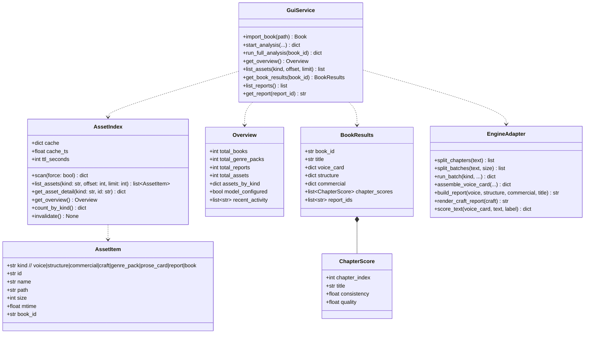
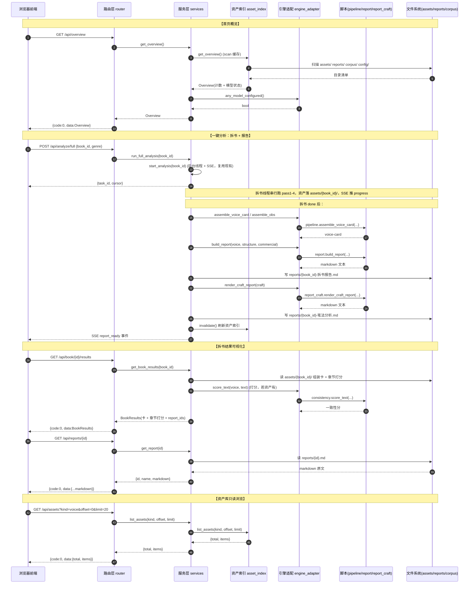
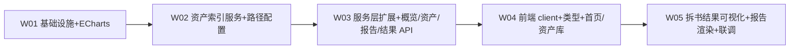

# 增量系统设计 — novel-lab GUI 全功能可视化工作台

> 架构师：高见远
> 上游输入：`docs/PRD_gui_workbench.md`（增量 PRD，已定稿）+ `docs/DESIGN_gui_book_analyzer.md`（现有 GUI 架构）
> 定位：在现有「拆书查看器」分层架构（HTTP 路由 → 服务 → 引擎适配）之上做**增量扩展**，升级为「全功能可视化工作台」。
> 本文只描述**变更部分**，不重复旧 DESIGN 已定的拆书主链路、进程模型、断点续传等细节。

---

## 0. 变更摘要（一句话）

在保留「`http.server` 纯标准库后端 + Vite/React/MUI/Tailwind 前端 + `import` 直调复用脚本原子函数」这套既有范式不变的前提下，新增 **ECharts 可视化**、**全局资产索引服务**、**6 个工作台导航** 与 **一批只读查询 API**，按「阶段一打底 → 阶段二写作闭环 → 阶段三系统高级」三阶段交付。

---

## 1. 实现方案 + 框架选型

### 1.1 核心难点与决策

| 难点 | 决策 | 理由 |
|---|---|---|
| 图表库选型 | **ECharts**，通过 `echarts-for-react` 封装 | 主理人已拍板（Q1）；雷达图/仪表盘/热力图开箱即用，契合「精致美观 + 可视化都要」；前端层不受铁律三约束 |
| 后端必须纯标准库 | 增量代码仅用 `http.server`/`json`/`os`/`pathlib`/`re`/`fnmatch` 等，**不新增任何 pip 包** | 铁律三硬约束；`markdown` 渲染交给前端，后端只做「读文件返回字符串/结构化 JSON」 |
| 现有 `ResultPanel` 只渲染裸 JSON | 新增 `AnalysisResultView`（资产卡 + 章节打分图 + 报告渲染）替换之 | 阶段一 M1 核心诉求；复用旧 `asset_index` 定位资产 |
| 资产分散在 `assets/` `reports/` `corpus/` `config/` | 新增统一「资产索引」服务 `asset_index.py`，扫描目录 → 内存缓存 + 按需失效 | PRD §6.3 明确要求；供首页/资产库/写作注入选择器三处复用，避免各写各的扫描逻辑 |
| 首页性能（资产 >100） | 懒加载 + 缓存 + 分页（`offset`/`limit`） | 主理人已拍板（Q6）；索引服务一次扫描缓存，查询只做切片 |
| Markdown 报告渲染 | 后端 `GET /api/reports/<id>` 返回原始 md 文本，前端用 `react-markdown` 渲染 | 后端不引第三方；渲染是纯前端职责 |
| 「分析」一键串联（拆书+报告+笔法报告） | 服务层新增 `run_full_analysis` 编排：复用现有拆书线程 + 完成后回调组装 + 调 `report.py` 原子函数生成 md | 复用「原子函数不复用 main 编排」原则（旧 DESIGN §1.2） |

### 1.2 前后端分层如何扩展（增量，不改范式）

```
浏览器前端 (Vite + React + MUI + Tailwind + ECharts + react-markdown)
        │  HTTP REST + SSE（沿用现有）
        ▼
GUI 后端（纯标准库）
  路由层 router.py        —— 新增 只读查询端点（/api/overview /api/assets /api/reports /api/book/{id}/results ...）
  服务层 services.py       —— 新增 概览聚合、资产查询、报告读取、结果结构化、一键分析编排
  资产索引 asset_index.py  —— 新增 扫描 assets/reports/corpus/config 目录，内存缓存
  引擎适配 engine_adapter.py —— 新增 report.py / report_craft.py / consistency.py 原子函数复用
        │  同进程 import（不 subprocess）
        ▼
novel-lab 脚本（纯标准库，零改动）
  pipeline.py · report.py · report_craft.py · consistency.py · metrics.py · ...
```

**关键点**：`engine_adapter.py` 仍是唯一 `import scripts/` 的地方；`asset_index.py` 只做目录扫描与 JSON 文件解析，**不 import 任何脚本**，保持「路由→服务→适配/索引」分层清晰。

### 1.3 ECharts 引入方式

- 依赖：`echarts@^5` + `echarts-for-react@^3`（`echarts-for-react` 是对 echarts 的 React 组件薄封装）。
- 封装层：新建 `src/components/charts/` 目录，收敛统一主题与按需引入：
  - `BaseChart.tsx`：统一 `initOpts`（主题色板、字体、背景透明）、`notMerge`、`resize` 处理，内部包 `ReactECharts`。
  - `RadarChart.tsx` / `BarChart.tsx` / `GaugeChart.tsx` / `PieChart.tsx`：按图表类型封装的受控组件，接收 `data` + `option` 覆盖。
- 主题色统一在 `src/theme.ts` 定义（见 §7），所有图表引用同一份色板，保证视觉统一。
- 按需注册：`echarts-for-react` 全量引入即可（工作台内图表种类有限，打包体积可接受），不额外做 tree-shaking 优化。

### 1.4 「分析」一键串联的实现策略

阶段一新增「分析」入口 = 拆书（现有 `start_analysis`）+ 拆书报告 + 笔法报告。实现分两步：

1. **拆书阶段**：复用现有 `start_analysis`（后台线程 + SSE），不改。
2. **报告阶段**：拆书线程跑完后（`status == done`），服务层触发 `_generate_reports(book_id)`：
   - 从 `assets/{book_id}/` 汇总各批 pass 结果，组装 voice-card / structure / commercial（复用现有 `assemble_voice_card` / `assemble_obs`）。
   - 调 `engine_adapter.build_report(voice, structure, commercial)` → 写 `reports/{book_id}-拆书报告.md`。
   - 调 `engine_adapter.render_craft_report(craft)` → 写 `reports/{book_id}-笔法分析.md`。
   - 校验合计字数 ≥ 10000（铁律二），结果通过 SSE 事件 `report_ready` 推送 + `/api/overview` 反映。

> 说明：`craft-card` 需要 pass5（笔法）结果；现有拆书主链路 PASS_ORDER 只含 pass1-4。阶段一「分析」的报告生成采用**尽力而为**：若 craft-card 资产缺失则笔法报告留空并在结果里提示（不阻断拆书交付）。pass5 深度笔法纳入阶段三 M1 高级能力。

---

## 2. 文件列表（增量，相对路径基于 novel-lab 根目录）

> 标注：🆕 新增文件；✏️ 修改文件；〔一〕阶段一实现；〔二/三〕阶段二/三实现（本次仅列模块级，不细拆）。

### 2.1 后端（纯标准库，零第三方依赖）

| 相对路径 | 状态 | 阶段 | 职责 |
|---|---|---|---|
| `gui/engine_adapter.py` | ✏️ | 〔一〕 | 新增 `build_report` / `render_craft_report` / `score_text` 等原子函数复用；新增 `get_pass5_craft` 预留 |
| `gui/asset_index.py` | 🆕 | 〔一〕 | 全局资产索引服务：扫描 `assets/` `reports/` `corpus/` `config/`，分类计数 + 清单 + 缓存 |
| `gui/services.py` | ✏️ | 〔一〕 | 新增 `get_overview` / `list_assets` / `get_asset_detail` / `list_reports` / `get_report` / `get_book_results` / `run_full_analysis` |
| `gui/router.py` | ✏️ | 〔一〕 | 注册新增只读端点（见 §3.3 API 清单） |
| `gui/config.py` | ✏️ | 〔一〕 | 新增 `CORPUS_DIR` / `REPORTS_DIR` 路径常量（`NOVEL_DIR` 预留阶段二） |
| `gui/state_store.py` | ✏️ | 〔一〕 | 新增 `list_books_summary`（扫 gui_state 目录，供首页「已拆 N 本」） |
| `gui/writing_service.py` | 🆕 | 〔二/三〕 | 写作闭环服务层（注入/写作/打分/组装编排）—— 阶段二 |
| `gui/quality_service.py` | 🆕 | 〔二/三〕 | 质检服务层（检查/质检/qc）—— 阶段二 |
| `gui/system_service.py` | 🆕 | 〔二/三〕 | 系统服务层（模型/校验/合规/state-track）—— 阶段三 |
| `tests/test_asset_index.py` | 🆕 | 〔一〕 | 资产索引服务单元测试 |
| `tests/test_overview_api.py` | 🆕 | 〔一〕 | 概览/资产/报告 API 集成测试 |

### 2.2 前端（独立层，可自由引第三方）

| 相对路径 | 状态 | 阶段 | 职责 |
|---|---|---|---|
| `gui/web/package.json` | ✏️ | 〔一〕 | 新增 `echarts` / `echarts-for-react` / `react-markdown` / `remark-gfm` 依赖 |
| `gui/web/src/App.tsx` | ✏️ | 〔一〕 | 左侧栏从 4 个 Tab 改为 6 个工作台导航（首页/分析/写作/质检/资产库/系统/设置） |
| `gui/web/src/theme.ts` | 🆕 | 〔一〕 | 统一色板（主色 + 状态色 + 图表主题色），供 MUI theme 与 ECharts 共用 |
| `gui/web/src/layout/WorkbenchNav.tsx` | 🆕 | 〔一〕 | 左侧导航栏（工作台切换，含状态徽标） |
| `gui/web/src/components/charts/BaseChart.tsx` | 🆕 | 〔一〕 | ECharts 统一封装（主题/resize/initOpts） |
| `gui/web/src/components/charts/RadarChart.tsx` | 🆕 | 〔一〕 | 雷达图封装 |
| `gui/web/src/components/charts/BarChart.tsx` | 🆕 | 〔一〕 | 柱状图封装（章节打分对比、severity 分布） |
| `gui/web/src/components/charts/GaugeChart.tsx` | 🆕 | 〔一〕 | 仪表盘/进度环封装 |
| `gui/web/src/components/charts/PieChart.tsx` | 🆕 | 〔一〕 | 饼图封装（资产类型分布） |
| `gui/web/src/components/HomeDashboard.tsx` | 🆕 | 〔一〕 | M0 首页：KPI 卡片 + 数据管理入口 |
| `gui/web/src/components/AnalysisResultView.tsx` | 🆕 | 〔一〕 | M1 拆书结果可视化（资产卡 + 章节打分图 + 报告渲染），替代 ResultPanel |
| `gui/web/src/components/AssetLibrary.tsx` | 🆕 | 〔一〕 | M4 资产库只读浏览（分类树 + 详情 + 计数） |
| `gui/web/src/components/MarkdownReport.tsx` | 🆕 | 〔一〕 | Markdown 报告渲染封装（react-markdown + remark-gfm） |
| `gui/web/src/components/WritingWorkbench.tsx` | 🆕 | 〔二/三〕 | M2 写作工作台（注入/写作/打分/组装）—— 阶段二 |
| `gui/web/src/components/QualityWorkbench.tsx` | 🆕 | 〔二/三〕 | M3 质检工作台（检查/质检/qc）—— 阶段二 |
| `gui/web/src/components/SystemPanel.tsx` | 🆕 | 〔二/三〕 | M5 系统与合规（模型/校验/合规/state-track）—— 阶段三 |
| `gui/web/src/api/client.ts` | ✏️ | 〔一〕 | 新增 `getOverview` / `listAssets` / `getAssetDetail` / `listReports` / `getReport` / `getBookResults` / `runFullAnalysis` |
| `gui/web/src/types.ts` | ✏️ | 〔一〕 | 新增 `Overview` / `AssetItem` / `ReportItem` / `BookResults` 等类型 |
| `gui/web/src/state/AppContext.tsx` | ✏️ | 〔一〕 | 新增当前工作台 + 资产索引缓存状态 |

### 2.3 文档

| 相对路径 | 状态 | 职责 |
|---|---|---|
| `docs/DESIGN_gui_workbench.md` | 🆕 | 本文档 |

---

## 3. 数据结构与接口

### 3.1 资产索引数据模型（类图）



### 3.2 资产索引服务设计（`asset_index.py`）

**扫描范围与分类规则**（阶段一）：

| 目录 | kind | 识别规则 | 用途 |
|---|---|---|---|
| `assets/{book_id}/` | `voice` / `structure` / `commercial` / `craft` | 扫描 `c{ch}-b{bi}-{pass}.json`，按 pass 名归类；或扫描已组装的 `*-voice-card.json` 等 | 资产库浏览 + 拆书结果 |
| `reports/*.md` | `report` | 文件名后缀 `-拆书报告.md` / `-笔法分析.md` | 首页报告数 + 报告渲染 |
| `corpus/*.txt` | `book` | `*.txt`（排除子目录 raw/sampled/metrics/fanqie 内部） | 首页「已导入语料」+ 写作选书 |
| `config/models.json` | `model` | 读模型配置（复用 `engine_adapter.list_models`） | 首页「模型状态」 |
| `novel/`（预留） | `chapter` | 阶段二写作产出 | 写作注入选择器 |

**缓存与失效**：`scan()` 全量扫描一次，结果缓存于内存（带 `cache_ts`）；TTL 默认 5 秒（可配置），超过则下次查询时惰性重扫；写操作（阶段三资产导入）主动 `invalidate()`。首页 `>100` 资产时分页（`offset`/`limit`），`count_by_kind` 走缓存计数不发完整清单。

**安全**：所有返回给前端的路径均做相对化处理（`relative_to(ROOT_DIR)`），不暴露绝对路径；资产详情读取做 `kind` 白名单 + `id` 校验，防路径穿越。

### 3.3 新增 API 端点清单（阶段一）

> 统一响应包裹沿用旧 DESIGN：`{"code":0,"data":...,"message":""}`；字段 `snake_case`。

| 方法 | 路径 | 入参 | 出参（data） | 说明 |
|---|---|---|---|---|
| GET | `/api/overview` | — | `Overview` | 首页概览聚合（资产数/题材包数/报告数/模型状态） |
| GET | `/api/assets` | `?kind=&offset=&limit=` | `{total, items:[AssetItem]}` | 资产清单分页（kind 可选，缺省返回全部） |
| GET | `/api/assets/<kind>/<id>` | — | 资产结构化 JSON | 资产详情（只读，白名单校验） |
| GET | `/api/reports` | — | `list[ReportItem]` | 报告清单（拆书报告 + 笔法分析） |
| GET | `/api/reports/<id>` | — | `{id, name, markdown}` | 报告 Markdown 原文（前端 react-markdown 渲染） |
| GET | `/api/book/<book_id>/results` | — | `BookResults` | 某书拆书结构化结果（组装卡 + 章节打分 + 报告关联） |
| GET | `/api/book/<book_id>/scores` | — | `list[ChapterScore]` | 章节打分数据（供章节打分对比图） |
| POST | `/api/analyze/full` | `{book_id, genre, model_id?}` | `{task_id, cursor, status}` | 一键「分析」（拆书 + 报告 + 笔法报告串联） |

> 已有端点 `/api/asset`（批级 pass 原始 JSON）保留，作为 `AnalysisResultView` 的底层数据源之一；新增 `/api/book/<id>/results` 是其「组装后」的高层视图。

### 3.4 前端类型扩展（`types.ts` 增量）

```typescript
type AssetKind = 'voice' | 'structure' | 'commercial' | 'craft' | 'genre_pack' | 'prose_card' | 'report' | 'book';
interface AssetItem { kind: AssetKind; id: string; name: string; path: string; size: number; mtime: number; bookId?: string; }
interface Overview { totalBooks: number; totalGenrePacks: number; totalReports: number; totalAssets: number; assetsByKind: Record<string, number>; modelConfigured: boolean; recentActivity: string[]; }
interface ChapterScore { chapterIndex: number; title: string; consistency: number; quality: number; }
interface BookResults { bookId: string; title: string; voiceCard: Record<string, unknown>; structure: Record<string, unknown>; commercial: Record<string, unknown>; chapterScores: ChapterScore[]; reportIds: string[]; }
interface ReportItem { id: string; name: string; kind: 'book' | 'craft'; bookId: string; size: number; }
```

---

## 4. 程序调用流程（时序图 — 阶段一）



---

## 5. 任务列表（有序，含依赖）

### 5.1 阶段一（本次实现重点，细分）

| Task ID | 任务名 | 源文件 | 依赖 | 优先级 | 验收标准 |
|---|---|---|---|---|---|
| W01 | 基础设施 + ECharts 引入 | `package.json` / `theme.ts` / `App.tsx`（导航改造）/ `layout/WorkbenchNav.tsx` / `components/charts/BaseChart.tsx` + `RadarChart.tsx` + `BarChart.tsx` + `GaugeChart.tsx` + `PieChart.tsx` | — | P0 | `npm install` 成功引入 echarts/echarts-for-react；`npm run build` 通过；App 显示 6 工作台左侧导航；BaseChart 能渲染测试图 |
| W02 | 资产索引服务 + 路径配置 | `gui/asset_index.py`（🆕）/ `gui/config.py`（✏️ CORPUS_DIR/REPORTS_DIR）/ `gui/state_store.py`（✏️ list_books_summary）/ `tests/test_asset_index.py` | W01 | P0 | 扫描 assets/reports/corpus/config 返回正确分类计数；缓存 TTL 生效；分页正确；单测通过 |
| W03 | 服务层扩展 + 概览/资产/报告/结果 API | `gui/services.py`（✏️ get_overview/list_assets/get_asset_detail/list_reports/get_report/get_book_results/run_full_analysis）/ `gui/router.py`（✏️ 注册端点）/ `gui/engine_adapter.py`（✏️ build_report/render_craft_report/score_text）/ `tests/test_overview_api.py` | W02 | P0 | `/api/overview` 返回聚合；`/api/assets` 分页；`/api/reports/<id>` 返回 md；`/api/book/<id>/results` 返回结构化结果；集成测试通过 |
| W04 | 前端 API client + 类型 + 首页/资产库组件 | `api/client.ts`（✏️）/ `types.ts`（✏️）/ `components/HomeDashboard.tsx` / `components/AssetLibrary.tsx` / `state/AppContext.tsx`（✏️） | W03 | P0 | 首页 KPI 卡片正确展示；资产库分类树 + 详情可浏览；分页/懒加载生效 |
| W05 | 拆书结果可视化 + 报告渲染 + 联调 | `components/AnalysisResultView.tsx` / `components/MarkdownReport.tsx` / `App.tsx`（✏️ 接线）/ `client.ts`（✏️ runFullAnalysis） | W04 | P0 | 拆书完成后结果面板显示资产卡（非裸 JSON）；章节打分图（柱状/雷达）呈现；报告 Markdown 富文本渲染；「分析」一键串联端到端走通 |

### 5.2 阶段二 / 阶段三（模块级任务概述，不在本次实现）

| Task ID | 任务名 | 模块范围 | 依赖 | 优先级 |
|---|---|---|---|---|
| W06 | 写作闭环（M2） | `writing_service.py` + `WritingWorkbench.tsx`（注入/写作/打分/组装） | W05 | P0 |
| W07 | 质检工作台（M3） | `quality_service.py` + `QualityWorkbench.tsx`（检查/质检/qc） | W05 | P1 |
| W08 | 系统与合规（M5） | `system_service.py` + `SystemPanel.tsx`（模型/校验/合规/state-track） | W07 | P1 |
| W09 | M1 高级 + M4 写入 | batch/pass5_aggregate/distill + import-genre-prose-cards/convert-genre-card | W07/W08 | P1 |

---

## 6. 依赖包列表

### 6.1 后端（零第三方依赖，仅标准库）

```
- 标准库：http.server / socketserver / threading / json / os / pathlib / sys / re / fnmatch / typing / time / hashlib / mimetypes / urllib / webbrowser
- （无任何 pip 依赖；铁律三满足。资产索引/报告读取均为纯文件与 JSON 操作）
```

### 6.2 前端（npm，新增）

```
- echarts@^5.5.0            图表核心（Q1 拍板）
- echarts-for-react@^3.0.2  ECharts 的 React 封装
- react-markdown@^9.0.0     Markdown 报告渲染（M1-3）
- remark-gfm@^4.0.0         GFM 表格/任务列表支持
（既有：react@^18.3 / react-dom@^18.3 / vite@^5.4 / @vitejs/plugin-react / typescript@^5.5 /
  @mui/material@^5.16 / @mui/icons-material@^5.16 / @emotion/react / @emotion/styled /
  tailwindcss@^3.4 / postcss / autoprefixer / @tanstack/react-virtual@^3.10）
```

---

## 7. 共享知识（跨文件约定）

- **API 路径前缀**：所有后端接口以 `/api/` 开头；`/api/events` 为 SSE 长连接（不走 JSON 包裹）。
- **响应包裹**：成功 `{"code":0,"data":...,"message":""}`；失败 `code` 非 0，`message` 可读，`data` 为 null。
- **JSON 字段命名**：后端统一 `snake_case`；前端 `types.ts` 用 `camelCase`，`client.ts` 统一转换（沿用旧 DESIGN，新接口照此办理）。
- **图表主题色**（`theme.ts` 单一定义，MUI 与 ECharts 共用）：
  - 主色 `#1976d2`；成功绿 `#2e7d32`；处理中蓝 `#0288d1`；失败红 `#d32f2f`；跳过灰黄 `#b0a47a`。
  - 章节打分图：一致性 = 主色，质量 = 成功绿。
  - 质检 severity：error=红 / warning=黄 / info=蓝（阶段二）。
- **资产索引数据结构**：`AssetItem` 的 `kind` 取值见 §3.2 白名单；`path` 一律相对 ROOT_DIR（不暴露绝对路径）；写操作后必须 `invalidate()`。
- **报告命名规范**：`reports/{book_id}-拆书报告.md` / `reports/{book_id}-笔法分析.md`，`book_id` 复用 `state_store.book_id_from_title` 生成的稳定 id。
- **铁律三边界**：后端 `gui/` 下禁止 import 任何第三方包；`engine_adapter.py` 是唯一 `import scripts/` 的地方，`asset_index.py` 不得 import 脚本，只做文件扫描。
- **铁律二字数校验**：一键「分析」在生成两份报告后合计校验 ≥10000 字符（复用铁律二口径）；不足时在结果中显式提示，不静默通过。
- **串行处理**：沿用旧 DESIGN，拆书/报告生成均在单工作线程串行；`threading` 仅用于 HTTP 并发 + 单分析线程。
- **阶段一验收独立性**：阶段一（W01-W05）不依赖阶段二/三任何代码；写作/质检/系统组件仅占位导航，点击显示「建设中」。

---

## 8. 待明确事项

> 主理人已拍板 8 条（Q1-Q8），本设计已全部遵循。剩余需澄清项尽量少：

| # | 事项 | 影响 | 建议默认值 |
|---|---|---|---|
| D1 | `assets/` 当前为空，拆书资产的「组装卡」（voice-card/structure/commercial）落盘时机与文件命名 | 决定 `/api/book/<id>/results` 如何定位组装结果 | 沿用旧 DESIGN A6：整书跑完统一组装，命名 `{book_id}-voice-card.json` 等，落在 `assets/{book_id}/` 下；若缺失则 `/results` 返回批级 pass 原始 JSON 作为降级 |
| D2 | 章节「质量分」数据来源 | 拆书主链路当前无每章质量打分（打分属 consistency.py，阶段二） | 阶段一章节打分图以「一致性分」为主（若 craft/voice 资产含分则用），质量维度留空或 0，阶段二接入 `consistency.score_text` 补齐 |
| D3 | 「分析」一键串联的笔法报告在 craft-card 缺失时的处理 | 阶段一是否阻断 | 尽力而为：craft 缺失时笔法报告留空 + 前端提示，不阻断拆书交付（见 §1.4） |
| D4 | 资产索引 `novel/` 写作目录（阶段二）是否阶段一就建扫描分支 | 目录当前不存在 | 阶段一仅预留 `NOVEL_DIR` 常量与 `chapter` kind 定义，不实际扫描；阶段二启用 |

---

## 9. 任务依赖图（阶段一）



---

*文档结束。本增量设计遵循「简洁优先 + 复用优先」，聚焦阶段一可独立验收，阶段二/三仅列模块级任务留待后续细化。*
