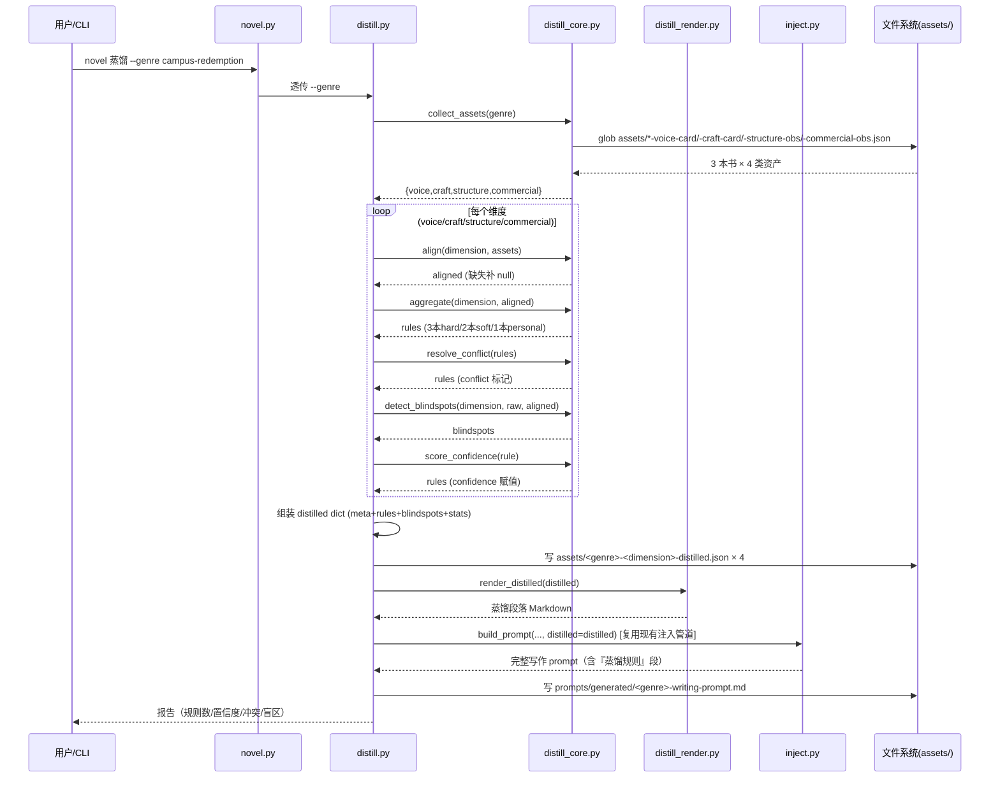

# novel-lab「蒸馏层」系统设计 + 任务分解

> 项目代号：novel-lab「蒸馏层」（distillation layer）
> 架构师：高见远（Gao） · 主理人：齐活林（Qi） · 产品：Alice
> 日期：2026-09-07
> 范围：**仅聚合 + 全量注入**，不含语义检索/RAG（下一期）

---

## 0. 前置定位结论（注入点）

主理人要求先定位「题材包（genre-pack）在哪个阶段被读取、被拼进哪个 prompt 段落」，据此设计自动注入挂钩点。定位结论如下：

| 关注点 | 结论 |
|--------|------|
| genre-pack 何时被「读取」 | `novel 注入` 子命令 → `scripts/inject.py` 的 `main()`，通过 `--genre-pack` 参数 `json.loads` 读入（`inject.py:384`）。 |
| 拼进哪个 prompt 段落 | `inject.py:build_prompt()` → 第 `329-331` 行，`render_genre_pack()` 渲染后作为 **「## 〇、题材规则（genre-pack · 最高优先级）」** 段落，排在所有段落最前、优先级最高。 |
| 拆书阶段是否自动读 genre-pack | **否**。`pipeline.py` 拆书（Pass1-5）**不读 genre-pack**。genre-pack 只在「写作/注入」阶段被消费。当前 `pass5_aggregate.py` 生成 genre-pack 后也仅提示"可被 inject.py 注入"，无自动链路。 |
| 本期的自动注入挂钩点 | 见 §3.5：新增 `scripts/distill.py` 聚合入口 + `inject.py` 增加 `--distilled` 段，`novel.py` 增加 `蒸馏` 子命令；在 `pipeline.py` 拆书完成处追加「蒸馏 Hook」。 |

**关键结论**：genre-pack 与写作 prompt 的耦合点在 `inject.py:build_prompt()`，自动注入蒸馏结果应**复用同一 `build_prompt()` 函数签名**，新增一个独立的 `--distilled` 参数与渲染段落（§3.5、§4），不改动现有段落渲染逻辑。

---

## Part A：系统设计

### 1. 实现方案 + 框架选型

#### 1.1 核心技术难点

| # | 难点 | 应对策略 |
|---|------|----------|
| 1 | **跨书字段不一致**（commercial-obs 三本书结构各异） | 先「对齐（normalize）」再聚合：定义统一目标 schema，缺失字段补 `null`，聚合时跳过 `null`，不报错。 |
| 2 | **共性与个性的分层判定**（3/2/1 本共有） | 按「覆盖书数」分硬规则（3 本）、软规则（2 本）、个人风格（1 本，不聚合仅标注来源）。与 `pass5_aggregate.py` 现有 80%/40% 阈值思想一致，但本层用「绝对书数」而非百分比（书少时更稳）。 |
| 3 | **冲突不消解** | 同一规则出现分歧时，保留两条、各自带 `source`（book 名），不强行合并。 |
| 4 | **防过度泛化护栏** | 规则式置信度评分（书数 + 字段完整度 + 冲突标记），低置信/过度泛化规则打 `over_generalized: true` 标记。**零 ML/embedding**。 |
| 5 | **盲区诊断（类型级）** | 检测"某本书某维度完全缺失"，输出 `blindspots` 清单，不做章节级细粒度。 |
| 6 | **可增量扩展** | distilled JSON 带稳定 `id`、`source` 列表、`dimension` 维度名，为下一期 RAG 预留检索入口。 |

#### 1.2 框架选型（严格纯标准库，零第三方依赖）

| 组件 | 选型 | 理由 |
|------|------|------|
| 语言 | Python 3.13.12（沿用现有） | 项目既定 |
| 数据格式 | JSON（`json` stdlib） | 资产已是 JSON |
| 文件/路径 | `pathlib.Path`（stdlib） | 与 `pass5_aggregate.py`、`inject.py` 一致 |
| 统计 | `collections.Counter` / `statistics`（stdlib） | 聚合计数、均值、中位数 |
| 命令行 | `argparse`（stdlib） | 与现有 19 脚本一致 |
| 测试 | `unittest`（stdlib） | 与 `tests/test_regressions.py` 一致 |
| 依赖注入到写作 | 复用 `inject.py:build_prompt()` | 不新造 prompt 管道 |

**零第三方依赖**：新增脚本 `import` 白名单仅含 `argparse / json / re / sys / collections / statistics / pathlib / copy / datetime / uuid`（均为 stdlib）。

#### 1.3 架构模式

采用**管道式（Pipeline）+ 单一职责脚本**，与现有 19 脚本风格完全一致：

```
novel.py（CLI 入口，新增「蒸馏」子命令）
   └─ scripts/distill.py（蒸馏主控：读→对齐→聚合→冲突→盲区→评分→落盘→注入）
        ├─ 复用 scripts/inject.py 的 build_prompt（注入）
        ├─ 复用 scripts/validate.py 的风格（可选的 distilled schema 校验）
        └─ 产出 assets/<genre>-<dimension>-distilled.json（新落盘形态）
```

- 每个维度（voice / craft / structure / commercial）独立一个蒸馏脚本函数模块，主控 `distill.py` 统一编排。
- 不覆盖原资产，只新增 `*-distilled.json`。
- 不做数据库/向量库。

---

### 2. 文件列表（相对路径）

**新增脚本（4 个）**

| 路径 | 职责 |
|------|------|
| `scripts/distill.py` | 蒸馏主控：收集同题材资产 → 对齐 → 逐维度聚合 → 冲突/盲区/评分 → 落盘 `*-distilled.json` → 调 inject 注入。 |
| `scripts/distill_core.py` | 纯函数库：`align()`、`aggregate()`、`resolve_conflict()`、`detect_blindspots()`、`score_confidence()`。无 LLM 依赖，可单测。 |
| `scripts/distill_render.py` | 蒸馏结果 → 写作 prompt 段落渲染（`render_distilled()`），供 `inject.py` 调用。 |

**修改脚本（2 个）**

| 路径 | 改动 |
|------|------|
| `novel.py` | 新增 `蒸馏` 子命令（透传 `distill.py`）；`注入` 子命令新增 `--distilled` 参数透传。 |
| `scripts/inject.py` | `build_prompt()` 新增 `distilled` 形参 + 「蒸馏规则」段落；`main()` 新增 `--distilled` 解析。 |

**新增落盘产物（示例，实际随聚合生成）**

| 路径 | 内容 |
|------|------|
| `assets/campus-redemption-voice-distilled.json` | 声音卡聚合 |
| `assets/campus-redemption-craft-distilled.json` | 技法卡聚合 |
| `assets/campus-redemption-structure-distilled.json` | 结构观测聚合 |
| `assets/campus-redemption-commercial-distilled.json` | 商业观测聚合 |

**新增测试（1 个）**

| 路径 | 内容 |
|------|------|
| `tests/test_distill.py` | 蒸馏层回归测试（对齐、聚合、冲突、盲区、评分、注入），纯 stdlib unittest。 |

**文档（本文件 + 图）**

| 路径 | 内容 |
|------|------|
| `docs/system_design.md` | 本设计文档 |
| `docs/class-diagram.mermaid` | 数据结构/接口类图 |
| `docs/sequence-diagram.mermaid` | 调用时序图 |

---

### 3. 数据结构与接口

#### 3.1 聚合后的 `*-distilled.json` schema（核心落盘形态）

```jsonc
{
  "meta": {
    "id": "campus-redemption-commercial-distilled",   // 稳定 id，供 RAG 检索
    "schema_version": "1.0",
    "dimension": "commercial",                         // voice | craft | structure | commercial
    "genre": "campus-redemption",
    "distilled_at": "2026-09-07",
    "source_books": ["chireng_chosen", "qingning_chosen", "sangshi_chosen"],
    "books_count": 3
  },
  "rules": [                                             // 聚合出的规则列表（核心）
    {
      "id": "commercial-payoff_density-0001",           // 稳定 id
      "dimension": "commercial",
      "field": "payoff_density.per_thousand_words",     // 字段路径
      "kind": "hard",                                   // hard(3本) | soft(2本) | personal(1本,不聚合)
      "books_count": 3,
      "value": { "per_thousand_words_median": 0.8 },    // 聚合值（可含统计量）
      "sources": [                                       // 来源列表（冲突时多条）
        { "book": "chireng_chosen", "value": 1.5 },
        { "book": "qingning_chosen", "value": 0.8 },
        { "book": "sangshi_chosen", "value": 0.8 }
      ],
      "confidence": 0.85,                                // 规则式置信度 0~1
      "conflict": false,                                 // 是否冲突（保留多条不消解）
      "over_generalized": false,                         // 过度泛化标记
      "blindspot_books": []                              // 该字段缺失的书（对齐为 null 的书）
    }
  ],
  "blindspots": [                                        // 类型级盲区诊断
    {
      "book": "sangshi_chosen",
      "dimension": "commercial",
      "field": "common_mistakes",                        // 完全缺失的字段
      "note": "该书 commercial-obs 未产出此字段"
    }
  ],
  "stats": {
    "total_rules": 42,
    "hard_rules": 12,
    "soft_rules": 18,
    "personal_styles": 12,                              // 仅标注，不进 rules
    "conflicts": 3,
    "blindspots": 1
  }
}
```

#### 3.2 对齐中间态 schema（commercial-obs 统一目标结构）

对不齐的商业观测，先对齐为统一结构，缺失补 `null`：

| 字段路径 | chireng | qingning | sangshi |
|----------|---------|----------|---------|
| `payoff_density.per_chapter` | 3 | **null** | **null** |
| `payoff_density.per_thousand_words` | 1.5 | 0.8 | 0.8 |
| `payoff_density.buildup_length` | 3000 | dict{chapters,words} | 21000 |
| `payoff_density.payoff_types` | list | **null**（散落在 ratio 字符串） | list |
| `skeleton` | str | dict{chapter_1, chapter_2_3_task} | str |
| `dry_spell_tolerance` | str | dict{max_consecutive_chapters, note} | str |
| `opening_analysis.chapter_1.*` | 齐 | 齐 | 齐（嵌套 `chapter_2_3_task`/`common_mistakes` 位置有差异） |
| `common_mistakes` | str | list | str（在 `opening_analysis.chapter_1` 内） |
| `paywall.position_chapter` | 10 | 10 | 27 |

> 对齐策略：`distill_core.align()` 对 `payoff_density` 等聚合字段做**数值化归一**（如 `buildup_length` 统一抽 `words` 或数值），不可数值化的保留原始值并标注 `type`，缺失补 `null`。聚合时 `null` 跳过、计入 `blindspot_books`。

#### 3.3 核心类/函数签名（`distill_core.py`）

```python
# ---- 数据类（轻量，用 dict 或 dataclass）----
from dataclasses import dataclass, field

@dataclass
class SourceValue:
    book: str
    value: object          # 对齐后的值（可为 None）
    raw: object            # 原始值（供溯源）

@dataclass
class AggregatedRule:
    id: str
    dimension: str
    field: str
    kind: str              # hard | soft | personal
    books_count: int
    value: object
    sources: list          # [SourceValue]
    confidence: float
    conflict: bool
    over_generalized: bool
    blindspot_books: list  # [book]

# ---- 核心函数 ----
def collect_assets(genre: str, book_names: list | None) -> dict:
    """收集同题材 4 类资产。返回 {'voice': {book: dict}, 'craft': ..., 'structure': ..., 'commercial': ...}"""

def align(dimension: str, assets: dict) -> dict:
    """把某维度各书资产对齐到统一目标 schema，缺失补 None。
    返回 {book: aligned_dict}。commercial 维度做字段归一化。"""

def aggregate(dimension: str, aligned: dict) -> list[AggregatedRule]:
    """按维度聚合：3本→hard，2本→soft，1本→personal（仅标注）。数值取中位数，列表求交集/并集。"""

def resolve_conflict(rules: list[AggregatedRule]) -> list[AggregatedRule]:
    """检测同一 field 的多值分歧，标记 conflict=True，保留多条不消解。"""

def detect_blindspots(dimension: str, raw_assets: dict, aligned: dict) -> list[dict]:
    """类型级盲区：某书某维度/字段完全缺失（raw 中无此 key 或值为 null）。"""

def score_confidence(rule: AggregatedRule) -> float:
    """规则式评分 = f(books_count, 字段完整度, 是否冲突)。硬规则高、冲突降权、缺字段降权。"""

def distill_genre(genre: str, book_names: list | None = None) -> dict:
    """主编排：collect → align → aggregate → resolve_conflict → detect_blindspots → score → 组装 distilled dict。"""
```

#### 3.4 注入渲染函数签名（`distill_render.py`）

```python
def render_distilled(distilled: dict | None) -> str:
    """蒸馏结果 → 写作 prompt 段落（Markdown）。
    硬规则标『必守』、软规则标『建议』、冲突标『二选一/分歧』、盲区标『注意缺失』。
    返回空串表示无蒸馏数据（不注入）。"""
```

#### 3.5 `inject.py` 改动签名

```python
def build_prompt(voice, structure, commercial, genre_pack=None,
                 craft_card=None, distilled=None) -> str:
    """新增 distilled 形参，在 genre-pack 段落之后、叙述层之前插入『蒸馏规则』段落。"""
```

---

### 4. 程序调用流程（时序图）



---

## Part B：任务分解

### 5. 依赖包列表

**无第三方依赖**（严格纯标准库）。新增脚本 `import` 白名单：`argparse`、`json`、`re`、`sys`、`collections`、`statistics`、`pathlib`、`copy`、`datetime`、`uuid`、`dataclasses`、`unittest`（仅测试）。`requirements.txt` 无需新增，`pip install` 无需执行。

### 6. 任务列表（有序，按实现顺序，含依赖）

| 任务 ID | 任务名 | 源文件 | 依赖 | 优先级 | 验收标准 |
|---------|--------|--------|------|--------|----------|
| **T01** | 蒸馏核心纯函数库（对齐/聚合/冲突/盲区/评分） | `scripts/distill_core.py`（新增） | 无 | P0 | `distill_core` 可被 `import`；`align` 对 3 本不一致 commercial-obs 返回补齐 null 的对齐结构；`aggregate` 正确分 hard/soft/personal；`resolve_conflict` 保留冲突多条；`score_confidence` 输出 0~1 且冲突降权。 |
| **T02** | 蒸馏主控脚本（编排 + 落盘） | `scripts/distill.py`（新增） | T01 | P0 | `python scripts/distill.py --genre campus-redemption` 能跑通，产出 4 个 `assets/campus-redemption-*-distilled.json`，含 meta/rules/blindspots/stats，不覆盖原资产。 |
| **T03** | 蒸馏注入渲染 + inject.py 挂钩 | `scripts/distill_render.py`（新增）、`scripts/inject.py`（修改） | T01 | P1 | `render_distilled()` 产出 Markdown；`inject.py:build_prompt` 新增 `distilled` 形参且插入「蒸馏规则」段；`inject.py:main` 支持 `--distilled`。 |
| **T04** | CLI 入口集成 + 拆书自动 Hook | `novel.py`（修改）、`scripts/pipeline.py`（修改） | T02, T03 | P1 | `novel 蒸馏 --genre xxx` 可运行；`novel 注入 ... --distilled <file>` 可运行；`pipeline.py` 拆书完成处追加「蒸馏 Hook」（同题材≥3本时自动调 distill）。 |
| **T05** | 回归测试 + 全量验证 | `tests/test_distill.py`（新增）、`run_tests.py`（确认兼容） | T01~T04 | P1 | `python run_tests.py` 全绿（新增蒸馏用例 + 原 8 用例不回归）；3 本真实资产跑通蒸馏并人工抽查蒸馏结果合理性。 |

> 任务划分遵循「每个任务 ≥3 相关文件/关注点」与「第一任务为基础设施」原则。此处将「核心库」作为 T01 基础设施（蒸馏层的"地基"），T02~T04 在其上分层，T05 收尾。

### 7. 共享知识（跨文件约定）

- **字段命名**：统一英文小写，字段路径用点号拼接（如 `payoff_density.per_thousand_words`）。聚合值优先用 `_median` 后缀表统计量。
- **置信度取值**：`confidence ∈ [0,1]`，规则式计算：硬规则(3本) 基础 0.8，软规则(2本) 基础 0.6，个人风格(1本) 0.3（且不进 rules）；每缺一本书扣 0.1；冲突标记再扣 0.1；下限 0.1。`over_generalized` 在 confidence < 0.5 时置 `true`。
- **来源标注格式**：`source` 一律用 `{ "book": "<book_name>", "value": <原始值> }`；冲突时 `sources` 为多元素列表，`conflict: true`。
- **null 占位约定**：对齐阶段缺失字段补 `null`（JSON 的 `null`），聚合时**跳过 null**，不报错，且把对应 book 记入该 rule 的 `blindspot_books`。原始资产文件**永不改写**。
- **id 约定**：`distilled.meta.id = "<genre>-<dimension>-distilled"`；`rule.id = "<dimension>-<field-slug>-<4位序号>"`（`/`、`.` 转 `-`）。稳定、可复现，供下一期 RAG 检索。
- **落盘形态**：每个题材/维度独立一个 `*-distilled.json`，**不覆盖**原 `*-voice-card.json` 等资产。
- **盲区粒度为类型级**：仅记录「某书某维度/字段完全缺失」，不做章节级。
- **零第三方依赖**：任何新增 `import` 必须属于 stdlib；禁止 `numpy/pandas/sklearn/embedding`。
- **复用既有管道**：注入必须走 `inject.py:build_prompt()`，不另造 prompt 拼接逻辑。
- **风格一致**：新增脚本沿用现有脚本的 docstring（中文）+ `argparse` + `if __name__ == "__main__": main()` 结构。

### 8. 待明确事项（含默认建议）

| # | 待明确点 | 默认建议 |
|---|----------|----------|
| 1 | `payoff_types` 在 qingning 里是散落字符串（"情感回应:7，他人认可:2，反杀:1"），无法与另两本的 list 结构对齐 | 默认在 `align()` 里对 qingning 的 `ratio` 字符串做轻量解析（正则抽 `类型:数字`），转成 list；解析失败则置 null 并记盲区，不报错。 |
| 2 | `buildup_length` 三本书类型不一（int / dict / int），语义可能不一致 | 默认统一抽「字数」数值（dict 取 `words`，int 原样），聚合取中位数；无法数值化的标 `type` 保留原始，不强行换算。 |
| 3 | 蒸馏后是否要 schema 校验（`validate.py` 尚无 distilled schema） | 默认本期**不新增** distilled schema 严格校验，仅在 `distill.py` 内做结构自检（meta/rules 必填字段存在）；下一期补 `schema/distilled.schema.json`。 |
| 4 | 「全量注入」是否覆盖 voice-card 的 6 个 key（narration/dialogue/emotion_handling/imagery/banned/provenance） | 默认聚合**可聚合的 5 个**（provenance 为合规元数据不聚合），banned 取交集（3 本共有的禁用词才上升为硬规则）。 |
| 5 | craft-card 的 10 维度中，`techniques` 是自然语言列表，跨书"聚合"如何定义 | 默认按「技法名 + skeleton 文本相似」粗聚（同名/近名合并，`craft_summary.top_3_strengths` 取 3 本高频交集），不引入 embedding，纯字符串匹配 + 频次统计；做不到语义去重就保留各自来源。 |
| 6 | 自动 Hook 触发阈值：拆到第 4 本书时才触发，还是每次拆书后都重跑 | 默认每次拆书完成后、若该题材书数 ≥3 则重跑蒸馏（幂等，覆盖重生成 `*-distilled.json`），书数 <3 时静默跳过并提示"待≥3本"。 |

---

## 附：图文件

- 类图：`docs/class-diagram.mermaid`
- 时序图：`docs/sequence-diagram.mermaid`
