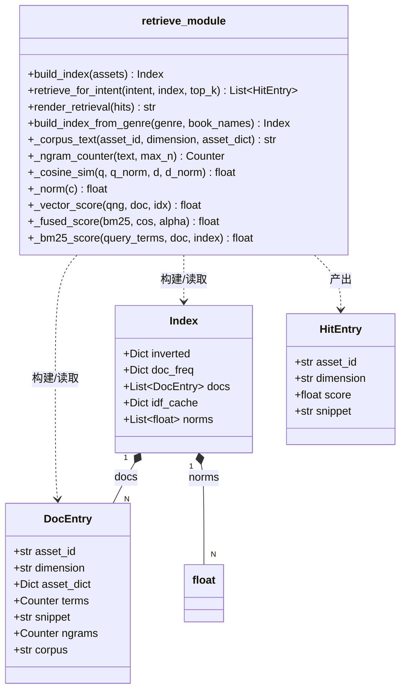
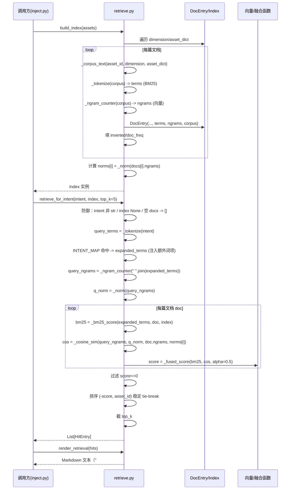

# novel-lab P0 · 语义检索 RAG 完整落地（纯标准库向量）· 系统架构设计 + 任务分解

> 架构师：高见远（software-architect）
> 范围：P0 —— 用 Python 标准库实现**字符 n-gram 向量 + 余弦相似度**语义检索，替换/增强当前 `scripts/retrieve.py` 的 BM25 简化倒排索引桥接。
> 硬约束（铁律）：**零第三方依赖（仅标准库）**；原始资产只读；对外接口（`build_index` / `retrieve_for_intent` / `render_retrieval` / `build_index_from_genre`）向后兼容；检索结果可复现（稳定 tie-break）；不得破坏既有 62/62 测试。

---

## 1. 实现方案 + 框架选型

### 1.1 核心挑战

当前 `retrieve.py` 的「BM25 简化倒排索引」是**词项重叠**近似语义，存在三个已知缺陷：

1. **分词过粗**：`_TOKEN_RE = re.compile(r"[\w\u4e00-\u9fff]+")` 把连续中日韩字符切成一个整体 token。查询词「钩子」与文档词项「作为微小钩子」无法精确相等，只能靠 `_bm25_score` 里的「子串补偿」分支（`t in dt or dt in t` 且 `len>=2`）勉强召回，召回率和区分度都低。
2. **无真正的语义相似度**：子串补偿是「布尔包含」而非「相似度」，长文档、高频子串会虚高分数，同义词（「悬念」vs「悬疑」）无法关联。
3. **意图映射是硬编码字典**：`INTENT_MAP` 只能覆盖 10 个手工关键词，扩展性差，无法处理任意自然语言意图（如「想要一个章末反转的钩子」）。

**P0 目标**：用标准库的字符 n-gram 向量 + 余弦相似度，做「字符粒度的模糊语义匹配」，天然解决 CJK 无分词、同义/近义、任意长度查询三个问题，同时保留可解释、可复现、可单测的特性。

### 1.2 算法设计（纯标准库 char n-gram + 余弦）

#### (1) n-gram 的 n 取值 —— **推荐「1/2/3 混合」（unigram + bigram + trigram）**

**理由（三条）**：

- **unigram（1-gram）**：保留单字符频次，对「字面重叠」敏感，等价于字符级 bag-of-words，能在向量完全无共同 bigram 时仍给出合理相似度，避免稀疏导致的全零余弦。
- **bigram（2-gram）**：捕获局部语序，是 CJK「无分词语义匹配」的甜点档。中文双字词（钩子、悬念、反转、爽点、伏笔）几乎都能被 bigram 命中，是召回主力。
- **trigram（3-gram）**：捕获更长的固定搭配（「三段式」「反转式」），提升区分度、降低「钩子」vs「上钩」这类误配。

**为什么不用单一 2-gram**：纯 2-gram 在查询「钩」（单字）或极短查询时会因无共同 bigram 而归零，健壮性差；且 2-gram 对单字替换（「悬念」→「悬疑」）不敏感，混合 1/3-gram 可补偿。

**混合方式**：把 n=1、2、3 的 n-gram 多重集**拼接进同一个 `Counter`**（键为 `f"{n}:{gram}"`，前缀 n 避免不同长度 gram 的字符串冲突），对文档和查询用**同一套** `_ngram_counter(text)` 生成，保证维度对齐。

#### (2) 数据结构：`collections.Counter` + `math.sqrt`

- 文档向量：`Counter`，键 = `"1:钩"、"2:钩子"、"3:三段式"` 等，值 = 该 gram 在文档 corpus 中的频次（整数）。
- 查询向量：同样的 `Counter`。
- 余弦相似度：只对两个向量**共同键**求和，避免遍历全词典：

```
cos(q, d) = Σ_{g∈keys(q)∩keys(d)} q[g]·d[g]  /  ( ‖q‖ · ‖d‖ )
‖v‖ = math.sqrt( Σ_{g} v[g]² )
```

**实现要点**：
- 分母范数预计算并缓存（文档向量在索引构建时算好 `self._norms[doc_idx]`），查询向量每次检索算一次。
- 全零向量（文档 corpus 为空 / 查询为空）余弦定义为 0，避免除零。
- 用 `math.sqrt` / `math.sqrt` 的平方和，不引入 numpy。

#### (3) 文档向量如何构建 —— **复用现有 corpus 文本，新增一个独立的 `_corpus_text(doc)` 提取函数**

当前 `build_index` 的 `_add_doc` 里已经有一段「corpus 拼接」逻辑（第 264–272 行）：

```python
corpus_parts = [asset_id, dimension]
corpus_parts.append(_flatten_asset_body(asset_dict))
for rule in asset_dict.get("rules") or []:
    corpus_parts.append(str(rule.get("field", "")))
    corpus_parts.append(_flatten_value(rule.get("value")))
terms = Counter(_tokenize(" ".join(corpus_parts)))
```

**方案**：把这段「corpus 拼接」抽成独立的纯函数 `_corpus_text(asset_id, dimension, asset_dict) -> str`，**两个分支复用同一个文本源**：
- BM25 分支：`_tokenize(corpus_text)` 继续产 `terms`（保持现有测试不动）。
- 向量分支：`_ngram_counter(corpus_text)` 产 `ngrams`（新增）。

**为何复用而非重新拼 corpus**：corpus 文本已排除了 meta/provenance 噪声，且经过 `_flatten_asset_body` 的字段白名单清洗，是「最干净的语义载体」；复用保证 BM25 与向量看到的是**同一份文档表示**，融合打分才有可比性，也避免两套文本漂移。

**在 `DocEntry` 上新增字段**（而非重新拆模块），见 §3。

#### (4) 查询向量如何构建

`retrieve_for_intent` 内，对 `intent` 字符串调用同一个 `_ngram_counter(intent)`。**意图映射注入的额外词项**（`expanded_terms`）同样进入查询向量：把 `expanded_terms` 用 `" ".join` 拼回一个字符串再 `_ngram_counter`（或对每个 term 累加），使意图加权与向量检索协同（见 §1.5）。

#### (5) 保留 BM25 还是完全替换 —— **最终推荐：保留 BM25 作为「字面匹配」分支，向量作为「语义召回」分支，线性加权融合**

**一句话理由**：BM25 对「精确词项命中」区分度好、已有 19 个测试依赖它，向量对「模糊/同义/长查询」召回好，二者互补，线性加权既保精确又提召回，且不破坏既有测试。

**融合公式**（归一化后线性加权）：

```
final_score(d) = α · norm_bm25(d) + (1 - α) · cos(q, d)
```

- `α` 默认 **0.5**（可调常量，收敛在顶部常量区）。
- `norm_bm25(d)`：BM25 原始分做**最大-最小归一化**到 [0,1]（对当次候选集），使量纲与余弦一致。
- `cos(q, d)`：天然在 [0,1]（频次非负，余弦≥0）。
- **融合只在「两分支都产出了分数」时发生**；若某文档仅命中一个分支，另一分支给 0，公式仍成立。

**阈值/无命中语义**：当前 `retrieve_for_intent` 用 `score <= 0.0` 过滤无命中。融合后改用「余弦 + BM25 都为零 → 过滤」，即 `final_score <= 0.0` 过滤，保持「查询词完全无关 → 空列表」的既有语义（`test_no_hit_intent_returns_empty` 依赖此行为）。

#### (6) `INTENT_MAP` 意图加权是否保留 —— **保留，且与向量检索协同**

保留 `INTENT_MAP` 的「命中关键词 → 注入额外召回词项」逻辑，但**把注入目标从「BM25 查询词项」扩展为「同时注入 BM25 词项与查询向量 n-gram」**：

- 原逻辑 `expanded_terms` 已用于 BM25 打分，**不动**（`test_intent_map_injects_terms` 依赖）。
- 新增：`expanded_terms` 拼成字符串后进入 `_ngram_counter`，使「钩子」意图注入的「hook」「悬念」等词项也能通过向量召回对应维度文档。

这样 `INTENT_MAP` 的领域先验既强化了字面匹配，又强化了向量匹配，两层一致。

### 1.3 复杂度说明（规模：几十篇文档，无性能压力）

- **文档向量化**：`O(Σ 文档字符数)`，n-gram 生成是线性扫一遍文本。
- **查询向量化**：`O(len(intent))`。
- **单次检索**：`O(N · min(|q|, |d|))`，N=文档数（几十），q/d 为 n-gram 多重集大小。余弦只遍历共同键，实际远小于满维度。
- **内存**：每篇文档存一个 `Counter`（n-gram 键），几十篇 × 数百键，完全可忽略。

**结论**：无需任何优化，无需近似最近邻（ANN），线性扫描即可，且天然确定、可复现。

### 1.4 架构模式

纯函数式 + 数据类（dataclass），延续现有 `retrieve.py` 风格：**无状态、无 I/O、无副作用**的检索核心，索引构建与检索分离（`build_index` 产 `Index`，`retrieve_for_intent` 消费 `Index`）。不引入类继承/策略模式，保持「一文件内聚」，符合项目「最小变更」原则。

---

## 2. 文件列表及相对路径

**原则：最小变更、优先在 `retrieve.py` 内新增函数，不拆新模块。**

**理由（为何不新拆 `vector_index.py`）**：
1. 向量检索与 BM25 共享 `DocEntry` 的 corpus 文本、共享 `Index.docs` 文档列表、共享 `retrieve_for_intent` 的排序/渲染出口，拆开反而要跨文件传 `docs`，增加耦合。
2. 项目已 23 脚本 + 2 根入口，`retrieve.py` 仅 442 行，加 100 行向量逻辑仍在单一职责、可读范围内。
3. 既有测试通过 `RETRIEVE.build_index` / `RETRIEVE._bm25_score` 等直接引用 `retrieve` 模块对象，拆模块会破坏 `from retrieve import ...` 的测试引用面。

| 文件（相对路径） | 变更类型 | 说明 |
|---|---|---|
| `scripts/retrieve.py` | **修改（主要）** | 新增 n-gram 向量化、余弦相似度、融合打分函数；`DocEntry`/`Index` 增字段；`build_index`/`retrieve_for_intent` 接入向量分支。保留全部既有 BM25 函数。 |
| `tests/test_distill.py` | **修改（新增测试，不改旧测试）** | 在 `TestRetrieval` 类中追加 `TestVectorRetrieval`（或同文件新类）覆盖向量/融合行为；**现有 19 个 `TestRetrieval` 测试一行不改**（BM25 函数保留）。 |
| `scripts/inject.py` | **不改** | `retrieve_for_intent`/`render_retrieval`/`build_index` 签名不变，调用方零改动。 |
| `docs/system_design_P0_semantic_retrieval.md` | 新增（本文件） | 设计文档。 |
| `scripts/distill_core.py` 等其余 22 脚本 | 不改 | 无关。 |

**明确不动的文件**：`scripts/inject.py`、`scripts/distill_core.py`、`scripts/distill_render.py`、根入口 `novel.py`、`run_tests.py`。

---

## 3. 数据结构与接口

### 3.1 新增/变更的数据结构（JSON schema 视角）

#### `DocEntry`（变更：新增 2 字段）

```
DocEntry:
    asset_id: str = ""                 # 稳定 id（不变）
    dimension: str = ""                # 维度（不变）
    asset_dict: Dict[str, Any]         # 原始 distilled dict（不变）
    terms: Counter                     # BM25 词项频次（不变）
    snippet: str = ""                  # 200 字符摘要（不变）
    ngrams: Counter = field(...)       # 【新增】字符 n-gram 频次（键 "n:gram"）
    corpus: str = ""                   # 【新增】规范化后的 corpus 全文（供 n-gram 重建/调试）
```

#### `Index`（变更：新增 1 字段）

```
Index:
    inverted: Dict[str, List[int]]     # 倒排表（不变）
    doc_freq: Dict[str, int]           # 文档频率（不变）
    docs: List[DocEntry]               # 文档列表（不变）
    idf_cache: Dict[str, float]        # idf 缓存（不变）
    norms: List[float]                 # 【新增】每篇文档 n-gram 向量的 L2 范数（与 docs 下标对齐）
```

#### `HitEntry`（**不变**）

`asset_id / dimension / score / snippet` 四字段完全不变。`score` 语义从「BM25 分」扩展为「融合分」，但对外仍是「越大越相关」的 float，`inject.py` 只读 `snippet`，不受影响。

### 3.2 新增函数签名（纯标准库）

```python
# 字符 n-gram 生成：对文本生成 1/2/3-gram 多重集，键带 n 前缀避免跨长度冲突。
def _ngram_counter(text: str, max_n: int = 3) -> Counter: ...

# 余弦相似度（只遍历共同键；预计算范数传入，避免重复开方）。
def _cosine_sim(q: Counter, q_norm: float, d: Counter, d_norm: float) -> float: ...

# 向量范数（L2）。
def _norm(c: Counter) -> float: ...

# 从 asset 提取 corpus 全文（从 build_index 现有拼接逻辑抽出，纯函数）。
def _corpus_text(asset_id: str, dimension: str, asset_dict: Dict[str, Any]) -> str: ...

# 向量分支打分：对单篇文档返回 [0,1] 余弦分。
def _vector_score(query_ngrams: Counter, doc: DocEntry, idx: Index) -> float: ...

# 融合打分：BM25 归一化 + 余弦线性加权。
def _fused_score(bm25_raw: float, cos_sim: float, alpha: float) -> float: ...
```

### 3.3 对外接口兼容性（关键约束）

| 对外函数 | 现有签名 | P0 后签名 | 兼容性 |
|---|---|---|---|
| `build_index(assets)` | `-> Index` | `-> Index`（内部多填 `ngrams`/`norms`） | **完全兼容**，返回类型仍是 `Index` |
| `retrieve_for_intent(intent, index, top_k=5)` | `-> List[HitEntry]` | 不变 | **完全兼容**，仅内部打分换为融合分 |
| `render_retrieval(hits)` | `-> str` | 不变 | **完全兼容** |
| `build_index_from_genre(genre, book_names)` | `-> Index` | 不变 | **完全兼容** |

**迁移方案**：**无需迁移**。所有对外签名保持不变，`inject.py` 零改动。内部新增的都是私有函数（`_` 前缀）和新增字段（带默认值 `default_factory`），不破坏任何调用点。

### 3.4 类图（Mermaid classDiagram）



---

## 4. 程序调用流程（时序图）



---

## 5. 任务列表（有序、含依赖、精确到行级改动）

> 硬性上限：≤ 5 个任务。第一个任务必须是「项目基础设施」。但本项目 P0 是**单文件检索升级 + 测试**，无配置文件/依赖声明变更。故「基础设施」任务在此定义为「常量区 + 数据结构扩展 + 纯函数脚手架」，是后续所有任务的地基。

### 任务 T01：向量基础设施 —— 常量、数据结构、n-gram 纯函数

- **依赖**：无
- **优先级**：P0
- **改哪个文件**：`scripts/retrieve.py`
- **改什么（精确到行）**：
  1. 顶部常量区（`TOP_K`/`SNIPPET_LEN`/`BM25_K1` 附近，约第 40–44 行后）新增：
     - `NGRAM_MAX_N: int = 3`（n-gram 最大长度）
     - `FUSION_ALPHA: float = 0.5`（BM25 与向量融合权重，BM25 占比）
     - `MIN_NGRAM_GRAM_LEN: int = 1`（参与向量的最小 gram 长度，防止单字符噪声，默认 1 即全保留）
  2. `DocEntry` dataclass（约第 79–95 行）新增字段：`ngrams: Counter`、`corpus: str`，均 `dc_field(default_factory=Counter)` / `default_factory=str`。
  3. `Index` dataclass（约第 115–129 行）新增字段：`norms: List[float] = dc_field(default_factory=list)`。
  4. 新增纯函数（放在「分词与规范化」区之后、`build_index` 之前，约第 225 行前）：
     - `_corpus_text(asset_id, dimension, asset_dict) -> str`：把现有 `_add_doc` 里第 264–272 行的 corpus 拼接逻辑抽成纯函数。
     - `_ngram_counter(text, max_n=NGRAM_MAX_N) -> Counter`：对规范化文本生成 1/2/3-gram，键 `f"{n}:{gram}"`。
     - `_norm(c: Counter) -> float`：L2 范数。
     - `_cosine_sim(q, q_norm, d, d_norm) -> float`：共同键点积 / 范数积，零范数返回 0。
- **验收标准**：
  - `python -c "from scripts.retrieve import _ngram_counter; print(_ngram_counter('钩子'))"` 输出含 `2:钩子` 且值≥1。
  - `_cosine_sim(Counter({'2:钩子':1}), 1.0, Counter({'2:钩子':2}), 2.0) == 1.0`（同方向）。
  - 既有 `TestRetrieval` 全部通过（此任务不碰任何既有函数行为）。

### 任务 T02：`build_index` 接入向量化

- **依赖**：T01
- **优先级**：P0
- **改哪个文件**：`scripts/retrieve.py`
- **改什么**：
  1. 把 `_add_doc`（约第 250–285 行）内的 corpus 拼接替换为调用 `_corpus_text(...)`，结果存 `corpus`。
  2. 在 `_add_doc` 内新增：`ngrams = _ngram_counter(corpus)`，写入 `DocEntry`。
  3. `build_index` 末尾（`return index` 前，约第 300 行）新增：遍历 `index.docs`，`index.norms.append(_norm(doc.ngrams))`。
- **验收标准**：
  - `idx = build_index(assets); idx.docs[0].ngrams` 非空且含 `2:` 前缀键。
  - `len(idx.norms) == len(idx.docs)`。
  - `test_build_index_docs_count` / `test_build_index_inverted_populated` / `test_build_index_none_returns_empty` / `test_build_index_non_dict_*` 等既有测试仍通过（terms/inverted 逻辑未变）。

### 任务 T03：向量打分 + 融合打分函数

- **依赖**：T02
- **优先级**：P0
- **改哪个文件**：`scripts/retrieve.py`
- **改什么**：
  1. 新增 `_vector_score(query_ngrams, doc, idx) -> float`：取 `idx.norms[doc 下标]`，返回 `_cosine_sim`。
  2. 新增 `_fused_score(bm25_raw, cos_sim, alpha) -> float`：`alpha * bm25_norm + (1-alpha) * cos_sim`。BM25 归一化在调用处对候选集做 max-min（或直接在此函数内对传入的 `bm25_raw` 与 `bm25_max` 做除法，见 T04 具体实现约定）。
- **验收标准**：
  - `_fused_score(1.0, 0.0, 0.5) == 0.5`、`_fused_score(0.0, 1.0, 0.5) == 0.5`、`_fused_score(1.0, 1.0, 0.0) == 1.0`。
  - 纯函数、无副作用，可独立单测。

### 任务 T04：`retrieve_for_intent` 切换到融合打分

- **依赖**：T03
- **优先级**：P0
- **改哪个文件**：`scripts/retrieve.py`
- **改什么**：
  1. `retrieve_for_intent`（约第 356–408 行）在 `expanded_terms` 之后新增：
     - `query_ngrams = _ngram_counter(" ".join(expanded_terms))`
     - `q_norm = _norm(query_ngrams)`
  2. 打分循环（约第 392–404 行）改造为：对每篇文档同时算 `bm25 = _bm25_score(...)` 与 `cos = _vector_score(...)`，再用 `_fused_score` 融合。BM25 归一化：先收集本轮所有文档的 `bm25`，求 `bm25_max`（若为 0 则跳过归一化），再 `bm25/bm25_max` 传入融合。
  3. 过滤条件维持 `score <= 0.0` 跳过（融合分非正 → 过滤，保持 `test_no_hit_intent_returns_empty`）。
  4. 排序维持 `hits.sort(key=lambda h: (-h.score, h.asset_id))`（稳定 tie-break 不变）。
- **验收标准**：
  - 既有 19 个 `TestRetrieval` 测试**全部通过**（尤其是 `test_retrieve_returns_hits_sorted`、`test_no_hit_intent_returns_empty`、`test_intent_map_injects_terms`、`test_substring_no_duplicate_accumulation`）。
  - `test_substring_no_duplicate_accumulation` 直调 `_bm25_score`，因该函数未删，**不受影响**。
  - 手工验证：`retrieve_for_intent("想要章末反转", idx)` 能召回 craft-card/structure-obs 文档（向量召回 BM25 召不回的近义意图）。

### 任务 T05：新增向量/融合测试 + 全量回归

- **依赖**：T04
- **优先级**：P0
- **改哪个文件**：`tests/test_distill.py`
- **改什么**：在 `TestRetrieval` 类之后新增 `class TestVectorRetrieval(unittest.TestCase)`，覆盖：
  1. `_ngram_counter` 含 1/2/3-gram、键带 `n:` 前缀。
  2. `_cosine_sim`：相同向量=1.0，正交=0.0，零向量=0.0。
  3. `_fused_score`：权重边界（α=0/0.5/1）。
  4. `build_index` 产出 `norms` 长度 == `docs` 长度。
  5. 融合检索：近义意图（「悬念」vs 文档「悬疑」）能召回（BM25 召回不了、向量能召回的场景）。
  6. 确定性：同一 `intent` 两次 `retrieve_for_intent` 结果列表完全相同（含顺序）。
- **验收标准**：
  - `python run_tests.py` 全量 **62/62 + 新增** 全部通过，零失败。
  - 既有 `TestRetrieval` 的 19 个测试一行未改、全部通过（证明向后兼容）。

---

## 6. 依赖包列表

**零第三方依赖。** 仅标准库模块：

| 标准库模块 | 用途 |
|---|---|
| `math` | `math.sqrt` 计算余弦范数 |
| `collections.Counter` | n-gram 多重集 / 词项频次 |
| `re` | `_tokenize` 分词正则（复用）、`_corpus_text` 规范化 |
| `dataclasses` | `DocEntry`/`Index`/`HitEntry` 数据类（新增 `field` 默认值） |
| `pathlib.Path` | 文件路径（复用） |
| `typing` | 类型标注（`Any`/`Dict`/`List`/`Optional`/`Counter`） |
| `sys` | sys.path 注入（复用，不动） |

**明确不引入**：`numpy`、`sklearn`、`scipy`、`jieba`、`faiss`、任何 embedding 模型。向量全部由字符 n-gram 手工构建，用 `Counter` + `math.sqrt` 完成。

---

## 7. 共享知识 + 待明确事项

### 7.1 跨文件约定（工程师必须遵守）

1. **n-gram 向量归一化方式**：用 **L2 范数归一化的余弦相似度**（点积 / 范数积），**不是** softmax，**不是** TF-IDF 加权（标准库不引入 idf 到向量层，BM25 分支已承担 idf 语义）。文档范数预计算缓存于 `Index.norms`，查询范数每次现算。
2. **score 范围**：融合分 `final_score ∈ [0,1]`（BM25 经 max 归一化 + 余弦均 [0,1]，α∈[0,1]）。对外语义仍是「越大越相关」。`HitEntry.score` 语义变化（BM25→融合）已明确，下游 `inject.py` 只消费 `snippet`，不消费 `score`，无影响。
3. **排序稳定性约定**：`(-score, asset_id)` 双键排序，**保持不变**，保证同分时按 `asset_id` 升序、跨运行可复现。
4. **向后兼容约束**：`_bm25_score`/`_idf`/`_tokenize`/`_build_snippet`/`_flatten_asset_body`/`_flatten_value` **全部保留不删**，因为 `tests/test_distill.py` 直接引用 `_bm25_score`/`_idf`/`Index`/`DocEntry`。新增功能只做**加法**（新字段带默认值、新函数 `_` 前缀），不改任何既有函数签名与返回语义。
5. **corpus 单一来源**：BM25 的 `terms` 与向量的 `ngrams` 必须从**同一个 `_corpus_text(...)` 输出**派生，禁止各自拼文本。
6. **确定性**：全程无随机、无 dict 遍历顺序依赖（余弦只遍历查询向量键，排序稳定），结果可复现。
7. **空输入防御**：`intent` 非 str / `index` None / 空 docs / 空 ngrams / 零范数 → 返回空列表，绝不 crash、绝不除零。

### 7.2 既有 BM25 测试如何处置（关键）

- **结论：BM25 相关函数全部保留，故 19 个 `TestRetrieval` 测试一行不改、全部继续通过。**
- 受影响的测试清单（**仅确认，不需修改**）：
  - `test_substring_no_duplicate_accumulation`：直调 `_bm25_score`/`_idf`/`BM25_K1` → 函数保留，**不动**。
  - `test_build_index_*`（docs_count / inverted_populated / none / non_dict_value / non_dict_meta）：`build_index` 内部新增 `ngrams`/`norms` 填充，但 `docs`/`inverted`/`doc_freq` 行为不变 → **不动**。
  - `test_retrieve_*`（sorted / top_k / empty / no_hit / intent_map / non_str / none_index）：`retrieve_for_intent` 打分从 BM25 换融合，但 `score<=0 过滤`、排序、top_k 语义不变 → **预期仍通过**；其中 `test_no_hit_intent_returns_empty`（查「不存在的词xyz」）依赖「无命中→空列表」，融合后余弦与 BM25 均为 0 → 仍空列表，**通过**。
  - `test_render_retrieval_*` / `test_snippet_truncation`：`render_retrieval`/`_build_snippet`/`SNIPPET_LEN` 不动 → **通过**。
  - `test_build_index_from_genre_returns_index`：返回类型仍 `Index` → **通过**。
- **唯一新增测试**在 T05，追加到 `tests/test_distill.py`，不改旧行。

### 7.3 待明确事项（需主理人/产品经理拍板）

1. **融合权重 `α` 的默认值**：本设计默认 `α=0.5`（BM25 与向量各半）。是否要偏向量（如 `α=0.3`，更重语义召回）？—— 影响「精确词项命中」与「模糊语义召回」的取舍，建议先 0.5 上线，用真实意图样本回归后调。
2. **是否保留 `min_gram_len` 过滤**：默认 `MIN_NGRAM_GRAM_LEN=1`（保留 unigram）。是否要排除单字符 gram 以降噪（单字「的」「了」可能稀释相似度）？本设计倾向保留 unigram 以保短查询健壮性，但可配置。
3. **`HitEntry.score` 语义变更是否需通知下游**：`score` 从 BM25 原始分（可 >1）变为融合分（[0,1]）。当前 `inject.py` 只读 `snippet` 不读 `score`，无影响；但若未来有按 score 阈值过滤的逻辑，需同步认知。
4. **是否要暴露「检索来源」标识**（BM25 命中 vs 向量命中）供调试/可解释：P0 可不做，P1 可选在 `HitEntry` 加 `sources` 字段，需拍板。
5. **向量检索是否要替换 `build_index_from_genre` 的检索路径**：`build_index_from_genre` 内部调 `build_index`，自动获得向量能力，无需改动；确认无额外诉求即可。

---

## 附：最终推荐结论（一句话）

**保留 BM25 作为字面匹配分支、新增字符 n-gram 向量作为语义召回分支，用 `α=0.5` 线性加权融合——既保住精确词项命中的区分度和全部既有测试，又补上 CJK 无分词下的模糊/近义召回，且零第三方依赖、纯标准库可复现。**
