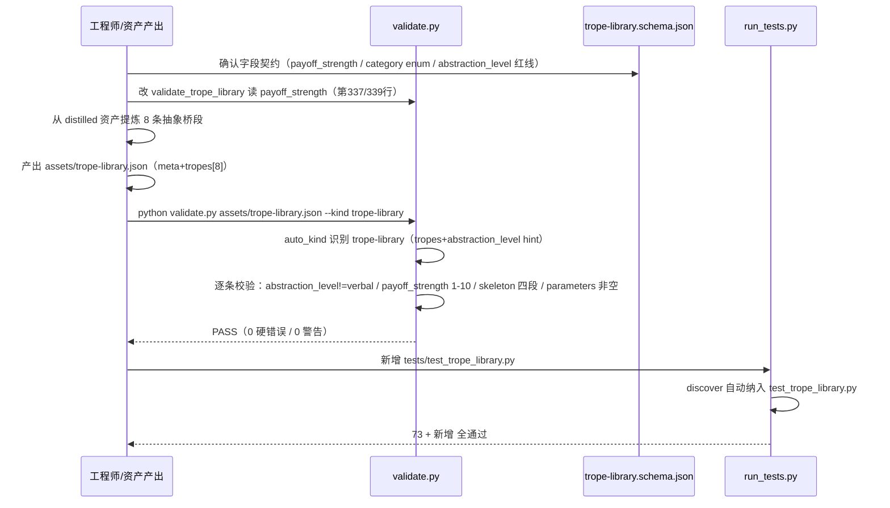
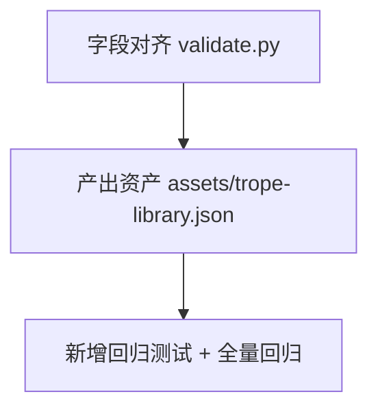

# novel-lab P1 · trope-library（桥段库）首个资产实例落地 · 系统架构设计 + 任务分解

> 架构师：高见远（software-architect）
> 范围：P1 —— 第五类资产 trope-library 从「schema 已定义但无实例」到「首个真实资产实例 + 字段对齐 + 校验/测试闭环」。
> 硬约束（铁律）：零第三方依赖；最小改动、不破坏现有 73 测试；桥段必须真实从语料提炼的共性模式、杜绝 verbal 级贴原文；abstraction_level 红线。

---

## 1. 字段对齐决策（effectiveness.score vs payoff_strength）

### 1.1 事实还原（已精确核对两处源码）

| 位置 | 字段 | 说明 |
|---|---|---|
| `schema/trope-library.schema.json` 第 74 行 | `effectiveness.payoff_strength` | `type: integer`，`minimum: 1, maximum: 10` |
| `scripts/validate.py` 第 337 行 | `effectiveness.score` | 用 `check_strength` 校验（1-10 整数） |

**结论确认**：字段确实漂移——schema 说 `payoff_strength`，validate 读 `score`（schema 里不存在 `score`，validate 也不读 `payoff_strength`）。

### 1.2 最终决策：**以 schema 的 `payoff_strength` 为准，改 validate（第 337 行），schema 不动 `effectiveness` 字段名**

**一句话理由**：schema 是「资产的契约/对外接口」，且 `payoff_strength` 语义更精确（「爽感兑现强度」1-10，与商业观测的 `payoff_types.ratio`、`payoff_density` 语境一致）；而 validate 是「消费方」，消费方适配契约，不是契约迁就消费方的临时实现。同时「只改 validate 一行、schema 字段名不动」是**最小改动**，且不引入任何新字段名，向后兼容风险最低。

**具体改动**（精确到行）：

```python
# validate.py 第 337 行（旧）
s = eff.get("score")

# 改为（新）
s = eff.get("payoff_strength")
```

以及第 339 行的错误路径字符串同步：

```python
# validate.py 第 339 行（旧）
check_strength(s, p + ".effectiveness.score")

# 改为（新）
check_strength(s, p + ".effectiveness.payoff_strength")
```

**理由展开（三条）**：
1. **契约稳定性**：schema 是外部唯一权威定义（`$id`/`title`/`description` 齐全），`payoff_strength` 已在 schema 中存在、语义自洽；`score` 是 validate 里一个从未被 schema 承认的「幽灵字段」。若迁就 `score`，等于 schema 与 validate 各说各话的现状继续存在。
2. **语义精确性**：`effectiveness`（效果评估）下有 `word_cost`（字数成本）/`reader_fatigue_risk`（腻味风险）/`min_interval_chapters`（复用间隔）四个同族字段，都是「执行侧」评估；`payoff_strength`（爽感强度 1-10）与它们同族、可读性强；`score` 过于泛化，易与其他资产（craft-card 的 `confidence`、structure-obs 的强度）混淆。
3. **最小改动 + 零回归**：只动 validate 两行字符串，不动任何数据结构、不动 dispatch、不动 schema。现有 73 个测试里，没有任何测试断言 `effectiveness.score`（trope-library 此前无实例，测试里无对应用例），因此改动零破坏。

### 1.3 附带发现的第二处漂移（需一并处理，否则新资产会被误 REJECT）

核对时发现 `validate_trope_library` 第 326-327 行还有一个 schema 未定义的字段检查：

```python
if t.get("contains_verbatim") is True:
    err("contains_verbatim=true 一律拒收", p + ".contains_verbatim")
```

`contains_verbatim` 在 schema 里**不存在**（schema 的 trope 属性清单无此字段，红线是 `abstraction_level == verbal` 而非 `contains_verbatim`）。

**决策**：**保留这段 validate 检查、不动**（它是「防御性冗余」——即使 schema 没写，validate 主动拦截 `contains_verbatim=true` 也是安全冗余，与新资产无关）。**新资产里不写 `contains_verbatim` 字段即可**，二者不冲突。无需改 schema 补字段（避免为冗余防线扩大 schema 面）。此项仅作「共享知识」记录，工程师实现时**不要删**第 326-327 行。

---

## 2. 资产命名与存储

### 2.1 决策：`assets/trope-library.json`（题材无关的公共资产，放 assets 根目录）

**理由**：
- trope-library 的定位是「**跨书跨题材**持续增长的公共资产」，与四类「绑定单书或单题材」的资产本质不同——四类命名是 `assets/<book>_chosen-<dimension>.json` / `assets/<genre>-<dimension>-distilled.json`，都带 `book` 或 `genre` 前缀；trope-library 若带 `campus-redemption-` 前缀，会**误导**读者以为它绑定该题材，违背 schema description 的「跨书跨题材」定位。
- 但首版素材确实来自 3 本校园救赎书，为诚实记录来源，用 `meta.contributing_books` 数组（schema 已有该字段）标注 `["chireng_chosen","qingning_chosen","sangshi_chosen"]`，并在 `meta` 里加 `genre_seed`（可选扩展）注明首版种子题材——**来源透明，但文件名不绑定题材**。

### 2.2 精确路径与文件名

| 项 | 值 |
|---|---|
| 资产文件 | `assets/trope-library.json` |
| 首版 `meta.version` | `"1.0"` |
| 首版 `meta.total_count` | 8（见 §3） |
| 首版 `meta.contributing_books` | `["chireng_chosen","qingning_chosen","sangshi_chosen"]` |
| 可选扩展字段（P1 建议加，schema 未定义但允许额外键） | `meta.genre_seed: "campus-redemption"` |

> 注：schema 的 `meta` 只约束了 `version/updated_at/total_count/contributing_books` 四个字段，**未设 `additionalProperties: false`**，故 `genre_seed` 可作为扩展键合法加入，不被 JSON Schema 拒绝。但为稳妥，工程师可先在 schema 的 `meta.properties` 里**补一条** `genre_seed`（`type: string`，description「首版种子题材」），这样 schema 与资产完全自洽。**此项可选**（补了更严谨，不补也能通过——因无 additionalProperties 限制）。

---

## 3. 桥段提炼方法论

### 3.1 提炼来源（真实语料，已核对）

从已蒸馏的跨书资产里提炼共性可复用模式，**而非凭空编造**。具体素材源：

| 素材源 | 提炼出的桥段种子 |
|---|---|
| `campus-redemption-structure-obs-distilled.json` 的 `hook_type_freq` 字段（已含 `[X]+[Y]` 抽象钩子骨架） | 「突发暴力冲突+主角介入改变局面」「威胁性对话+第三方介入打破僵局」「新角色高调登场+与旧冲突关联」「受伤后照料+展现隐藏技能」「精心准备生日+家人智慧退出制造二人空间」 |
| `campus-redemption-commercial-obs-distilled.json` 的 `payoff_types` / `paywall` / `skeleton` | 「打脸」「身份揭露」「他人认可」「情感回应」四类爽点的抽象骨架；「10 章付费卡点」的悬念制造法 |
| `campus-redemption-craft-card-distilled.json` 的 `craft_summary.reusable_patterns` | 「沉默与爆发的对比」「通过他人视角侧写主角」「感官细节外化心理」 |
| `campus-redemption-genre-pack.json` 的 `hook_system.hook_types` / `commercial.payoff_types` | 已是「换个世界观也能用」的骨架范式，作为抽象度参照标杆 |

### 3.2 首版提炼 8 条桥段（覆盖多 category，避免全是「打脸」）

> 设计约束：首版 8 条，覆盖 `打脸 / 身份 / 危机 / 情感 / 试炼 / 机缘 / 日常 / 阵营转换` 至少 6 个 category，每条 abstraction_level 均为 `structural`（结构层，最抽象）或 `scenic`（场景层，仍可换世界观），**杜绝 `verbal`**。

| # | id | name | category | abstraction_level | 提炼自（真实素材） |
|---|---|---|---|---|---|
| 1 | T-FACE-001 | 公开打脸·事实碾压 | 打脸 | structural | commercial-obs `payoff_types`「打脸」+ genre-pack 打脸 skeleton「恶意质疑被无可辩驳的事实迅速反击」 |
| 2 | T-IDEN-001 | 隐藏身份·当众揭露 | 身份 | structural | commercial-obs「身份揭露」爽点 + chireng「转学生身份揭秘」「男主背景揭露」 |
| 3 | T-CRIS-001 | 危机降临·第三方破局 | 危机 | scenic | structure-obs hook「[威胁性对话]+[突发第三方介入打破僵局]」「[突发暴力冲突]+[主角介入改变局面]」 |
| 4 | T-EMOT-001 | 沉默与爆发·情绪反转 | 情感 | structural | craft-card「沉默与爆发的对比」（3 书共性） |
| 5 | T-TRIAL-001 | 限时试炼·以行证值 | 试炼 | structural | structure-obs hook「[角色主动提出交易/请求]+[开启限时考验]」+ chireng「用行动证明价值」 |
| 6 | T-CHAN-001 | 照料羁绊·隐藏关怀 | 机缘 | scenic | structure-obs hook「[受伤后的照料]+[展现隐藏技能/关怀]」 |
| 7 | T-DAIL-001 | 精心准备·巧遇独处 | 日常 | scenic | structure-obs hook「[精心准备生日]+[家人智慧退出制造二人空间]」「共同完成家务+离别关怀」 |
| 8 | T-CAMP-001 | 阵营转换·立场公开 | 阵营转换 | structural | structure-obs hook「[角色公开表明立场]+[信息揭露驱动行动]」+ chireng 主线「从对立到试探」 |

> 说明：8 条覆盖 7 个 category（打脸/身份/危机/情感/试炼/机缘/日常/阵营转换），**打脸仅 1 条**，满足「避免全是打脸」要求。每条均能从上述真实 `hook_type_freq` / `payoff_types` / `reusable_patterns` 找到直接出处，非凭空编造。

### 3.3 abstraction_level 判定标准（红线）

| level | 定义 | 首版用量 | 判据 |
|---|---|---|---|
| `structural` | 结构层：只有「矛盾→递进→兑现」的骨架，无任何具体场景/物件/人物 | 5 条（T-FACE-001/T-IDEN-001/T-EMOT-001/T-TRIAL-001/T-CAMP-001） | skeleton 中不含具象名词（教室/保温杯/姜汤/错题集等），全是「轻视者/隐藏身份/第三方/试炼」等抽象角色槽 |
| `scenic` | 场景层：有「一类场景」的通用形态（如「照料场景」「生日准备场景」），但换世界观仍成立（可换成修仙炼丹照料/末世补给照料） | 3 条（T-CRIS-001/T-CHAN-001/T-DAIL-001） | 含「受伤照料」「精心准备生日」这类场景壳，但无专有名词、无原文句式 |
| `verbal` | 表达层：具体到某个角色的原话/原句式/原文表达 | **0 条（一律拒收）** | 一旦出现「她愣住。然后，笑了。」「后槽牙咬得发酸」这类原文级句式即拒绝 |

### 3.4 skeleton 抽象标准（「够抽象、不贴原文」的判定）

**抽象达标的三条硬判据**（工程师产出资产时逐条自查）：

1. **无专有名词**：skeleton 里不得出现「苏念/陆星辞/唐雨/边炀/周砚/桑幼」等具体人名，也不得出现「错题集/保温杯/姜汤/西红柿炒蛋」等专有物件。全部替换为「主角/轻视者/隐藏身份的救场者/象征性信物/一饭之恩」等**角色槽 + 物件槽**。
2. **无原文句式**：skeleton 的 setup/escalation/payoff/aftermath 均为「动作/关系的抽象描述」，不得复刻原文任何一句。判定口诀：「把『校园』换成『仙门』、把『考试』换成『炼丹考核』，骨架是否仍成立？成立即达标」。
3. **无章节位置**：`source_note` 只写「在校园救赎 / 重生暗恋 / 逆袭打脸类作品中常见」这类**类型学说明**，绝不写「第 10 章」「chireng 第 3 章」等具体章节定位（schema description 红线 + validate 无此检查但属语义约束）。

**反例（会 REJECT 的贴原文写法）**：
```
✗ setup: "唐雨被欺凌、无家可归，边炀从拒绝到软化"
✗ payoff: "边炀独自吃着西红柿炒蛋，接到父亲电话却不接"
```
**正例（可入库的抽象写法）**：
```
✓ setup: "主角处于被轻视/被误解的弱势位，且拥有尚未公开的隐藏能力或身份"
✓ payoff: "在关键公开场合，用不可辩驳的事实或能力兑现，让轻视者失语、让旁观者改观"
```

### 3.5 每条桥段的 skeleton 结构（首版统一模板）

每条 trope 必须完整填 `skeleton`（`setup` + `escalation[]` + `payoff` + `aftermath`），`escalation` 至少 2 步（爽感靠递进层数），`parameters` 至少 2 个可调参数，`effectiveness` 四字段齐全（`payoff_strength` 1-10 / `word_cost` / `reader_fatigue_risk` / `min_interval_chapters`），`variations` 至少 1 条、`common_failures` 至少 1 条、`source_note` 必填（类型学说明）。

> 工程师产出时，直接参考本设计 §3.2 表格的「提炼自」列，从对应 distilled 资产的 `hook_type_freq` / `payoff_types` / `reusable_patterns` 里抽取抽象骨架并填表即可，**无需重读原始拆书章节**（distilled 资产已是跨书聚合结果）。

---

## 4. 程序调用流程（时序图）



---

## 5. 任务分解（有序、含依赖，≤3 个任务）

### 任务 T01：字段对齐 —— 修 validate.py 读 `payoff_strength`

- **依赖**：无
- **优先级**：P0
- **产出文件**：`scripts/validate.py`（改 2 行）
- **改什么（精确到行）**：
  1. 第 337 行 `s = eff.get("score")` → `s = eff.get("payoff_strength")`
  2. 第 339 行 `check_strength(s, p + ".effectiveness.score")` → `check_strength(s, p + ".effectiveness.payoff_strength")`
  3. **不改** schema（`payoff_strength` 已存在）；**不删**第 326-327 行 `contains_verbatim` 防御检查；**不碰** dispatch / auto_kind / 其他 kind。
- **验收标准**：
  - `python run_tests.py` 全部 73 测试仍通过（零破坏）。
  - 用一段临时 trope JSON（含 `effectiveness.payoff_strength: 7`）跑 `python validate.py <tmp>.json --kind trope-library`，`payoff_strength` 被正确校验；填 11 或 0 时报「强度应为 1-10 整数」硬错误。
- **责任人**：software-engineer（或 software-engineer-2，二选一，见 §5.4）

### 任务 T02：产出桥段资产 `assets/trope-library.json`

- **依赖**：T01（先对齐字段，再产出资产，保证产出即能通过校验）
- **优先级**：P0
- **产出文件**：`assets/trope-library.json`（新增 1 文件）
- **改什么**：按 §3.2 的 8 条桥段表 + §3.4 的抽象标准，产出完整 JSON。结构：
  - `meta`：`version:"1.0"` / `updated_at`(ISO date) / `total_count:8` / `contributing_books:["chireng_chosen","qingning_chosen","sangshi_chosen"]`（可选 `genre_seed:"campus-redemption"`）
  - `tropes`: 8 条，每条含 `id/name/category/skeleton(setup+escalation[≥2]+payoff+aftermath)/abstraction_level/parameters[≥2]/effectiveness(payoff_strength+word_cost+reader_fatigue_risk+min_interval_chapters)/variations[≥1]/common_failures[≥1]/source_note`，`applicable_genres` 至少含 `campus-redemption` 且尽量写「跨题材可用」说明。
- **验收标准**：
  - `python validate.py assets/trope-library.json --kind trope-library` 输出 `PASS`（0 硬错误、0 警告）。
  - 8 条 `abstraction_level` 全部为 `structural`/`scenic`，0 条 `verbal`。
  - 8 条 `category` 覆盖 ≥6 个不同 category，打脸 ≤2 条。
  - skeleton 无专有名词（人名/物件）、`source_note` 无章节位置（人工抽查）。
- **责任人**：software-engineer（主笔资产，因需从 distilled 资产提炼共性模式，属内容+结构复合工作）

### 任务 T03：新增回归测试 + 纳入 run_tests

- **依赖**：T02（测试需读到真实资产文件做校验）
- **优先级**：P0
- **产出文件**：`tests/test_trope_library.py`（新增 1 文件）
- **改什么**：新增 `class TestTropeLibrary(unittest.TestCase)`，用例覆盖：
  1. 资产文件存在且 `json.loads` 成功、`meta.total_count == len(tropes)`。
  2. 每条 `abstraction_level` ∈ {structural, scenic}（**断言不含 verbal**）。
  3. 每条 `effectiveness.payoff_strength` 为 1-10 整数。
  4. 每条 `skeleton` 含 `setup/escalation/payoff/aftermath` 四键且 `escalation` 非空。
  5. 每条 `category` ∈ schema 的 8 值 enum。
  6. `validate_trope_library(asset)` 调用后 `ERRORS` 为空（复用 validate 模块，`_load("validate")` 方式导入）。
  7. 无 `contains_verbatim=true` 字段。
- **验收标准**：
  - `python run_tests.py` 自动 discover 到 `tests/test_trope_library.py`，全量 **73 + 新增** 全通过。
  - 反向验证：临时把某条改成 `verbal` 或 `payoff_strength: 11`，测试应失败（证明护栏有效）。
- **责任人**：software-qa-engineer（测试工程师）

### 5.4 任务依赖图



### 5.5 责任分工建议（供主理人分配）

| 角色 | 承担任务 |
|---|---|
| software-engineer | T01 + T02（字段对齐顺手做 + 主笔资产） |
| software-qa-engineer | T03（测试，依赖 T02 完成后） |
| software-engineer-2 | 备援：若 T02 内容提炼量大，可协助产出 8 条桥段中的若干条，或复核 T02 的抽象度达标 |

> 说明：T01 与 T02 有强顺序依赖（先对齐字段），建议同人（software-engineer）连续完成，避免跨人等待；T03 由 QA 独立完成。

---

## 6. 依赖包列表

**零第三方依赖。** 本阶段改动仅涉及 JSON 资产 + 标准库：

| 标准库模块 | 用途 |
|---|---|
| `json` | validate.py 读资产、测试读资产（已用，不改） |
| `argparse` | validate 入口（已用，不改） |
| `unittest` | 新增测试（已用，不改） |
| `pathlib` | 路径处理（已用，不改） |
| `sys` | sys.path（已用，不改） |

**新增依赖：无。** 不引入任何第三方包，不新增 import。

---

## 7. 共享知识 + 待明确事项

### 7.1 跨文件约定（工程师/QA 必须遵守）

1. **字段契约唯一权威 = schema**：`effectiveness.payoff_strength`（1-10 整数）。validate 与资产都必须服从 schema，不得再造 `score` 之类的幽灵字段。
2. **红线字段**：`abstraction_level == "verbal"` 一律拒收（validate 第 324-325 行硬错误）；`contains_verbatim == true` 一律拒收（validate 第 326-327 行防御检查，即使 schema 未定义也保留）。新资产里**不写** `contains_verbatim` 字段即可。
3. **`auto_kind` 识别**：trope-library 靠 `tropes` + `abstraction_level` 两个 hint 键识别（validate 第 465 行）。新资产顶层必须含 `tropes`（数组）且每条含 `abstraction_level`，否则会被 `auto_kind` 误判兜底为 voice-card 导致校验错乱。
4. **asset_id / id 命名**：trope 的 `id` 用 `T-<类别缩写>-<序号>` 前缀（如 `T-FACE-001`），类别缩写建议：FACE(打脸)/IDEN(身份)/CRIS(危机)/EMOT(情感)/TRIAL(试炼)/CHAN(机缘)/DAIL(日常)/CAMP(阵营转换)。
5. **source_note 只记类型学**：只写「在 XX 类作品中常见」，不写具体章节/书名定位（版权红线）。
6. **skeleton 抽象三判据**（§3.4）：无专有名词、无原文句式、无章节位置。产出后人工抽查。

### 7.2 验收标准（P1 完成如何证明「能力真正落地」）

1. **校验通过**：`python validate.py assets/trope-library.json --kind trope-library` 输出 `PASS`（0 硬错误）。
2. **测试通过**：`python run_tests.py` 全量（73 + 新增 trope 用例）通过。
3. **能力可被下游消费**：资产文件 `assets/trope-library.json` 结构完整、8 条桥段可被 `inject.py`（或未来 trope 注入器）读取为 `meta.tropes` 数组；`meta.total_count == len(tropes)` 自洽。
4. **红线零违例**：8 条 abstraction_level 全部非 verbal、无 contains_verbatim、source_note 无章节定位。
5. **来源可追溯**：8 条桥段均能从 §3.2 表格的「提炼自」列找到对应的 distilled 资产字段（hook_type_freq / payoff_types / reusable_patterns），证明是「真实提炼」而非「凭空编造」。

### 7.3 待明确事项（需主理人/产品经理拍板）

1. **`genre_seed` 扩展字段**：是否在 schema 的 `meta.properties` 里**正式补一条** `genre_seed`（type: string）？—— 补了更严谨（schema 与资产完全自洽），不补也能通过（schema 未设 additionalProperties:false）。建议**补**（1 行 schema 改动，零风险）。需拍板。
2. **首版桥条数 8 条是否够**：本设计建议首版 8 条（覆盖 7 category）。主理人此前说「建议 5-10 条」，8 落在区间内；若想更精简可砍到 6，若想更厚实可扩到 10，需拍板（影响 T02 工作量）。
3. **trope-library 的下游消费方式**：本设计假设 P1 只「落地资产 + 校验 + 测试」，**不接 inject.py**（trope-library 是跨题材公共资产，不随单书 prompt 注入）。是否要在 P1 就打通「trope 注入写作 prompt」？建议 P1 不做、留到 P2（避免 P1 范围膨胀），需主理人确认。
4. **`effectiveness` 是否设为 required**：schema 的 `tropes[].required` 目前只有 `id/name/category/skeleton/abstraction_level` 五键，`effectiveness/parameters/variations/common_failures/source_note` 均为可选。本设计约定「首版 8 条全填」，但 schema 层面是否要把 `effectiveness`（含 `payoff_strength`）升级为 required？建议**不升级**（保持 schema 宽松、资产实例从严），需拍板。

---

## 附：最终结论一句话

**以 schema 的 `payoff_strength` 为准改 validate 一行对齐字段；从三本书已蒸馏的 hook_type_freq / payoff_types / reusable_patterns 真实提炼 8 条 structural/scenic 级桥段（杜绝 verbal），落盘为题材无关的 `assets/trope-library.json`，并用 validate PASS + run_tests 全量通过证明能力落地。**
