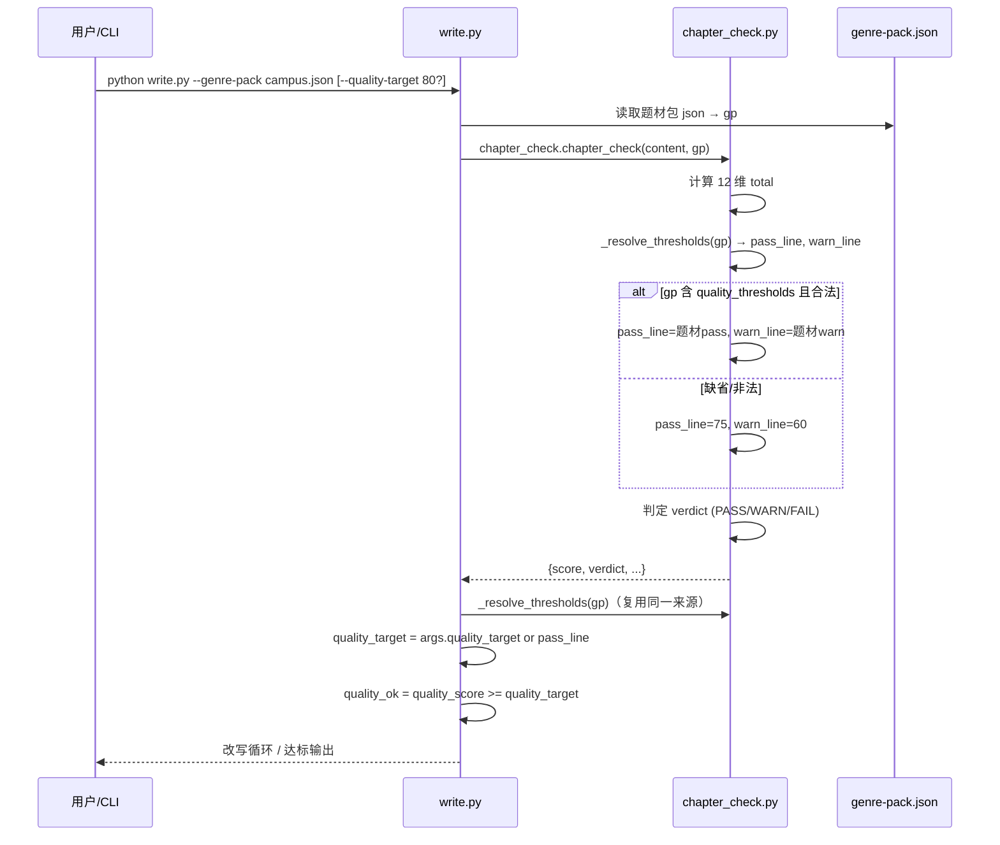
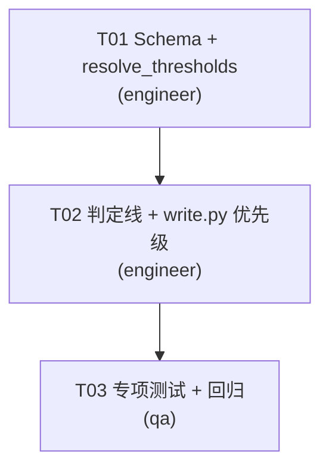

# P2 系统设计：评分阈值题材适配配置化

> 架构师：高见远
> 阶段：P2（增量开发，P0 语义检索 / P1 trope-library 已闭环）
> 目标：把 `chapter_check.py` 硬编码的 PASS/WARN 判定线（75/60）下沉为题材包（genre-pack）可配置项，并打通 `write.py --quality-target` 与题材阈值的优先级。

---

## 1. 背景与问题

### 1.1 现状（已实测确认）

| 位置 | 现状 | 问题 |
|------|------|------|
| `scripts/chapter_check.py` 第 355–361 行 | `if total >= 75: verdict="PASS" elif total >= 60: verdict="WARN" else "FAIL"` | 判定线**硬编码**，所有题材一刀切 |
| `scripts/chapter_check.py` 第 324 行 | `def chapter_check(text, genre_pack=None)` | `genre_pack` 参数**预留但从未使用** |
| `scripts/write.py` 第 145 行 | `--quality-target` 默认 `75` | 与题材阈值如何取舍未定义 |
| `scripts/write.py` 第 265 行 | `quality_ok = quality_score >= args.quality_target` | 只看 CLI，无视题材包 |
| `schema/genre-pack.schema.json` | `commercial` 层有 `payoff_density`/`opening_analysis`/`paywall`，**无评分阈值字段** | 阈值无处落 |
| `scripts/write.py` 第 246–248 行 | 读 `gp` 并传给 `chapter_check.chapter_check(content, gp)` | 链路已通，只差消费端 |

### 1.2 核心诉求

1. **阈值可配置**：不同题材（如都市逆袭 vs 轻松日常）对「爽点密度」「AI 味」「旁白情绪标签」的容忍度不同，需要题材级差异化判定线。
2. **向后兼容**：`chapter_check(text)`（不传 `genre_pack`）行为必须与现在**完全一致**（75/60）。
3. **纯标准库**：零第三方依赖（项目铁律），只用 `json`/`pathlib`/现有 dataclass。
4. **82 测试全绿**：现有测试不回归。

---

## 2. 配置方案设计

### 2.1 `quality_thresholds` 放哪？

**结论：放在 `commercial` 层下，新增 `quality_thresholds` 属性（与 `payoff_density`/`opening_analysis` 平级）。**

理由：

- **语义归属**：判定线本质是「商业质量把关」——PASS 线对应「能否发出去留读者」，WARN 线对应「能否靠改写挽救」。这属于商业层，不是 `structure`（结构）也不是 `language_rules`（语言铁律）。
- **与 `opening_analysis` 同源**：`opening_analysis` 已经在前 3 章做「决定点击率」的商业把关，`quality_thresholds` 是全章节的「决定留存」把关，逻辑并列。
- **最小侵入**：`commercial.required` 当前是 `["payoff_density", "opening_analysis"]`，新增字段**不加进 required**，旧题材包（不含 `quality_thresholds`）依然合法，天然向后兼容。
- **不进 `meta`**：`meta` 是「这个包是什么」的元信息，不放「怎么判」的规则。

### 2.2 字段结构

```jsonc
// genre-pack.schema.json -> properties.commercial.properties 新增：
"quality_thresholds": {
  "type": "object",
  "description": "章节质量判定线。缺省时回退全局默认 PASS=75/WARN=60",
  "properties": {
    "pass": {
      "type": "integer",
      "minimum": 0,
      "maximum": 100,
      "description": "PASS 线：总分 ≥ 该值判定 PASS"
    },
    "warn": {
      "type": "integer",
      "minimum": 0,
      "maximum": 100,
      "description": "WARN 线：PASS > 总分 ≥ 该值判定 WARN，低于该值 FAIL"
    }
  },
  "required": ["pass", "warn"]
}
```

**设计约束与说明：**

- **只配两条判定线（`pass`/`warn`），不做「逐维度加权」**。原因：`chapter_check` 的 12 维权重已在文件头 docstring 固化、合计恰为 100，逐维度改写会破坏 `tests/test_regressions.py` 里「weights sum 100」的回归断言，且收益低（题材差异主要体现在整体松紧，而非单维微调）。若未来需要，可扩展 `dimension_weights` 字段，但**本阶段不做**。
- **校验约束 `pass >= warn`**：在 schema 层不强制（JSON Schema 无法表达跨字段比较），改在 `chapter_check` 消费端防御（见 3.2），保证「PASS 线必须 ≥ WARN 线」这一业务不变量。
- **不提供 `max_score`**：满分恒为 100，已在返回结构里，无需配置。

### 2.3 是否需要「默认阈值配置文件」？

**结论：不需要独立配置文件，用代码内联常量作为全局兜底默认值。**

理由：

- 现有全局默认 `75/60` 已经在 `chapter_check.py` 内联，抽象成模块级常量 `DEFAULT_PASS = 75` / `DEFAULT_WARN = 60` 即可，不引入新文件。
- 新增独立 `default-thresholds.json` 会增加一个「需要读取、可能丢失、需要 schema」的脆弱点，违背「最小变更」。
- 兜底语义清晰：`genre_pack is None` **或** `genre_pack` 不含 `quality_thresholds` 时，都用 `DEFAULT_PASS`/`DEFAULT_WARN`。

---

## 3. 消费端设计

### 3.1 `chapter_check.py` 改动（核心）

**目标：`genre_pack=None` 行为不变，传入含阈值题材包时覆盖判定线。**

改动点：

1. 文件头新增模块级常量：
   ```python
   DEFAULT_PASS = 75
   DEFAULT_WARN = 60
   ```

2. 新增阈值解析辅助函数：
   ```python
   def _resolve_thresholds(genre_pack):
       """从题材包解析 PASS/WARN 判定线，缺省回退全局默认。"""
       pass_line = DEFAULT_PASS
       warn_line = DEFAULT_WARN
       if genre_pack:
           th = genre_pack.get("commercial", {}).get("quality_thresholds")
           if isinstance(th, dict):
               p = th.get("pass")
               w = th.get("warn")
               if isinstance(p, int) and isinstance(w, int):
                   # 业务不变量：PASS 线必须 ≥ WARN 线，非法值回退默认
                   if 0 <= w <= p <= 100:
                       pass_line, warn_line = p, w
       return pass_line, warn_line
   ```

3. `chapter_check` 判定块（第 355–361 行）替换为：
   ```python
   pass_line, warn_line = _resolve_thresholds(genre_pack)
   if total >= pass_line:
       verdict = "PASS"
   elif total >= warn_line:
       verdict = "WARN"
   else:
       verdict = "FAIL"
   ```

**向后兼容证明**：
- `chapter_check(text)` → `genre_pack=None` → `_resolve_thresholds` 返回 `(75, 60)` → 判定逻辑与现在逐字节一致。
- 传入了「不含 `quality_thresholds` 的旧题材包」→ 同样回退 `(75, 60)`，行为不变。
- 所有 12 维 `check_*` 函数签名不变，`total` 计算不变，返回结构不变（仅新增内部变量，不改变返回 dict 的 key）。

### 3.2 防御性设计

- **类型防御**：`th.get("pass")` / `th.get("warn")` 用 `isinstance(..., int)` 校验，防止题材包塞 `"80"`（字符串）或 `None` 导致比较崩溃。
- **范围防御**：`0 <= w <= p <= 100`，一旦题材包给出 `warn > pass` 或越界值，静默回退默认（而非报错），保证 `chapter_check` 永不因配置坏数据崩溃。
- **不引入 try/except 包裹主流程**：`_resolve_thresholds` 本身已防御，`chapter_check` 主流程保持无异常路径。

### 3.3 `write.py` 改动（优先级打通）

**优先级规则（明确写死）：CLI 显式传参 > 题材包默认 > 全局默认。**

关键问题：`--quality-target` 的语义是「改写目标线」，`quality_thresholds.pass` 的语义是「题材 PASS 线」。两者都是「达到多少分算通过」，**必须统一为一个来源，避免双重标准**。

设计决策：

| 场景 | 生效的 quality 目标线 |
|------|----------------------|
| 用户显式传 `--quality-target 80` | `80`（CLI 最高优先级，覆盖一切） |
| 用户没传 `--quality-target`，但给了 `--genre-pack` 且含 `quality_thresholds.pass` | `题材包 pass 值` |
| 用户没传 `--quality-target`，也没给 `--genre-pack` | `75`（现有默认，不变） |
| 给了 `--genre-pack` 但不含阈值 | `75`（回退默认） |

实现方式（`write.py` 改动）：

1. 第 145 行 `--quality-target` 的 `default` 从 `75` 改为 `None`，语义变为「未显式指定」：
   ```python
   ap.add_argument("--quality-target", type=int, default=None,
                   help="章节质量达标线（默认取题材包阈值，无则 75）")
   ```

2. 在质量自检块（第 242–266 行附近）解析最终目标线：
   ```python
   import chapter_check
   # 优先级：CLI 显式 > 题材包 pass > 全局默认
   if args.quality_target is not None:
       quality_target = args.quality_target
   else:
       pass_line, _ = chapter_check._resolve_thresholds(gp)
       quality_target = pass_line
   ...
   quality_ok = quality_score >= quality_target
   ```

**注意**：这里复用了 `chapter_check._resolve_thresholds`，保证 `write.py` 与 `chapter_check` 对「题材包阈值」的解读**始终一致**（单一事实来源，避免两处各写一套解析逻辑漂移）。

> 说明：`_resolve_thresholds` 前缀下划线表示模块内部，但 `write.py` 已通过 `import chapter_check` 使用其公开函数，跨模块调用同一模块的「内部辅助函数」在本项目（单包、无 `__all__` 限制）是可接受的，且比复制解析逻辑更安全。若顾虑，可去掉下划线改为 `resolve_thresholds`——**推荐改为公开名**（见任务 T01）。

### 3.4 语义一致性澄清（重要）

- `chapter_check` 返回的 `verdict`（PASS/WARN/FAIL）用的是 `_resolve_thresholds` 解析出的 `pass_line`/`warn_line`。
- `write.py` 的 `quality_ok` 判断用的是 `pass_line`（即 `--quality-target` 或题材包 `pass`）。
- 两者在「同一题材包 + 未显式传 `--quality-target`」时，`pass_line` 来源一致 → `quality_ok=True` 当且仅当 `verdict=="PASS"`，语义自洽，不会出现「质量达标但 verdict 是 WARN」的矛盾。

---

## 4. 数据流 / 调用时序



---

## 5. 文件清单（增量变更）

| 文件 | 变更类型 | 说明 |
|------|---------|------|
| `schema/genre-pack.schema.json` | 修改 | `commercial.properties` 新增 `quality_thresholds`（不进 required） |
| `scripts/chapter_check.py` | 修改 | 新增 `DEFAULT_PASS`/`DEFAULT_WARN` 常量 + `resolve_thresholds()` + 判定块改用阈值 |
| `scripts/write.py` | 修改 | `--quality-target` default→None + 质量线优先级解析 |
| `tests/test_thresholds.py` | 新增 | 阈值配置化专项测试（见任务分解） |
| `assets/campus-redemption-genre-pack.json` | 修改（可选，实例示范） | 补一个 `quality_thresholds` 真实示范值，证明链路可用 |

---

## 6. 兼容性矩阵（硬约束核对）

| 约束 | 满足方式 |
|------|---------|
| 纯标准库、零第三方依赖 | 仅用 `json`/`pathlib`/内置类型，不引入任何包 |
| `chapter_check(text)` 行为不变 | `genre_pack=None` → `_resolve_thresholds` 返回 `(75,60)`，判定逻辑逐字节等价 |
| 82 测试绿色 | 现有测试全部走「无 genre_pack」或「无阈值题材包」路径，命中默认分支；新增测试独立文件 `test_thresholds.py`，不影响存量 |
| 最小变更 | 仅 3 个脚本/schema 改动 + 1 个新测试文件，不重构 12 维打分 |
| `write.py --quality-target` 兼容 | default 改为 None 后，不传参行为与原 default=75 完全一致（回退链终点仍是 75） |

---

## 7. 任务分解（Task Breakdown）

> 粒度 T01–T03，标注 owner（engineer / qa）。依赖关系线性：T01 → T02 → T03。

### T01 — Schema 与阈值解析函数（engineer）

**任务**：落地配置字段 + 消费端解析能力。

- **Source Files**：
  - `schema/genre-pack.schema.json`（新增 `quality_thresholds`）
  - `scripts/chapter_check.py`（新增 `DEFAULT_PASS`/`DEFAULT_WARN` 常量 + `resolve_thresholds()`，**公开名不带下划线**）
- **Dependencies**：无
- **Priority**：P0
- **验收**：
  - `resolve_thresholds(None)` 返回 `(75, 60)`
  - `resolve_thresholds({"commercial": {"quality_thresholds": {"pass": 80, "warn": 65}}})` 返回 `(80, 65)`
  - `resolve_thresholds({"commercial": {"quality_thresholds": {"pass": 50, "warn": 70}}})`（warn>pass）返回 `(75, 60)` 回退
  - `resolve_thresholds({"commercial": {"quality_thresholds": {"pass": "80", "warn": 65}}})`（非 int）返回 `(75, 60)` 回退
  - schema 变更后旧题材包（无 `quality_thresholds`）仍通过 JSON Schema 校验

### T02 — 判定线与 write.py 优先级打通（engineer）

**任务**：把阈值接入 `chapter_check` 判定块，并打通 `write.py` 优先级。

- **Source Files**：
  - `scripts/chapter_check.py`（判定块 355–361 改用 `resolve_thresholds(genre_pack)`）
  - `scripts/write.py`（`--quality-target` default→None + 质量线解析，复用 `chapter_check.resolve_thresholds`）
- **Dependencies**：T01
- **Priority**：P0
- **验收**：
  - `chapter_check(text)` 与改造前对同一文本产生**相同** `score`/`verdict`/`details`/`issues`
  - 传入含 `quality_thresholds={"pass":80,"warn":65}` 的题材包，某 70 分文本 verdict 从 PASS 变 WARN（验证阈值生效）
  - `write.py` 不传 `--quality-target` 且给含阈值题材包 → 用题材包 `pass` 判定达标
  - `write.py` 显式传 `--quality-target 82` → 覆盖题材包阈值
  - 不传 `--quality-target` 也不传 `--genre-pack` → 目标线仍为 75（行为不变）

### T03 — 专项测试与回归验证（qa）

**任务**：新增阈值测试 + 全量回归 + 实例示范。

- **Source Files**：
  - `tests/test_thresholds.py`（新增：阈值解析、判定覆盖、回退、write.py 优先级——用 monkeypatch/子进程或纯函数级覆盖）
  - `assets/campus-redemption-genre-pack.json`（可选：补示范阈值值，验证真实链路）
- **Dependencies**：T02
- **Priority**：P0
- **验收**：
  - `python run_tests.py` 全绿（82 + 新增阈值测试，无回归）
  - 覆盖：`genre_pack=None` 回退、合法阈值生效、非法阈值回退、`warn>pass` 回退、CLI 优先级
  - `chapter_check(text)` 逐字段与基线一致（用一个 fixture 文本做前后对比断言）

---

## 8. 依赖包

**无新增第三方依赖。** 仅标准库：`json`、`pathlib`、`typing`（现有）。

```
# 本任务零新增依赖（项目铁律：纯 Python 标准库）
```

---

## 9. 共享知识 / 约定

- **单一事实来源**：题材包阈值的解析逻辑只在 `chapter_check.resolve_thresholds` 一处实现，`write.py` 复用，禁止两处各写一份。
- **阈值语义**：`pass` = PASS 线（≥ 即通过）；`warn` = WARN 线（≥ 且 < pass 为 WARN，< warn 为 FAIL）。业务不变量 `0 <= warn <= pass <= 100`。
- **默认兜底**：`DEFAULT_PASS=75`、`DEFAULT_WARN=60`，与历史行为对齐；`--quality-target` 默认改为 `None` 表示「未显式指定」，回退链终点仍是 75。
- **优先级**：CLI 显式 `--quality-target` > 题材包 `quality_thresholds.pass` > 全局默认 75。
- **防御**：题材包阈值字段若类型非 int、越界、或 `warn>pass`，一律静默回退默认，**不抛异常、不崩溃**。
- **不逐维度加权**：本阶段只配整体判定线，不动 12 维权重（保护 `weights sum 100` 回归）。

---

## 10. 未决 / 待确认事项

1. **是否给 `campus-redemption-genre-pack.json` 落一个真实阈值示范值？** 我建议在 T03 补一个（如 `pass:80, warn:65`，体现「都市逆袭对质量要求略高于全局」），但若你希望题材包保持纯净、示范放测试 fixture 里，也可。**默认：T03 补示范值。**
2. **`resolve_thresholds` 命名**：我推荐公开名（去掉下划线），因 `write.py` 跨模块调用。若你坚持「非 API 不公开」，可保留下划线并接受跨模块调用内部函数。**默认：公开名 `resolve_thresholds`。**
3. **是否允许 `pass==warn`（只分 PASS/FAIL，无 WARN 档）？** 当前设计允许（`0<=warn<=pass`），等于「取消 WARN 中间档」。若无此需求，可收紧为 `warn < pass`。**默认：允许相等（更宽松）。**

---

## 11. 任务依赖图


