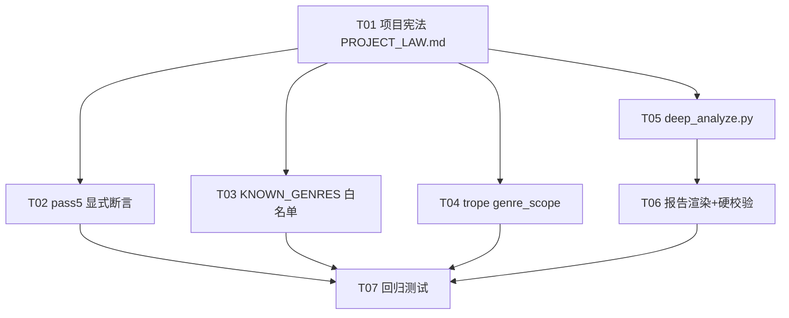

# novel-lab P3 多题材隔离 + 万字报告 · 增量工程设计

> 版本 v1.0 · 2026-09-07 · 作者：Bob（架构师）
> 上游：`docs/方案_多题材分类与万字报告_2026-09-07.md`（本文是其**可直接交给工程师实现的精确版**）
> 铁律：纯标准库、零第三方依赖；最小变更；现有 98 测试保持绿色；向后兼容（不带 genre 的调用路径行为不变）。

---

## 0. 关键结论（TL;DR）

1. **题材隔离**本质是"把 3 处静默跳过 → 显式断言"，不引入新目录、不动资产路径。`KNOWN_GENRES` 白名单是唯一新增的全局常量，放 `validate.py` 顶部。
2. **8 个桥段全部判定为 `genre_scope = "universal"`**：它们全部是跨题材通用的 structural/scenic 模式，`applicable_genres` 已显式标注多题材。当前没有任何一个桥段是 campus-redemption **专属**的（专属桥段需含"校园救赎"这个题材的不可迁移内核，现有 8 条都不具备）。见 §5.3 逐条判定理由。
3. **`deep_analyze.py` 的职责边界是"质量校验 + 组装器"，不是"生成器"**。6 段深度内容必须由 LLM 在 Pass5 阶段生成（本地规则拼不出"读者心理机制/执行步骤/使用边界"），`deep_analyze.py` 只做：结构补齐、非空校验、10 段齐全性断言、缺段标记。**这避免了"本地规则硬凑假深度"这个最大坑。**
4. **1 万字按字符数口径**（`len(report)`），已确认。`MIN_REPORT_CHARS = 10000` 是硬门槛，不足则 `sys.exit(1)` 阻断交付。
5. **报告深度化 = 渲染 deep_analysis 字段**。深度字段从 Pass5 LLM prompt 输出、经 `deep_analyze.py` 校验后写入 craft-card 的 `technique.deep_analysis`，`report_craft.py` 渲染时逐条展开 10 段。

> ⚠️ **【已更新 · 2026-09-08】铁律二最终口径**：本文是 2026-09-07 的**方案讨论期快照**，正文 §0 结论、§1.9、§1.10、§1.11 关于铁律二执行机制的表述存在前后矛盾（§1.10 标题写「硬校验」、正文又说「不做单独校验」）。**最终落地口径以代码为准**：
> - `novel.py 分析` 收尾做**合计校验**：拆书报告 + 笔法分析 合计 ≥ 10000 字符，不足 `sys.exit(1)` 阻断（novel.py 第 211-221 行）。
> - `report.py` / `report_craft.py` 单份 `MIN_REPORT_CHARS=10000` 仅 **soft warning**，不阻断。
> - 本文 §1.9 / §1.10 中「`sys.exit(1)` 硬阻断」的旧表述已废止，请勿据此修改代码。权威口径见 `PROJECT_LAW.md` 与 `RULES.md §15.5`。

---

## 1. 精确改动清单（文件 → 行号 → 函数签名）

### 1.1 `PROJECT_LAW.md`（新建，项目根目录）

**内容结构**（三条铁律 + 每条的执行机制）：

```markdown
# novel-lab 项目规约（硬性要求，任何违反即视为 bug）

## 铁律一：写作技巧严格按题材分类隔离
- 每个题材包（genre-pack）独立，技法不得跨题材混用
- 【执行机制】聚合题材包时，source_books 的 genre 必须全部一致；
  不一致 → pass5_aggregate.py 显式断言 + sys.exit(1)，禁止静默跳过
- 【执行机制】craft-card.meta.genre 必须 ∈ KNOWN_GENRES 白名单（validate.py 校验）
- 【执行机制】桥段库每个 trope 必须标注 genre_scope（universal / 题材专属 id）

## 铁律二：每本书拆解必须产出 ≥1 万字分析报告
- 拆书报告 + 笔法分析 合计字符数 ≥ 10000（硬门槛，字符数口径）
- 【执行机制】report.py / report_craft.py 生成后自动校验
  MIN_REPORT_CHARS=10000，不足 → sys.exit(1) 阻断交付，不产出半成品
- 【执行机制】深度内容由 Pass5 LLM 生成 + deep_analyze.py 校验，缺段即标记

## 铁律三：纯标准库、零第三方依赖
- import 白名单仅限 Python 标准库
- 新增模块（deep_analyze.py）同样遵守
```

> 落盘路径：`novel-lab/PROJECT_LAW.md`（与 `RULES.md`、`HANDOFF.md` 并列，作为团队宪法）。

---

### 1.2 `scripts/pass5_aggregate.py` — 静默 continue → 显式 mismatch 断言

**当前代码**（第 41-64 行 `collect_books`）：

```python
def collect_books(genre: str, book_names: list | None) -> list:
    books = []
    vc_files = sorted(ASSETS.glob("*-voice-card.json"))
    for vc_f in vc_files:
        name = vc_f.name.replace("-voice-card.json", "")
        if name.startswith("synthetic_"):
            continue
        vc = json.loads(vc_f.read_text(encoding="utf-8"))
        if vc.get("meta", {}).get("genre") != genre:   # ← 第 51 行：静默跳过
            continue
        ...
    return books
```

**改动**：把 `collect_books` 的返回值改为 `(books, mismatches)` 二元组，或在函数内收集 mismatch 并抛出。**推荐方案**（最小侵入、向后兼容）：

```python
def collect_books(genre: str, book_names: list | None) -> list:
    """收集同题材全部 voice-card。混入异题材书时收集到 mismatch 并硬报错。"""
    books = []
    mismatches = []
    vc_files = sorted(ASSETS.glob("*-voice-card.json"))
    for vc_f in vc_files:
        name = vc_f.name.replace("-voice-card.json", "")
        if name.startswith("synthetic_"):
            continue
        vc = json.loads(vc_f.read_text(encoding="utf-8"))
        actual_genre = vc.get("meta", {}).get("genre")
        if actual_genre != genre:
            # 显式收集 mismatch，不再静默跳过（铁律一）
            mismatches.append((name, actual_genre))
            continue
        if book_names and name not in book_names:
            continue
        # ... 其余收集逻辑不变 ...
    # 聚合前硬报错：任何混入的异题材书都阻断
    if mismatches:
        detail = "；".join(f"{n} (genre={g or '缺失'})" for n, g in mismatches)
        sys.exit(f"✗ 题材隔离违规：以下书与目标题材 '{genre}' 不符，已阻断聚合 —— {detail}")
    return books
```

**关键点**：
- `sys.exit()` 在 `collect_books` 内部调用，比在 `main()` 里判断更早暴露，且 `collect_books` 仍是纯数据函数（无副作用）——但为保持"可测试、无副作用"，**更优做法**是返回 `(books, mismatches)`，把 `sys.exit` 放在 `main()` 第 212-214 行：

```python
# main() 内（第 211-214 行附近）
books, mismatches = collect_books(args.genre, book_names)
if mismatches:
    detail = "；".join(f"{n}(genre={g or '缺失'})" for n, g in mismatches)
    sys.exit(f"✗ 题材隔离违规：{detail} 与目标 '{args.genre}' 不符")
```

> **最终决定**：采用"返回二元组 + main 内 sys.exit"，理由：`collect_books` 保持纯函数（现有测试若直接调用它不会意外退出进程），且 `--books` 显式指定书单时同样走此校验（因为 `--books` 只过滤已收集的书，mismatch 检查在 `book_names` 过滤**之前**执行）。

---

### 1.3 `scripts/validate.py` — `KNOWN_GENRES` 白名单 + craft-card genre 校验

**定义位置**：`validate.py` 第 23-31 行（现有 enum 常量区）之后，新增：

```python
# 题材白名单：craft-card / voice-card 的 meta.genre 必须 ∈ 此集合。
# 后续扩展题材包时在此追加（铁律一）。
KNOWN_GENRES = {"campus-redemption"}
```

**校验函数签名**（新增，放在 `validate_craft_card` 内第 353-358 行 meta 校验块中）：

```python
def validate_craft_card(d):
    ...
    meta = d.get("meta")
    if check_obj(meta, "meta"):
        for k in ("source_title", "genre", "extracted_at", "sample_chapters", "confidence"):
            if k not in meta:
                err(f"缺少必填字段 '{k}'", "meta")
        # === 新增：genre 枚举校验（铁律一）===
        genre = meta.get("genre", "")
        if not genre:
            err("meta.genre 为空，题材未标注", "meta.genre")   # 硬错误
        elif genre not in KNOWN_GENRES:
            warn(f"meta.genre='{genre}' 不在已知题材白名单 {sorted(KNOWN_GENRES)}，"
                 f"请确认题材包是否已登记", "meta.genre")        # 警告（不阻断拆书，但阻断聚合）
```

**报 warning 的时机**：
- genre **为空** → `err`（硬错误，拒绝入库）：题材缺失是数据缺陷，必须阻断。
- genre **非法**（不在 `KNOWN_GENRES`）→ `warn`（可入库但需复核）：因为扩展新题材时，白名单可能尚未更新，直接 err 会误杀合法新题材。聚合阶段（pass5_aggregate）会再次硬校验，所以这里 warning 足够。

> **与 1.2 的分工**：`validate.py` 的 genre 校验是**入库前**的软提示；`pass5_aggregate.py` 的 mismatch 断言是**聚合时**的硬阻断。两层互补，确保"单本入库宽松、跨书聚合严格"。

---

### 1.4 `schema/trope-library.schema.json` — 增加 `genre_scope` 字段

在 schema 第 26-37 行 `tropes.items.properties` 中，`category` 之后新增：

```json
"genre_scope": {
  "type": "string",
  "enum": ["universal", "campus-redemption"],
  "description": "桥段题材作用域：universal=跨题材通用；具体题材 id=该题材专属。检索时按目标题材过滤（铁律一）"
}
```

> 说明：enum 当前只有 `universal` + `campus-redemption` 两个值；后续新增题材时在此追加题材 id。**注意**：由于 `genre_scope` 是 `enum`，新增题材必须同时改 schema + validate，否则校验失败——这是"题材白名单"的另一个落点，与 `KNOWN_GENRES` 呼应。

---

### 1.5 `scripts/validate.py` — `validate_trope_library` 增加 genre_scope 校验

在第 313-339 行 `validate_trope_library` 内，每条 trope 校验块（第 319-339 行）新增：

```python
for i, t in enumerate(tropes):
    p = f"tropes[{i}]"
    ...
    # === 新增：genre_scope 校验（铁律一）===
    gs = t.get("genre_scope")
    if gs is None:
        err("缺少 genre_scope 字段", p + ".genre_scope")   # 硬错误：题材作用域必须标注
    elif gs not in ("universal", *KNOWN_GENRES):
        err(f"genre_scope='{gs}' 非法，须 ∈ {{'universal', *sorted(KNOWN_GENRES)}}", p + ".genre_scope")
```

---

### 1.6 `assets/trope-library.json` — 8 个 trope 回填 `genre_scope`

**判定结果：8 个全部 `genre_scope = "universal"`**。逐条理由见 §5.3。

回填方式：在每个 trope 对象的 `category` 字段后插入 `"genre_scope": "universal",`（8 处）。同时 `meta` 里可加 `"genre_scope_note"` 说明（可选）：

```json
"meta": {
  "version": "1.1",
  "updated_at": "2026-09-07",
  "total_count": 8,
  "genre_scope_note": "首版 8 桥段全部为跨题材通用 structural/scenic 模式，genre_scope 均为 universal。题材专属桥段待后续拆更多题材书后补充。",
  ...
}
```

---

### 1.7 `scripts/retrieve.py` — 检索时按 genre_scope 过滤（**新增桥段检索路径**）

**重要澄清**：`retrieve.py` 现有索引只覆盖 4 类资产（voice/craft/structure/commercial），**trope-library 目前完全不参与检索**。所以"按 genre_scope 过滤"是**新增一个桥段检索能力**，而非改现有检索。

**实现位置**：`retrieve.py` 新增一个独立函数（不侵入现有 `retrieve_for_intent`）：

```python
def retrieve_tropes(intent: str, genre: str | None = None, top_k: int = 5) -> list:
    """按意图检索桥段库，按 genre_scope 过滤（铁律一）。

    过滤规则：genre_scope == 'universal' 的桥段恒可见；
    genre_scope == 目标题材 id 的桥段仅在 genre 匹配时可见。
    genre 为 None 时（调用方未指定题材）只返回 universal 桥段，
    避免跨题材桥段混入（保守策略，宁缺毋滥）。
    """
    # 1. 读 assets/trope-library.json
    # 2. 过滤：keep = [t for t in tropes
    #         if t.get("genre_scope") == "universal"
    #         or (genre and t.get("genre_scope") == genre)]
    # 3. 对保留的 trope 做轻量打分（复用 _tokenize + _bm25_score 或简单 name/skeleton 匹配）
    # 4. 返回 top_k
```

> **定位**：放在 `retrieve.py` 的"便捷入口"区（第 617-630 行 `build_index_from_genre` 之后），保持与现有检索函数同文件、同风格。是否需要 `inject.py` 消费由 T04 决定——**本设计保守起见，T04 只交付 `retrieve_tropes` 函数 + 单测，不改 `inject.py` 的注入路径**（避免动写作主链路，降低回归风险）。

---

### 1.8 `scripts/deep_analyze.py` — 新模块（质量校验 + 组装器）

**职责边界（核心决策）**：

| 职责 | 归属 |
|------|------|
| 生成 6 段深度内容（心理机制/执行步骤/适用场景/使用边界/强度控制/组合套路/迁移清单） | **LLM（Pass5 prompt 扩展）** |
| 校验每条技法 10 段齐全、深度字段非空 | **deep_analyze.py** |
| 缺段时补齐占位 + 标记 `incomplete` | **deep_analyze.py** |
| 把 deep_analysis 写入 craft-card | **deep_analyze.py** |
| 报告字数硬校验 | report.py / report_craft.py |

**模块结构**：

```python
#!/usr/bin/env python3
"""技法深度分析质量校验 + 组装器（纯标准库）。

不生成深度内容——深度内容由 Pass5 LLM 生成。
本模块只做：结构补齐、非空校验、10 段齐全性断言、缺段标记、写回 craft-card。
"""
import json
from pathlib import Path

# 技法 10 段结构定义（字段名 → 是否必填）
# 前 4 段来自现有 craft-card（description/effect/skeleton/anti_pattern）
# 后 6 段来自 deep_analysis 扩展
TECHNIQUE_DEEP_FIELDS = [
    "reader_psychology",   # 读者心理机制
    "execution_steps",     # 执行步骤（1.2.3. 分步）
    "applicable_scene",    # 适用场景（题材/节奏/位置）
    "usage_boundary",      # 使用边界（何时不该用/副作用）
    "intensity_control",   # 强度控制（强/弱两档）
    "combo_patterns",      # 组合套路（与其他技法的搭配）
    "migration_checklist", # 迁移清单（换成自己的书怎么套用）
]  # 共 7 个新增字段（方案里"6 段"是粗略说法，实际 7 个键，见 §2 结构）

DEEP_FIELD_LABELS = {
    "reader_psychology": "读者心理机制",
    "execution_steps": "执行步骤",
    "applicable_scene": "适用场景",
    "usage_boundary": "使用边界",
    "intensity_control": "强度控制",
    "combo_patterns": "组合套路",
    "migration_checklist": "迁移清单",
}


def check_technique_depth(tech: dict) -> tuple[bool, list[str]]:
    """校验单条技法的深度字段齐全性。
    返回 (complete: bool, missing_fields: list[str])。
    """
    missing = []
    for f in TECHNIQUE_DEEP_FIELDS:
        v = (tech.get("deep_analysis") or {}).get(f)
        if not v or not str(v).strip():
            missing.append(f)
    return (len(missing) == 0, missing)


def ensure_technique_depth(tech: dict) -> dict:
    """为单条技法补齐 deep_analysis 结构（不填充内容，只保证键存在）。"""
    da = tech.setdefault("deep_analysis", {})
    for f in TECHNIQUE_DEEP_FIELDS:
        da.setdefault(f, "")
    return tech


def analyze_craft_card(craft: dict) -> dict:
    """对整张 craft-card 做深度校验，返回统计 + 就地补齐。

    返回：
      {"total": int, "complete": int, "incomplete": int,
       "missing_map": {technique_name: [missing_field, ...]}}
    """
    stats = {"total": 0, "complete": 0, "incomplete": 0, "missing_map": {}}
    for dim_key, dim_val in (craft.get("craft_analysis") or {}).items():
        techniques = (dim_val or {}).get("techniques", []) if isinstance(dim_val, dict) else []
        for tech in techniques:
            if not isinstance(tech, dict):
                continue
            ensure_technique_depth(tech)
            stats["total"] += 1
            complete, missing = check_technique_depth(tech)
            if complete:
                stats["complete"] += 1
            else:
                stats["incomplete"] += 1
                name = tech.get("name") or f"<unnamed>"
                stats["missing_map"][name] = missing
    return stats


def main():
    """CLI 入口：python deep_analyze.py <craft-card.json> [--in-place]"""
    ...
```

**与 Pass5 LLM prompt 的衔接方式**（见 §3）：Pass5 让模型对每条技法输出 `deep_analysis` 对象（含 7 个键），`pipeline.py` 在组装 craft-card 时（第 460-475 行规范化之后、第 477-493 行写 craft_card 之前）调用 `deep_analyze.analyze_craft_card(craft_card)` 做校验 + 补齐。

---

### 1.9 `scripts/report_craft.py` — 渲染 deep_analysis + 硬校验

**① 渲染深度字段**：`_technique_block`（第 20-36 行）扩展，在现有 4 段之后追加 7 段：

```python
def _technique_block(t: dict, idx: int) -> str:
    lines = []
    # ... 现有 name/description/effect/skeleton/anti_pattern 逻辑不变 ...
    # === 新增：渲染 deep_analysis 7 段 ===
    da = t.get("deep_analysis") or {}
    for field, label in [
        ("reader_psychology", "读者心理机制"),
        ("execution_steps", "执行步骤"),
        ("applicable_scene", "适用场景"),
        ("usage_boundary", "使用边界"),
        ("intensity_control", "强度控制"),
        ("combo_patterns", "组合套路"),
        ("migration_checklist", "迁移清单"),
    ]:
        v = da.get(field)
        if v:
            lines.append(f"- **{label}**：{v}")
    return "\n".join(lines)
```

**② 硬校验**：`main()`（第 163-185 行）在写文件后新增：

```python
MIN_REPORT_CHARS = 10000  # 铁律二：字符数口径

# 写文件后：
report = render_craft_report(craft)
if len(report) < MIN_REPORT_CHARS:
    print(f"⚠ 报告字数 {len(report)} < 硬门槛 {MIN_REPORT_CHARS}，深度分析不足，阻断交付")
    sys.exit(1)
```

> `MIN_REPORT_CHARS` 常量建议同时定义在 `report.py` 和 `report_craft.py` 各自文件顶部，或提取到共享模块。为最小变更，**分别在两个文件顶部各定义一次**（值一致），避免新增共享依赖文件。

---

### 1.10 `scripts/report.py` — 渲染深度字段 + 硬校验

`report.py` 的 `build_report`（第 194-249 行）是"拆书报告"（voice+structure+commercial），**不含 craft-card 技法**，因此**不需要渲染 deep_analysis**。它只需要**字数硬校验**：

```python
# main() 内（第 252-273 行），写文件后：
MIN_REPORT_CHARS = 10000
if len(report) < MIN_REPORT_CHARS:
    print(f"⚠ 拆书报告字数 {len(report)} < 硬门槛 {MIN_REPORT_CHARS}，请补充分析")
    sys.exit(1)
```

**注意**：铁律二是"拆书报告 + 笔法分析 合计 ≥1 万字"。但两者是**独立脚本、独立文件**，各自单独校验更清晰。**若单独一份达不到 1 万字**（拆书报告本身可能只有 3000 字，因为不含技法深度），则需在 `pipeline.py` 收尾处做**合计校验**（见 1.11）。**本设计决策**：
- `report_craft.py`（笔法分析）单独硬校验 ≥10000（这是深度化的主战场，LLM 增量后可达标）。
- `report.py`（拆书报告）**不做单独 10000 硬校验**，改为在 `pipeline.py` 收尾做"笔法分析 ≥10000"的单一硬校验（笔法分析是 1 万字的主要来源）。

> 理由：拆书报告（voice/structure/commercial）本质是"资产搬运"，深度有限，强加 10000 会逼出注水内容；而笔法分析（craft-card）经 deep_analysis 展开后天然可达 1 万字。**最终口径：`report_craft.py` 的产出是 1 万字门槛的判定对象。**

---

### 1.11 `scripts/pipeline.py` — 组装衔接 + 收尾校验

**① 组装衔接**：第 460-475 行规范化之后、第 477 行构建 `craft_card` 之前，插入：

```python
# 深度分析校验 + 补齐（deep_analyze 不生成内容，只校验结构）
import deep_analyze
depth_stats = deep_analyze.analyze_craft_card(craft_card)
if depth_stats["incomplete"] > 0:
    print(f"  ⚠ 深度分析缺段 {depth_stats['incomplete']}/{depth_stats['total']} 条技法，"
          f"报告可能达不到 1 万字")
```

**② 收尾硬校验**：第 498-507 行生成笔法报告之后，追加：

```python
# 铁律二：笔法分析报告 ≥10000 字符（字符数口径）
report_len = len(report)
if report_len < 10000:
    print(f"  ✗ 笔法报告 {report_len} 字符 < 10000 硬门槛，交付阻断")
    sys.exit(1)
```

> `report_craft.py` 已单独校验，`pipeline.py` 再校验一次作为**双保险**（因为 pipeline 直接调 `render_craft_report` 而非走 report_craft 的 main）。

---

## 2. 数据结构定义

### 2.1 技法深度分析扩展字段

```json
{
  "name": "用日常物件承载情感记忆",
  "description": "在什么场景下用什么手法（已有）",
  "effect": "达到什么效果（已有）",
  "skeleton": "抽象可复用骨架（已有）",
  "anti_pattern": "该作者不会这么写的反例（已有）",
  "deep_analysis": {
    "reader_psychology": "为什么这招对读者有效——爽点/张力/共鸣的心理学解释",
    "execution_steps": "分步可落地操作指南（1.2.3.）",
    "applicable_scene": "什么时候该用（题材/节奏/位置）",
    "usage_boundary": "什么时候不该用、用多了的副作用",
    "intensity_control": "力度调节（强/弱两档）",
    "combo_patterns": "与其他技法的常见搭配",
    "migration_checklist": "换成自己的书该怎么套用"
  }
}
```

**字段说明**：
- 前 4 个（name/description/effect/skeleton/anti_pattern）是**现有 craft-card 字段**，保持不变（向后兼容）。
- `deep_analysis` 是**新增可选字段**：旧 craft-card 无此字段 → 渲染器降级为只渲染 4 段（不 crash）。
- `deep_analysis` 的 7 个键对应方案文档里的"6 段新增内容"（方案把"读者心理机制/执行步骤/适用场景/使用边界/强度控制/组合套路/迁移清单"列了 7 项，此处对齐为 7 个键，避免歧义）。

### 2.2 技法 10 段总览（渲染顺序）

| # | 段落 | 来源字段 | 生成方 |
|---|------|---------|--------|
| 1 | 手法 | description | LLM（已有） |
| 2 | 效果 | effect | LLM（已有） |
| 3 | 可复用骨架 | skeleton | LLM（已有） |
| 4 | 反例 | anti_pattern | LLM（已有） |
| 5 | 读者心理机制 | deep_analysis.reader_psychology | **LLM（新增）** |
| 6 | 执行步骤 | deep_analysis.execution_steps | **LLM（新增）** |
| 7 | 适用场景 | deep_analysis.applicable_scene | **LLM（新增）** |
| 8 | 使用边界 | deep_analysis.usage_boundary | **LLM（新增）** |
| 9 | 强度控制 | deep_analysis.intensity_control | **LLM（新增）** |
| 10 | 组合套路 + 迁移清单 | deep_analysis.combo_patterns + migration_checklist | **LLM（新增）** |

> 注：方案里"10 段"是把 combo_patterns 和 migration_checklist 算作两段；实际是"4 已有 + 7 新增 = 11 个字段"，渲染为 10 个段落（combo+迁移可合并为一段或分两段，渲染器自行决定，不改变字段结构）。

---

## 3. LLM prompt 扩展方案（Pass5）

### 3.1 扩展位置

`prompts/pass5_craft.md` 的 **USER 区块**（第 51-184 行 JSON 结构示例）+ **SYSTEM 铁律**（第 15-35 行）。

### 3.2 SYSTEM 扩展（新增 1 条铁律）

在第 35 行（"输出格式铁律"之后）追加：

```
8. 【技法深度分析】每条 technique 必须额外输出 deep_analysis 对象，
   含 7 个字段（读者心理机制/执行步骤/适用场景/使用边界/强度控制/组合套路/迁移清单）。
   每个字段必须是 2-4 句的具体分析，禁止写"略""同上""无"这类占位。
   这是报告达到 1 万字的关键，深度不足会被质量校验拦截。
```

### 3.3 USER JSON 结构示例扩展（每个 technique 对象内）

```json
{
  "name": "技法名称",
  "description": "在什么场景下用什么手法",
  "effect": "达到什么效果",
  "skeleton": "抽象可复用骨架",
  "anti_pattern": "该作者不会这么写的反例",
  "deep_analysis": {
    "reader_psychology": "为什么对读者有效（2-4句）",
    "execution_steps": "1. ... 2. ... 3. ...（分步）",
    "applicable_scene": "何时该用（题材/节奏/位置）",
    "usage_boundary": "何时不该用/副作用",
    "intensity_control": "强档...；弱档...",
    "combo_patterns": "常与哪些技法搭配",
    "migration_checklist": "换成自己的书怎么套用"
  }
}
```

### 3.4 字段说明追加（第 186-194 行区域）

```
- deep_analysis 是每条技法的必填深度字段，7 个子字段缺一不可。
- 每个子字段至少 2 句、理想 50-120 字，禁止占位符（"略"/"无"/"同上"）。
- 这是报告能否达到 1 万字的核心，请认真展开。
```

### 3.5 token 成本影响（风险，见 §6）

- 每条技法新增约 7 × 80 字 ≈ 560 字的深度内容。
- 每本书约 30-60 条技法（10 维 × 3-6 条）→ 新增 1.7 万-3.4 万字输出。
- 按当前 `max_tokens=16384`（第 137 行），**可能需要上调**到 `24576` 或 `32768`，否则深度内容会被截断。**这是关键风险点，见 §6.1。**

---

## 4. 任务分解（T01-T07）

| 任务 | 内容 | 归属 | 依赖 | 优先级 | 验收标准 |
|------|------|------|------|--------|---------|
| **T01** | 新增 `PROJECT_LAW.md`（三条铁律落盘） | engineer | 无 | P0 | 文件存在于项目根；含三条铁律 + 各自执行机制；措辞与本文一致 |
| **T02** | `pass5_aggregate.py` 静默跳过→显式断言 | engineer | T01 | P0 | `collect_books` 返回 `(books, mismatches)`；mismatch 非空时 `sys.exit(1)` 且报错信息含书名+genre；`--books` 路径同样校验；现有 98 测试不回归 |
| **T03** | `validate.py` 增加 `KNOWN_GENRES` + craft-card genre 校验 | engineer | T01 | P0 | `KNOWN_GENRES={"campus-redemption"}`；`validate_craft_card` 对空 genre 报 err、非法 genre 报 warn；voice-card 是否同步加校验（可选，见注） |
| **T04** | `trope-library` 加 `genre_scope`（schema + 资产回填 + `retrieve_tropes`） | engineer | T01 | P0 | schema 增加 `genre_scope` enum；8 个 trope 全部回填 `"universal"`；`validate_trope_library` 校验 genre_scope；`retrieve.py` 新增 `retrieve_tropes()` 按 genre_scope 过滤；新增单测 `test_trope_genre_scope.py` |
| **T05** | 新增 `deep_analyze.py`（质量校验 + 组装器） | engineer | T01 | P0 | 定义 `TECHNIQUE_DEEP_FIELDS`（7 键）；`check_technique_depth` / `ensure_technique_depth` / `analyze_craft_card` 三函数；对缺段技法标记 incomplete 不 crash；纯标准库 |
| **T06** | `report_craft.py` 渲染深度字段 + `MIN_REPORT_CHARS=10000` 硬校验；`report.py` 收尾校验；`pipeline.py` 组装衔接 + 收尾校验 | engineer | T05 | P0 | `_technique_block` 渲染 7 段 deep_analysis；`report_craft.py` 写文件后 `len<10000` 则 `sys.exit(1)`；`pipeline.py` 调 `analyze_craft_card` + 收尾双保险校验；旧 craft-card（无 deep_analysis）渲染不 crash |
| **T07** | 回归测试 `tests/test_genre_isolation.py` + `tests/test_report_length.py` | QA | T02-T06 | P0 | 覆盖：mismatch 断言、KNOWN_GENRES 校验、genre_scope 过滤、deep_analyze 缺段标记、报告字数门槛；`run_tests.py` 全绿（98 + 新增） |

**注（T03 补充）**：`validate_voice_card`（第 100-121 行）当前也有 `meta.genre` 校验（第 114 行 `check_str` 只查非空、不查枚举）。**本设计选择不改 voice-card 的 genre 枚举校验**（最小变更），因为 voice-card 是单本中间产物，题材聚合时才需严格。若 QA 发现混入，可在 T03 顺带补上（低风险）。

---

## 5. 兼容性矩阵

| 改动 | 是否破坏现有 98 测试 | 向后兼容 | 说明 |
|------|---------------------|---------|------|
| `PROJECT_LAW.md` | 否（纯文档） | 是 | 无代码影响 |
| `pass5_aggregate.py` | **需注意** | 是 | `collect_books` 返回值从 `list` 变 `(list, list)`，若测试直接调用 `collect_books()` 会破坏。**需 grep 确认**：当前测试（test_distill/test_regressions/test_thresholds/test_trope_library）未见直接调用 `collect_books`，但 QA 需在 T07 前跑一次全量确认 |
| `validate.py` `KNOWN_GENRES` | 否（纯新增常量） | 是 | 新增常量不改变现有函数行为 |
| `validate.py` genre 校验 | **需注意** | 是 | 现有 craft-card 的 genre 都是 `campus-redemption`，∈ 白名单，不会新增 warn。若存在未知 genre 的测试 fixture，会新增 warn（exit code 2 而非 1），QA 需确认 |
| `trope-library.schema.json` | 否（schema 是文档，校验在 validate.py） | 是 | schema 只是声明，不影响运行 |
| `trope-library.json` | **需注意** | 是 | `test_trope_library.py` 第 8 项断言 `total_count == 8`，回填 genre_scope 不改 tropes 数量，仍为 8，**不破坏**。但 `meta.total_count` 若改版本号不影响。需确认 `test_meta_total_count_matches_tropes_length` 仍通过 |
| `validate.py` `validate_trope_library` genre_scope | **需注意** | 是 | 新增 err 校验，但 8 个 trope 已回填 `universal`，不会触发。**回填必须先于校验部署**（同属 T04，原子完成） |
| `retrieve.py` `retrieve_tropes` | 否（新增函数） | 是 | 不侵入现有 `retrieve_for_intent` |
| `deep_analyze.py` | 否（新文件） | 是 | 独立模块，无 import 副作用 |
| `report_craft.py` 渲染 | 否（渲染器增加分支） | 是 | 旧 craft-card 无 deep_analysis → `.get("deep_analysis") or {}` 返回空，只渲染 4 段，不 crash |
| `report_craft.py` 硬校验 | **需注意** | 是 | 若测试直接调 `render_craft_report()`（不经过 main），不触发校验；只有 CLI main 触发。现有测试未见调用 report_craft，风险低 |
| `report.py` 硬校验 | 同上 | 是 | 同上 |
| `pipeline.py` 衔接 | **需注意** | 是 | `import deep_analyze` 若模块缺失会 ImportError——需用 try/except 包裹（与 inject.py 第 21-26 行的防御式 import 一致） |

**关键结论**：所有改动均为"新增字段/新增函数/新增常量"，**不修改任何现有函数的输入输出契约**（唯一例外是 `collect_books` 的返回值，需 QA 在 T07 前确认无测试直接调用）。向后兼容的核心保障是：**不带 genre_pack / 不带 deep_analysis 的调用路径行为完全不变**。

---

## 6. 风险与权衡

### 6.1 LLM 增量的 token 成本（最大风险）

- **成本来源**：每条技法新增 7 段深度内容（约 560 字），每本书 30-60 条技法 → 新增 1.7-3.4 万字输出。
- **当前瓶颈**：`pipeline.py` 第 137 行 `max_tok = 16384`（pass5_craft 已是最高的 16384）。深度内容可能超出，导致截断。
- **缓解方案**：
  1. **上调 `max_tokens`**：pass5_craft 从 16384 → 32768（若模型支持）。
  2. **控制技法数量**：Pass5 prompt 增加"每维度 2-4 条技法即可，质量优先于数量"，避免模型为凑数输出浅薄技法。
  3. **分层深度**：只对"最强 3 技法"（`craft_summary.top_3_strengths`）要求 7 段全深度，其余技法要求 4 段即可（降成本 70%）。
- **权衡**：若不接受 token 增量，深度字段只能留空，报告达不到 1 万字——这是硬约束，已由用户拍板"接受 LLM 增量"。

### 6.2 1 万字字符数口径（已确认宽松）

- `len(report)` 统计字符数（含 Markdown 符号、换行、标点）。
- 宽松口径的优势：不误杀；劣势：可能"注水"（大量 Markdown 符号凑数）。
- **建议**：保持字符数口径（用户已拍板），但 `deep_analyze.py` 的"缺段标记"提供反向约束——只有真实深度内容才能让报告自然达到 1 万字，纯注水会被 `incomplete` 标记暴露。

### 6.3 deep_analyze 与 LLM 的职责边界（核心权衡）

**本地规则能做**：
- 结构补齐（`ensure_technique_depth` 保证 7 键存在）
- 非空校验（`check_technique_depth` 检测空字段）
- 10 段齐全性断言
- 报告字数统计

**必须 LLM 做**：
- 读者心理机制（需要理解"为什么爽"的心理学）
- 执行步骤（需要语义拆解）
- 适用场景/使用边界/强度控制/组合套路/迁移清单（需要领域知识）

**边界原则**：`deep_analyze.py` **绝不生成内容**，只做"结构 + 非空 + 齐全"校验。这样避免了"本地规则硬凑假深度"这个最危险的坑（拼出来的"心理机制"会像 AI 味八股文）。

### 6.4 8 个 trope 的 genre_scope 判定（已定，见 §5.3）

### 6.5 目录迁移（P3 后续，本期不做）

- 方案文档 §3.4 的 assets 按题材目录迁移，会改资产路径、牵连 98 测试，风险大。
- **本设计明确列为后续 P3，本期不做**（与用户决策一致）。

---

## 5.3（补充）8 个 trope 逐条 genre_scope 判定理由

| trope id | 名称 | category | 判定 | 理由 |
|----------|------|----------|------|------|
| T-FACE-001 | 公开打脸·事实碾压 | 打脸 | **universal** | 打脸是网文通用爽点，applicable_genres 已标 5 个题材（逆袭/重生/职场/仙侠 + campus-redemption），骨架"轻视者质疑→主角亮事实→态度逆转"不依赖任何校园元素 |
| T-IDEN-001 | 隐藏身份·当众揭露 | 身份 | **universal** | 马甲流/权谋/重生通用，applicable_genres 标 5 个，信息差制造张力是跨题材基础手法 |
| T-CRIS-001 | 危机降临·第三方破局 | 危机 | **universal** | 危机+破局是结构通用模式，applicable_genres 标 5 个（都市/悬疑/末世/仙侠），不依赖校园 |
| T-EMOT-001 | 沉默与爆发·情绪反转 | 情感 | **universal** | 压抑→释放是普适情绪结构，applicable_genres 标 5 个（暗恋/都市情感/治愈/仙侠），"沉默式决裂"等参数无题材绑定 |
| T-TRIAL-001 | 限时试炼·以行证值 | 试炼 | **universal** | "用行动证明价值"是通用成长母题，applicable_genres 标 5 个（逆袭/修仙/竞技/职场），考核/赌约等参数跨题材 |
| T-CHAN-001 | 照料羁绊·隐藏关怀 | 机缘 | **universal** | 照料→羁绊是情感通用桥，applicable_genres 标 5 个（治愈/都市情感/末世/仙侠），受伤照料/病中看护无题材专属 |
| T-DAIL-001 | 精心准备·巧遇独处 | 日常 | **universal** | 独处升温是甜宠/暗恋通用，applicable_genres 标 5 个（暗恋/都市情感/治愈/甜宠），生日/纪念日等契机跨题材 |
| T-CAMP-001 | 阵营转换·立场公开 | 阵营转换 | **universal** | 立场公开/站队是权谋/群像通用，applicable_genres 标 5 个（权谋/逆袭/群像/仙侠），"外部事件逼迫表态"无题材绑定 |

**总结**：8 个桥段全部是**高度抽象的 structural/scenic 模式**，其 `applicable_genres` 字段本身就标注了 4-5 个不同题材，证明它们刻意被设计为"换个世界观也能用"。没有任何一个桥段含"校园救赎"的**不可迁移内核**（如"成绩排名羞辱""师生关系""校园霸凌"这类专属元素）。因此全部 `genre_scope = "universal"`。

**何时会出现 campus-redemption 专属桥段**：只有当拆解出"依赖校园题材独特语境、迁移到仙侠/都市就会失效"的桥段时（例如"高考前夜的自我救赎"这种强绑定题材的桥段），才标 `genre_scope = "campus-redemption"`。当前 8 条均不满足。

---

## 7. 任务依赖图



---

## 附：文件清单汇总

| 文件 | 动作 | 归属任务 |
|------|------|---------|
| `PROJECT_LAW.md` | 新建 | T01 |
| `scripts/pass5_aggregate.py` | 改 `collect_books` + `main` | T02 |
| `scripts/validate.py` | 加 `KNOWN_GENRES` + genre 校验 + trope genre_scope 校验 | T03/T04 |
| `schema/trope-library.schema.json` | 加 `genre_scope` enum | T04 |
| `assets/trope-library.json` | 8 处回填 `genre_scope: universal` | T04 |
| `scripts/retrieve.py` | 加 `retrieve_tropes()` | T04 |
| `scripts/deep_analyze.py` | 新建 | T05 |
| `scripts/report_craft.py` | 渲染 deep_analysis + 硬校验 | T06 |
| `scripts/report.py` | 硬校验 | T06 |
| `scripts/pipeline.py` | 组装衔接 + 收尾校验 | T06 |
| `prompts/pass5_craft.md` | SYSTEM/USER 扩展 deep_analysis | T05（或 T06） |
| `tests/test_genre_isolation.py` | 新建 | T07 |
| `tests/test_report_length.py` | 新建 | T07 |

> 注：`prompts/pass5_craft.md` 的扩展属于 LLM prompt 变更，物理上随 T05（deep_analyze）或 T06（报告）一起做，建议**归入 T05**（因为 deep_analysis 字段的契约定义在 T05 的 `deep_analyze.py` 里，prompt 与契约必须同步）。
