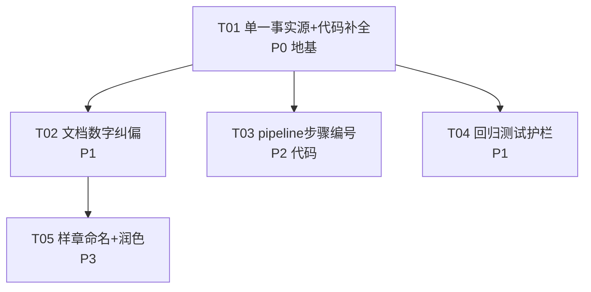

# novel-lab 交付层问题 · 系统化修复计划

> 编制：架构师「高见远」｜日期：2026-09-07
> 依据：12 个审查问题 + 全部实测证据（git / ls / 文档逐字核对）
> 性质：方案设计 + 任务分解，**不含任何代码改动**

---

## 0. 锚定事实（单一事实源，所有数字以本节为准）

修复中涉及的一切数字，以下列**实测值**为唯一基准，禁止再引用文档旧数字：

| 事实项 | 实测值 | 实测命令 | 说明 |
|---|---|---|---|
| Git 提交总数 | **15** | `git rev-list --count HEAD` | HEAD = `fdbc116` |
| Git HEAD | `fdbc116`（chore: 项目深度清理） | `git log --oneline -1` | 其后无更新提交 |
| assets/ 资产数 | **13 个 JSON** | `ls assets/*.json | wc -l` | 3书×4类=12 + genre-pack 1；合成测试卡已随 `fdbc116` 退役 |
| scripts/ 纯脚本数 | **19 个 `.py`** | `ls scripts/*.py | wc -l` | 另含 `__pycache__`（非脚本） |
| schema/ 数 | **6** | `ls schema/*.json | wc -l` | 含 trope-library（规划中） |
| reports/ 数 | **6** | `ls reports/*.md | wc -l` | 3书 ×（拆书报告+笔法分析） |
| 样章一致性实测分 | **94.7**（chireng） | 见 09-05 诊断报告"样章回归对照" | 旧文件名仍写"100分" |
| 工作区状态 | clean（无未提交改动） | `git status` | 修复文档类改动需新建提交 |

---

## 1. 问题清单总表（12 项）

### 优先级定义
- **P0**：交付包"不能开箱即用"或"结论造假"，用户拿到的包是残缺/误导的，必须最先修。
- **P1**：跨文档数字失真，会误导使用者对项目规模/进度的判断。
- **P2**：自相矛盾 / 过度声称 / 缺护栏，影响可信度与长期可维护性。
- **P3**：可读性、样章文学性等"锦上添花"项，可延后或并行处理。

### 总表

| # | 问题 | 维度 | 优先级 | 根因 | 修复步骤（改动位置） | 验证方法 |
|---|---|---|---|---|---|---|
| 1 | 交付包与代码分离 | 结构 | **P0** | 交付时只打包了"说明性 md/txt"，未把代码实体（scripts/assets/schema/根脚本/.git）纳入交付目录 | 在桌面交付包下建立 `novel-lab/` 代码子目录，拷贝（或 `git archive` 导出）项目全部非版权实体；交付包根目录放 `README.md` 说明两目录关系 | `diff -r` 对比两目录脚本/资产/schema 一致性；在交付包内 `py_compile scripts/*.py` 通过 |
| 2 | 三份文档提交数漂移（6 / 8 / 15） | 结构 | **P1** | 文档写于不同时点（09-01 6 提交、09-05 8 提交），之后 `7ae7703`、`fdbc116` 等追加提交未回写旧文档 | 三份文档所有"提交数"统一改为 **15**；维护记录表补全 15 条提交；删除"6 个/8 个"字样 | `grep -rn "6 个提交\|8 个提交\|6 个\|8 个" 三份文档` 无残留；`git rev-list --count HEAD` = 15 与文档一致 |
| 3 | 资产数量不一致（14 vs 13） | 结构 | **P1** | 合成测试卡随 `fdbc116` 退役后，文档未同步，"14 资产"仍散落多文档 | 全局把"14 个资产"改为"13 个资产"；删除"合成测试卡 1"表述；样章回归表"14 资产 validate"改"13 资产" | `grep -rn "14 个资产\|14 资产\|合成测试卡" 三份文档` 无残留；`ls assets/*.json | wc -l` = 13 |
| 4 | "14 资产"单一事实源缺失 | 逻辑 | **P1** | 数字硬编码进多文档正文，无单一引用源，一处变更需全局手工查找 | 建立"数字事实源"：在交付包根 `README.md` 用一张表集中声明提交数/资产数/脚本数/ schema 数；各文档正文不再写死数字，改为"见 README 事实表" | README 事实表存在；三份文档正文无独立硬编码数字 |
| 5 | pipeline 步骤编号 /6 与 /7 自相矛盾 | 逻辑 | **P2** | 源码历史遗留：前两步打印 `/6`、后五步打印 `/7`，09-05 报告称"E1 已修统一 /7"，但交付说明 §4.1 仍写"历史遗留瑕疵不改" | ① 修代码 `pipeline.py` 步骤打印统一为 `/7`（唯一代码改动，见 §3 界定）；② 同步两份文档措辞一致；③ 交付说明 §4.1 删除"历史遗留瑕疵不改"注 | 重跑 `pipeline.py --help` 或 dry-run，7 步编号全为 `/7`；两份文档无互相矛盾的编号描述 |
| 6 | 诊断报告 HEAD 标错 | 逻辑 | **P2** | 报告撰写时 HEAD 是 `7ae7703`，后 `fdbc116` 又追加，清单未回写 | 诊断报告"提交清单"补 `fdbc116`，并把 `(HEAD)` 标注移到 `fdbc116`；或干脆删除 `(HEAD)` 标注避免再漂移 | 报告清单与 `git log --oneline` 逐条对齐，`(HEAD)` 指向 `fdbc116` |
| 7 | "文档与代码高度一致"过度声称 | 完整性 | **P2** | 检查报告总评给"高度一致"定性，但 §7 自承未逐行精读 6613 行 | 总评降级为"文档与代码基本一致（目录/文件/命令级核实，未逐行审计）"；把"未逐行审计"从 §7 上移到总评显眼处 | 总评措辞含"未逐行审计"限定；无"高度一致"绝对化表述 |
| 8 | 缺自动化回归测试护栏 | 完整性 | **P1** | 项目零第三方依赖、纯脚本，无 pytest；4 个"静默失效"类 bug 修复后无测试防复发 | 新增 `tests/` 目录 + 纯标准库 `unittest` 用例，覆盖 4 类回归点（详见 §2 T04）；新增 `run_tests.py` 一键入口 | `python run_tests.py` 全绿；人为注入缺陷（如删 `import re`）后用例变红 |
| 9 | 文档冗余（三份重复同一信息） | 可读性 | **P3** | 三份文档各自独立成文，未做去重，定位/资产类型/脚本清单/架构图重复且措辞不一 | 以交付说明为"主文档"，检查报告/诊断报告改为"指向主文档"；重复的架构图/脚本清单只在主文档保留一份 | 三份文档各自职责单一；同一条目（如脚本清单）只出现一次 |
| 10 | 样章文件名含"一致性100分"与真实分矛盾 | 可读性 | **P2** | 文件名在 09-02 写章时定名，09-05 词表扩容后该章降至 94.7，文件名未改 | 重命名样章文件为 `...一致性94.7分.txt`（或去掉分数），并在样章内首行附"复测日期+分数"注 | 文件名与实测分一致；`ls 端到端验证样章/` 可见新名 |
| 11 | 样章开头视角切换生硬 | 文学 | **P3** | 第 1-6 行全知客观叙述 → 第 7 行突转内心独白，无过渡词/引语标记 | 在样章第 7 行内心独白前补过渡（如视角锚定词或引号），使客观叙述与内心活动衔接自然 | 人工重读开头 1-10 行，视角切换无断裂感 |
| 12 | 配角"边炀"登场功能化、缺动机钩子 | 文学 | **P3** | 配角作为推进情节的工具人登场，未埋动机/冲突钩子 | 在样章边炀登场处补 1-2 句动机暗示（如对唐雨的态度/自身目的），让登场有张力 | 人工重读边炀登场段，能读出动机悬念 |

---

## 2. 任务分解与依赖

> 硬约束：≤ 5 个任务；每任务 ≥ 3 相关文件；T01 为基础设施/事实源。

| 任务 ID | 任务名 | 覆盖问题 | 产出/改动文件 | 依赖 | 优先级 | 可并行 |
|---|---|---|---|---|---|---|
| **T01** | 建立单一事实源 + 交付包补全代码实体 | #1、#4 | ① 桌面交付包新增 `README.md`（事实表 + 目录说明）② 交付包内新建 `novel-lab/` 代码子目录（拷入 scripts/assets/schema/根脚本/.git） | 无 | P0 | 否（地基，最先） |
| **T02** | 三份文档数字与措辞统一纠偏 | #2、#3、#5、#6、#7、#9 | ① 项目说明文档 ② 完整度检查报告 ③ 诊断与修复报告（提交数 15、资产 13、步骤 /7、HEAD 纠正、降级"高度一致"、去重） | T01 | P1 | 可（与 T04 并行） |
| **T03** | 修复 pipeline 步骤编号（代码） | #5 | ① `scripts/pipeline.py`（步骤打印统一 /7） | T01 | P2 | 可（与 T02 并行） |
| **T04** | 新增回归测试护栏 | #8 | ① `tests/test_write_import.py` ② `tests/test_book_quality_glob.py` ③ `tests/test_chapter_check_score.py` ④ `tests/test_consistency_keys.py` ⑤ `run_tests.py` | T01 | P1 | 可（与 T02 并行） |
| **T05** | 样章命名纠正 + 文学性润色 | #10、#11、#12 | ① 样章 txt（重命名 + 开头过渡 + 边炀动机钩子）② 诊断报告"样章回归对照"同步分 | T02 | P3 | 可（依赖 T02 定名后） |

### 依赖关系图（Mermaid）



### 建议执行顺序

1. **T01 必须先做**：它是唯一地基，交付包结构 + 事实源不建好，其余文档纠偏和测试都无处落地。
2. **T02 / T03 / T04 三线并行**：三者互不依赖（都只依赖 T01），可同时开工，缩短总时长。
3. **T05 最后**：样章重命名依赖 T02 确定"94.7"这一事实口径，故排在 T02 之后。
4. 时间序：T01 →（T02 ∥ T03 ∥ T04）→ T05。

---

## 3. 修复范围界定（关键，避免改错位置）

| 改动落在哪 | 具体目录 | 涉及问题 | 改动类型 |
|---|---|---|---|
| **桌面交付包目录** `C:\Users\monesy\Desktop\novel-lab_拆书项目交付_2026-09-02` | 新增 `README.md`；新增 `novel-lab/` 代码子目录；改三份 md 文档；重命名样章 | #1 #2 #3 #4 #5 #6 #7 #9 #10 #11 #12 | 文档 + 目录结构 + 文件重命名 |
| **代码项目目录** `C:\Users\monesy\WorkBuddy\2026-08-06-16-49-41\novel-lab` | `scripts/pipeline.py`；新增 `tests/` + `run_tests.py` | #5 #8 | 仅代码（pipeline 编号）+ 新增测试文件 |

### 三条红线（避免误改）
1. **代码项目目录只动两处**：`pipeline.py` 的步骤编号、新增 `tests/` 与 `run_tests.py`。其余 17 个脚本、6 schema、13 资产**一律不动**——工程本体无 bug，问题全在交付层。
2. **不碰 git 历史**：不 `rebase` / 不 `amend` / 不 `reset`。文档纠偏用"新增提交"方式，历史提交保持原样（回滚靠 revert，不靠改写历史）。
3. **不碰版权材料**：`corpus/`（范文原文）绝不出现在交付包内，拷贝代码实体时严格排除 `corpus/`、`*.txt` 原文、`.secrets.json`、`__pycache__`。

### 交付包最终目录结构（目标态）

```
novel-lab_拆书项目交付_2026-09-02/
├── README.md                     ← 新增：单一事实源 + 目录说明
├── novel-lab_项目说明文档.md       ← 主文档（纠偏后）
├── novel-lab_完整度检查报告_...md   ← 指向主文档（纠偏后）
├── 诊断与修复报告_2026-09-05.md     ← 指向主文档（纠偏后）
├── 端到端验证样章/
│   └── 端到端验证样章_测试新书第1章_一致性94.7分.txt  ← 重命名+润色
└── novel-lab/                    ← 新增：代码实体
    ├── scripts/ (19 个 .py)
    ├── assets/ (13 个 JSON)
    ├── schema/ (6 个)
    ├── prompts/
    ├── novel.py
    ├── PROJECT_SUMMARY.md / RULES.md / HANDOFF.md / MODELS.md
    ├── tests/ + run_tests.py     ← 新增
    └── .git/ (版本库，导出时保留历史)
```

---

## 4. 风险与回滚

| 修复动作 | 风险点 | 回滚方式 |
|---|---|---|
| **交付包补代码实体**（#1） | 拷贝时误把 `corpus/` 版权原文、`.secrets.json` 带进交付包，泄版权/密钥 | 拷贝用 `git archive HEAD` 导出（自动遵循 .gitignore，天然排除 corpus/secrets/__pycache__）；导出后再 `ls` 复核无 corpus/secrets |
| **文档数字全局替换**（#2 #3） | 误把"14"替换到无关处（如"14 个维度"、日期"14 号"），引入新错误 | 替换前 `grep -n` 精确定位所有含"14/6/8"的上下文行，逐一确认语义后再改；每改一处跑一次 grep 校验 |
| **pipeline 编号改代码**（#5） | 改动打印逻辑可能影响 `--help` 或 dry-run 输出格式，或改动未覆盖全部 7 处打印 | 只改编号字符串 `/6`→`/7`，不碰逻辑；改后 `py_compile` + 实际跑一次 pipeline 核对 7 步全 `/7`；若出错 `git checkout scripts/pipeline.py` 秒回滚 |
| **新增测试文件**（#8） | 测试本身写错导致误报（假阳性），误导后续判断 | 测试用纯标准库 unittest，无新依赖；每个用例附"人为注入缺陷→断言变红"的自检步骤；若误报，删 `tests/` 目录即回滚 |
| **样章重命名 + 润色**（#10 #11 #12） | 润色改坏原文文风；重命名后其他文档引用的旧文件名断链 | 润色只做"最小增补"（过渡词 + 1-2 句动机），保留原文主体；重命名后 grep 全局搜旧文件名，同步更新所有引用 |
| **git 相关** | 任何改 git 历史（rebase/amend/reset）都可能丢提交 | **禁止改历史**；所有改动走"新增提交"，回滚用 `git revert <新提交>` 或 `git reset --hard HEAD~1`（仅回滚自己的新提交，不触及历史） |

---

## 5. "完整可用状态"验收标准

修复完成后，项目须同时满足以下四维标准才算合格。

### 5.1 功能维度（交付包可开箱即用）

| 验收项 | 验证命令/动作 | 合格判据 |
|---|---|---|
| 交付包含代码实体 | `ls "桌面交付包/novel-lab/scripts/*.py" | wc -l` | = 19 |
| 交付包代码可编译 | `cd 交付包/novel-lab && python -m py_compile scripts/*.py novel.py` | 全部通过，无报错 |
| 交付包资产齐全 | `ls "交付包/novel-lab/assets/*.json" | wc -l` | = 13 |
| 交付包 schema 齐全 | `ls "交付包/novel-lab/schema/*.json" | wc -l` | = 6 |
| 交付包无版权/密钥泄露 | `find 交付包 -name "*.secrets.json" -o -path "*corpus*"` | 无输出（空） |

### 5.2 缺陷维度（12 问题全部闭环）

| 验收项 | 验证命令/动作 | 合格判据 |
|---|---|---|
| 数字统一 | `grep -rn "6 个提交\|8 个提交\|14 个资产\|14 资产" 交付包/*.md` | 无残留 |
| 提交数正确 | `cd 代码目录 && git rev-list --count HEAD` | = 15，且与文档一致 |
| 资产数正确 | `ls 代码目录/assets/*.json | wc -l` | = 13，且与文档一致 |
| 步骤编号统一 | `python scripts/pipeline.py <样例txt> --genre test`（或 dry-run） | 7 步编号全为 `/7`，无 `/6` |
| HEAD 标注正确 | 对照 `git log --oneline -1` 与诊断报告清单 | `(HEAD)` 指向 `fdbc116` |
| 样章命名一致 | `ls "交付包/端到端验证样章/"` | 文件名分数 = 实测 94.7 |

### 5.3 测试维度（回归护栏生效）

| 验收项 | 验证命令/动作 | 合格判据 |
|---|---|---|
| 回归测试全绿 | `cd 代码目录 && python run_tests.py` | 4 个用例全部 PASS，exit code 0 |
| 护栏能防复发（注入缺陷自检） | 临时删 `scripts/write.py` 的 `import re` → 跑测试 | 对应用例变 RED；恢复后变 GREEN |
| 无新增第三方依赖 | `grep -rn "import pytest\|import numpy" tests/` | 无输出（纯 unittest） |

### 5.4 稳定性维度（工程本体无回归）

| 验收项 | 验证命令/动作 | 合格判据 |
|---|---|---|
| 工作区干净 | `cd 代码目录 && git status` | 除新增的 tests/run_tests.py/pipeline.py 改动外，无意外改动 |
| 历史提交未动 | `git log --oneline` | 15 条提交历史完整，无 rebase/amend 痕迹 |
| 主链路仍可用 | `python novel.py 状态`（或 `scripts/pipeline.py --help`） | 正常输出，无崩溃 |

### 验收清单（一键汇总脚本，供主理人执行）

```bash
# 在代码项目目录执行
cd "C:\Users\monesy\WorkBuddy\2026-08-06-16-49-41\novel-lab"

echo "== 1 提交数 ==" && git rev-list --count HEAD            # 期望 15
echo "== 2 资产数 ==" && ls assets/*.json | wc -l             # 期望 13
echo "== 3 脚本数 ==" && ls scripts/*.py | wc -l              # 期望 19
echo "== 4 schema ==" && ls schema/*.json | wc -l             # 期望 6
echo "== 5 编译 ==" && python -m py_compile scripts/*.py novel.py && echo OK
echo "== 6 测试 ==" && python run_tests.py                     # 期望全 PASS
echo "== 7 工作区 ==" && git status --short                    # 期望仅预期改动

# 在桌面交付包目录执行
cd "C:\Users\monesy\Desktop\novel-lab_拆书项目交付_2026-09-02"
echo "== 8 交付包脚本 ==" && ls novel-lab/scripts/*.py | wc -l   # 期望 19
echo "== 9 泄露扫描 ==" && find . -name "*.secrets.json" -o -path "*corpus*"   # 期望空
echo "== 10 数字残留 ==" && grep -rn "6 个提交\|8 个提交\|14 个资产\|14 资产" *.md  # 期望空
```

---

## 附：修复前后数字对照速查

| 项目 | 修复前（文档宣称） | 修复后（实测锚定） |
|---|---|---|
| Git 提交数 | 6（说明）/ 8（诊断） | **15** |
| 资产数 | 14（多文档） | **13** |
| 脚本数 | 19（一致，无需改） | 19 |
| schema 数 | 6（一致，无需改） | 6 |
| pipeline 步骤编号 | /6 + /7 混用 | 统一 **/7** |
| 样章一致性分 | 100（旧文件名） | **94.7** |
| HEAD 标注 | 标在 7ae7703 | **fdbc116** |
